**(转载)从`++[[]][+[]]+[+[]]==10`?深入浅出弱类型JS的隐式转换**

**本文是转载自jawil前辈的一篇关于js类型转化的博文讨论。此博文由浅入深，是我看到为数不多的关于js类型转换的优质文章。特此记录下来，以便学习。**

**在这里附上原文地址：喜欢可以给原作者star**

[原文地址](https://github.com/jawil/blog/issues/5)

-----

**起因**

凡是都有一个来源和起因，这个题不是我哪篇文章看到的，也不是我瞎几把乱造出来的，我也没这个天赋和能力，是我同事之前丢到群里，叫我们在浏览器输出一下，对结果出乎意料，本着实事求是的精神，探寻事物的本质，不断努力追根溯源，总算弄明白了最后的结果，最后的收获总算把js的隐式类型转换刨根问底的搞清楚了，也更加深入的明白了为什么JS是弱类型语言了。

**一、作业例子：**
这几个是留给大家的作业，涉及到的知识点下面我会先一一写出来，为什么涉及这些知识点，因为我自己一步步踩坑踩过来的，所以知道涉及哪些坑，大家最后按照知识点一步一步分析，一定可以得出 答案来，列出知识点之后，我们再来一起分析`++[[]][+[]]+[+[]]===10`?的正确性。

````js
{}+{}
//chrome:"[object Object][object Object]"，Firfox:NaN

{}+[]
//0

[]+{}
//"[object Object]"
````
**首先，关于1、2和3这三个的答案我是有一些疑惑，先给出答案，希望大家看完这篇文章能和我讨论一下自己的想法,求同存异。**

````js
{}+1

({}+1)

1+{}

[]+1

1+[]

1-[]

1-{}

1-!{}

1+!{}

1+"2"+"2"

1+ +"2"+"2"

1++"2"+"2"

[]==![]

[]===![]
````
这几个例子是我随便写的，几乎包含了所有弱类型转换所遇到的坑，为什么会出现这种情况，就不得不从JS这门语言的特性讲起，大家都知道JS是一门动态的弱类型语言，那么你有没有想过什么叫做弱类型？什么叫做动态？大家都知道这个概念，但有没有进一步思考呢？

今天通过这几个例子就来了解一下JS的弱类型，什么是动态暂时不做探讨。

**二、强弱类型的判别**

按照计算机语言的类型系统的设计方式,可以分为强类型和弱类型两种。二者之间的区别，就在于计算时是否可以不同类型之间对使用者透明地隐式转换。从使用者的角度来看，如果一个语言可以隐式转换它的所有类型，那么它的变量、表达式等在参与运算时，即使类型不正确，也能通过隐式转换来得到正确地类型，这对使用者而言，就好像所有类型都能进行所有运算一样，所以这样的语言被称作弱类型。与此相对，强类型语言的类型之间不一定有隐式转换。

**三、JS为什么是弱类型？**

弱类型相对于强类型来说类型检查更不严格，比如说允许变量类型的隐式转换，允许强制类型转换等等。强类型语言一般不允许这么做。具体说明请看维基百科的说明。

根据强弱类型的判别定义，和上面的十几个例子已经充分说明JavaScript 是一门弱类型语言了。

先讲一讲一些概念，要想弄懂上面题目答案的原理，首先你要彻底弄懂以下的概念，有些时候对一些东西似懂非懂，其实就是对概念和规则没有弄透，弄透之后等会回过头对照就不难理解，不先了解透这些后面的真的不好理解，花点耐心看看，消化一下，最后串通梳理一下，一层一层的往下剥，答案迎刃而解。

**四、ECMAScript的运算符、{}解析、自动分号插入**

**4.1 ECMAScript 运算符优先级**

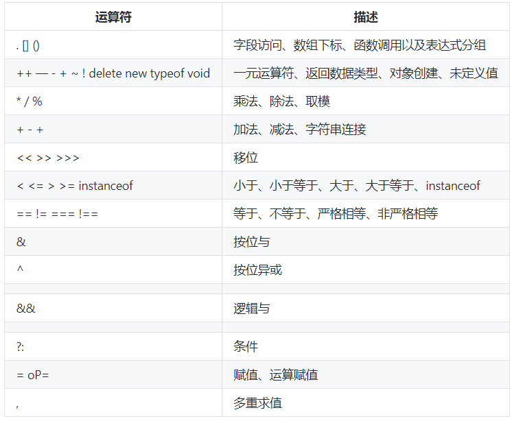

**4.2 ECMAScript 一元运算符（+、-）**

>一元运算符只有一个参数，即要操作的对象或值。它们是 ECMAScript 中最简单的运算符。

`delete`，`void`，`--`，`++`这里我们先不扯，免得越扯越多，防止之前博文的啰嗦，这里咋们只讲重点，有兴趣的可以看看[w3school(点我查看)](https://www.w3school.com.cn/js/pro_js_operators_unary.asp)对这几个的详细讲解。

上面的例子我们一个一个看，看一个总结一个规则，基本规则上面例子几乎都包含了，如有遗漏，还望反馈补上。

这里我们只讲 **一元加法** 和 **一元减法** ：

我们先看看[ECMAScript5规范](http://yanhaijing.com/es5/#about)（熟读规范，你会学到很多很多）对一元加法和一元减法的解读，我们翻到11.4.6和11.4.7。

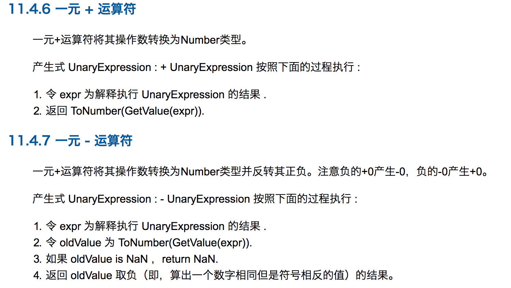

**其中涉及到几个ECMAScript定义的抽象操作，ToNumber(x),ToPrimitive(x)等等 下一章详细解答，下面出现的抽象定义也同理，先不管这个，有基础想深入了解可以提前熟读[ECMAScript5规范(点击查看)](http://yanhaijing.com/es5/#about)。**

规范本来就是抽象的东西，不太好懂不要紧，我们看看例子，这里的规范我们只当做一种依据来证明这些现象。

大多数人都熟悉一元加法和一元减法，它们在 ECMAScript 中的用法与您高中数学中学到的用法相同。
一元加法本质上对数字无任何影响：

````js
var iNum = 20;
iNum = +iNum; //注意不要和iNum += iNum搞混淆了;
alert(iNum); //输出 "20"
````
尽管一元加法对数字无作用，但对字符串却有有趣的效果，会把字符串转换成数字。

````js
var sNum = "20";
alert(typeof sNum); //输出 "string"
var iNum = +sNum;
alert(typeof iNum); //输出 "number"
````

这段代码把字符串 "20" 转换成真正的数字。当一元加法运算符对字符串进行操作时，它计算字符串的方式与 parseInt() 相似，主要的不同是只有对以 "0x" 开头的字符串（表示十六进制数字），一元运算符才能把它转换成十进制的值。因此，用一元加法转换 "010"，得到的总是 10，而 "0xB" 将被转换成 11。

另一方面，一元减法就是对数值求负（例如把 20 转换成 -20）：

````js
var iNum = 20;
iNum = -iNum;
alert(iNum);    //输出 "-20"
````

与一元加法运算符相似，一元减法运算符也会把字符串转换成近似的数字，此外还会对该值求负。例如：

````js
var sNum = "20";
alert(typeof sNum); //输出："string"
var iNum = -sNum;
alert(iNum); //输出 "-20"
alert(typeof iNum); //输出 "number"
````

在上面的代码中，一元减法运算符将把字符串 "-20" 转换成 -20（一元减法运算符对十六进制和十进制的处理方式与一元加法运算符相似，只是它还会对该值求负）。

**4.3 ECMAScript 加法运算符（+）**

**在多数程序设计语言中，加性运算符（即加号或减号）通常是最简单的数学运算符。
在 ECMAScript 中，加性运算符有大量的特殊行为。**

我们还是先看看ECMAScript5规范（熟读规范，你会学到很多很多）对加号运算符 ( + )解读，我们翻到11.6.1。

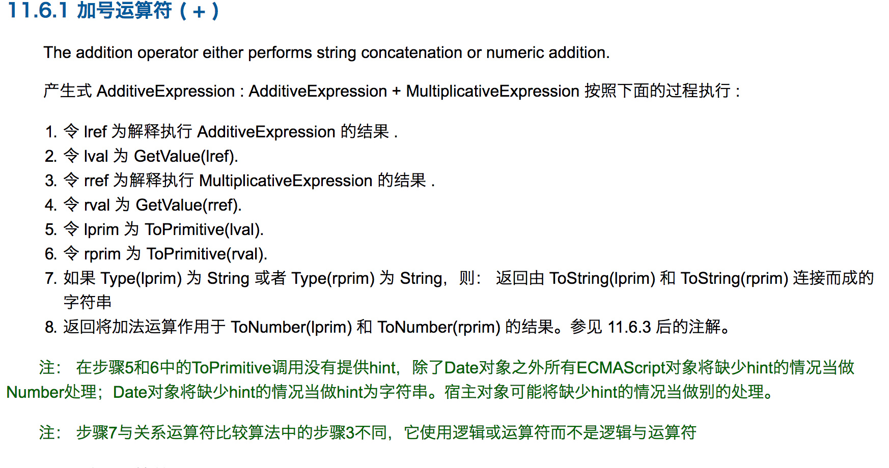

前面读不懂不要紧，下一章节会为大家解读这些抽象词汇，大家不要慌，但是第七条看的懂吧， **这就是为什么1+"1"="11"而不等于2的原因** ，因为规范就是这样的，浏览器没有思维只会按部就班的执行规则，所以规则是这样定义的，所以最后的结果就是规则规定的结果，知道规则之后，对浏览器一切运行的结果都会豁然开朗，哦，原来是这样的啊。

**在处理特殊值时，ECMAScript 中的加法也有一些特殊行为：**

1. 某个运算数是 NaN，那么结果为 NaN。
2. -Infinity 加 -Infinity，结果为 -Infinity。
3. Infinity 加 -Infinity，结果为 NaN。
4. +0 加 +0，结果为 +0。
5. -0 加 +0，结果为 +0。
6. -0 加 -0，结果为 -0

不过，如果某个运算数是字符串，那么采用下列规则：

1. 如果两个运算数都是字符串，把第二个字符串连接到第一个上。
2. 如果只有一个运算数是字符串，把另一个运算数转换成字符串，结果是两个字符串连接成的字符串。

**例如：**

````js
var result = 5 + 5; //两个数字
alert(result);      //输出 "10"
var result2 = 5 + "5";  //一个数字和一个字符串
alert(result);      //输出 "55"
````

这段代码说明了加法运算符的两种模式之间的差别。正常情况下，5+5 等于 10（原始数值），如上述代码中前两行所示。不过，如果把一个运算数改为字符串 "5"，那么结果将变为 "55"（原始的字符串值），因为另一个运算数也会被转换为字符串。

**注意：为了避免 JavaScript 中的一种常见错误，在使用加法运算符时，一定要仔细检查运算数的数据类型**

**4.4 ECMAScript 减法运算符（-）**

减法运算符（-），也是一个常用的运算符：

````js
var iResult = 2 - 1;
````

减、乘和除没有加法特殊，都是一个性质，这里我们就单独解读减法运算符（-）

我们还是先看看ECMAScript5规范（熟读规范，你会学到很多很多）对减号运算符 ( - )解读，我们翻到11.6.2。

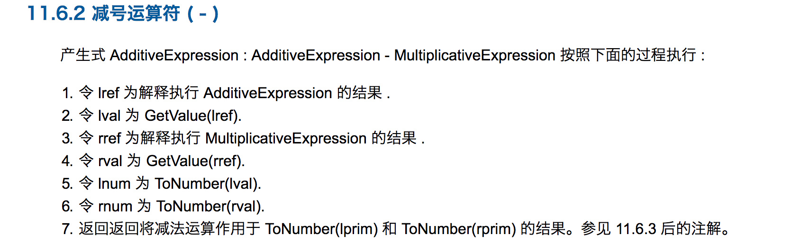

与加法运算符一样，在处理特殊值时，减法运算符也有一些特殊行为：

1. 某个运算数是 NaN，那么结果为 NaN。
2. Infinity 减 Infinity，结果为 NaN。
3. -Infinity 减 -Infinity，结果为 NaN。
4. Infinity 减 -Infinity，结果为 Infinity。
5. -Infinity 减 Infinity，结果为 -Infinity。
6. +0 减 +0，结果为 +0。
7. -0 减 -0，结果为 -0。
8. +0 减 -0，结果为 +0。
9. 某个运算符不是数字，那么结果为 NaN。

**注释：如果运算数都是数字，那么执行常规的减法运算，并返回结果。**

**4.5 ECMAScript 前自增运算符（++）**

直接从 C（和 Java）借用的两个运算符是前增量运算符和前减量运算符。
所谓前增量运算符，就是数值上加 1，形式是在变量前放两个加号（++）：

````js
var iNum = 10;
++iNum;
````

第二行代码把 iNum 增加到了 11，它实质上等价于：

````js
var iNum = 10;
iNum = iNum + 1；
````
我们还是先看看ECMAScript5规范（熟读规范，你会学到很多很多）对前自增运算符 ( ++ )解读，我们翻到11.4.4。

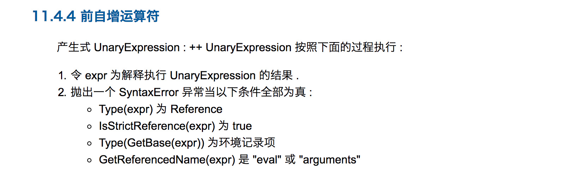

**此图有坑，后面会说到，坑了我很久。。。**

看不懂这些抽象函数和词汇也不要紧，想要深入了解可以通读ECMAScript5规范中文版，看几遍就熟悉了，第一次看见这些肯定一脸懵逼，这是什么玩意，我们只要明白++是干什么就行，这里不必去深究v8引擎怎么实现这个规范的。
至于

````js
var a=1;
console.log(a++);//1
var b=1;
cosole.log(++b);//2
````

还弄不明白的该好好补习了，这里不在本文的知识点，也不去花篇幅讲解这些，这里我们只要明白一点： **所谓前增量运算符，就是数值上加 1 。**

**4.6 ECMAScript 自动分号(;)插入**

尽管 JavaScript 有 C 的代码风格，但是它不强制要求在代码中使用分号，实际上可以省略它们。

JavaScript 不是一个没有分号的语言，恰恰相反上它需要分号来就解析源代码。 因此 JavaScript 解析器在遇到由于缺少分号导致的解析错误时，会自动在源代码中插入分号。

**4.6.1例子**

````js
var foo = function() {
} // 解析错误，分号丢失
test()
````
自动插入分号，解析器重新解析。

````js
var foo = function() {
}; // 没有错误，解析继续
test()
````

**4.6.2工作原理**

下面的代码没有分号，因此解析器需要自己判断需要在哪些地方插入分号。

````js
(function(window, undefined) {
    function test(options) {
        log('testing!')

        (options.list || []).forEach(function(i) {

        })

        options.value.test(
            'long string to pass here',
            'and another long string to pass'
        )

        return
        {
            foo: function() {}
        }
    }
    window.test = test

})(window)

(function(window) {
    window.someLibrary = {}
})(window)
````

下面是解析器"猜测"的结果。

````js
(function(window, undefined) {
    function test(options) {

        // 没有插入分号，两行被合并为一行
        log('testing!')(options.list || []).forEach(function(i) {

        }); // <- 插入分号

        options.value.test(
            'long string to pass here',
            'and another long string to pass'
        ); // <- 插入分号

        return; // <- 插入分号, 改变了 return 表达式的行为
        { // 作为一个代码段处理
            foo: function() {}
        }; // <- 插入分号
    }
    window.test = test; // <- 插入分号

// 两行又被合并了
})(window)(function(window) {
    window.someLibrary = {}; // <- 插入分号
})(window); //<- 插入分号
````
解析器显著改变了上面代码的行为，在另外一些情况下也会做出错误的处理。

**4.6.3 ECMAScript对自动分号插入的规则**

我们翻到ECMAScript5规范的7.9章节，看看其中插入分号的机制和原理，清楚只写以后就可以尽量以后少踩坑。

**必须用分号终止某些 ECMAScript 语句 ( 空语句 , 变量声明语句 , 表达式语句 , do-while 语句 , continue 语句 , break 语句 , return 语句 ,throw 语句 )。这些分号总是明确的显示在源文本里。然而，为了方便起见，某些情况下这些分号可以在源文本里省略。描述这种情况会说：这种情况下给源代码的 token 流自动插入分号。**

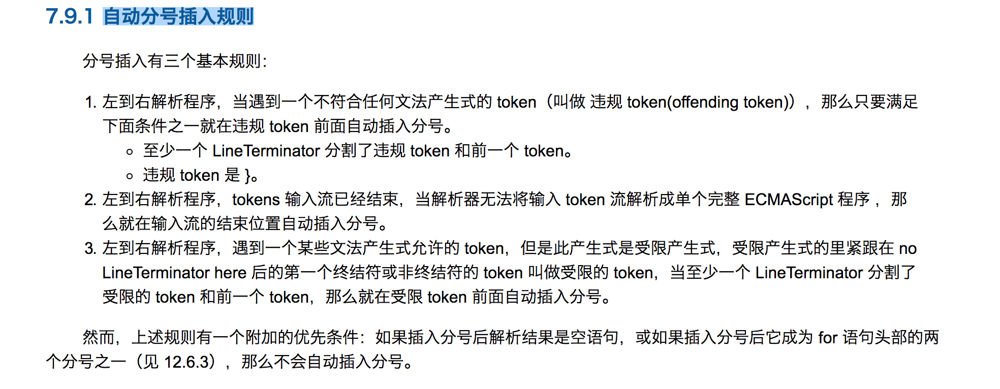

还是比较抽象，看不太懂是不是，不要紧，我们看看实际例子，总结出几个规律就行，我们先不看抽象的，看着头晕，看看具体的总结说明， **化抽象为具体** 。

首先这些规则是基于两点：

1. 以换行为基础；
2. 解析器会尽量将新行并入当前行，当且仅当符合ASI规则时才会将新行视为独立的语句。

**4.6.3.1 ASI的规则**

**1. 新行并入当前行将构成非法语句，自动插入分号。**

````js
if(1 < 10) a = 1
console.log(a)
// 等价于
if(1 < 10) a = 1;
console.log(a);
````

**2. 在continue,return,break,throw后自动插入分号**

````js
return
{a: 1}
// 等价于
return;
{a: 1};
````

**3. ++、--后缀表达式作为新行的开始，在行首自动插入分号**

````js
a
++
c
// 等价于
a;
++c;
````

**4. 代码块的最后一个语句会自动插入分号**

````js
function(){ a = 1 }
// 等价于
function(){ a = 1; }
````

**4.6.3.2 No ASI的规则**

**1. 新行以 ( 开始**

````js
var a = 1
var b = a
(a+b).toString()
// 会被解析为以a+b为入参调用函数a，然后调用函数返回值的toString函数
var a = 1
var b =a(a+b).toString()
````

**2. 新行以 [ 开始**

````js
var a = ['a1', 'a2']
var b = a
[0,1].slice(1)
// 会被解析先获取a[1]，然后调用a[1].slice(1)。
// 由于逗号位于[]内，且不被解析为数组字面量，而被解析为运算符，而逗号运算符会先执行左侧表达式，然后执行右侧表达式并且以右侧表达式的计算结果作为返回值
var a = ['a1', 'a2']
var b = a[0,1].slice(1)
````
**3. 新行以 / 开始**

````js
var a = 1
var b = a
/test/.test(b)
// /会被解析为整除运算符，而不是正则表达式字面量的起始符号。浏览器中会报test前多了个.号
var a = 1
var b = a / test / .test(b)
````

**4. 新行以 + 、 - 、 % 和 * 开始**

````js
var a = 2
var b = a
+a
// 会解析如下格式
var a = 2
var b = a + a
````

**5. 新行以 , 或 . 开始**

````js
var a = 2
var b = a
.toString()
console.log(typeof b)
// 会解析为
var a = 2
var b = a.toString()
console.log(typeof b)
````

到这里我们已经对ASI的规则有一定的了解了，另外还有一样有趣的事情，就是“空语句”。

````js
// 三个空语句
;;;

// 只有if条件语句，语句块为空语句。
// 可实现unless条件语句的效果
if(1>2);else
  console.log('2 is greater than 1 always!');

// 只有while条件语句，循环体为空语句。
var a = 1
while(++a < 100);
````

**4.6.4 结论**

建议绝对不要省略分号，同时也提倡将花括号和相应的表达式放在一行， 对于只有一行代码的 if 或者 else 表达式，也不应该省略花括号。 这些良好的编程习惯不仅可以提到代码的一致性，而且可以防止解析器改变代码行为的错误处理。

[关于JavaScript 语句后应该加分号么？(点我查看)](https://www.zhihu.com/question/20298345)我们可以看看知乎上大牛们对着个问题的看法。

**4.7 ECMAScript 对{}的解读，确切说应该是浏览器对{}的解析**

**js引擎是如何判断{}是代码块还是对象的？**

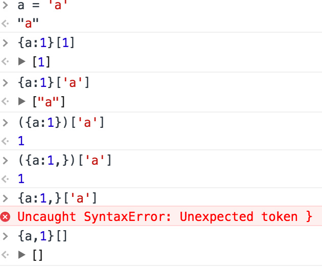

首先要深入明白的概念：

**4.7.1 JavaScript的语句与原始表达式**

原始表达式是表达式的最小单位——它不再包含其他表达式。javascript中的原始表达式包括this关键字、标识符引用、字面量引用、数组初始化、对象初始化和分组表达式，复杂表达式暂不做讨论。

**语句没有返回值，而表达式都有返回值的，表达式没有设置返回值的话默认返回都是undefined。**

在 `javascript` 里面满足这个条件的就函数声明、变量声明(var a=10是声明和赋值)、for语句、if语句、while语句、switch语句、return、try catch。
但是 `javascript` 还有一种函数表达式，它的形式跟函数声明一模一样。如果写 function fn() { return 0;} 是函数声明而写var a = function fn(){ return 0;} 等号后面的就是函数表达式。

**4.7.2 再来看看几个例子吧**

````js
{a:1}
{a:1};
{a:1}+1
````
我们直接在chrome看看结果：

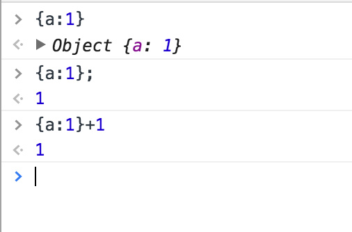

很奇怪是吧：

再来看看在Firefox下面的情况：
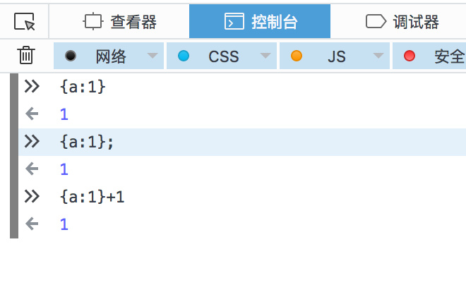

第二个很好理解，在有;的情况下，chrome和Firefox一致的把{a:1};解析为代码块，那么{a:1};怎么理解这个代码块，为什么不报错，还记得goto语句吗，JavaScript保留了goto的语法，我最先也半天没缓过神来，还好记得c语言里面的这个语法，没白学，其实可以这么理解：

````js
{
a:
 1;
};
````
关于第二个{a:1}+1的答案，chrome和Firefox结果也一致，两个浏览器都会把这段代码解析成:

````js
{
a:
 1;
};
+1;
````

其中关于{a:1}两个浏览器就达成了不一样的意见，只要{}前面没有任何运算符号，Firefox始终如一的把{}解析成{};也就是我们熟知的代码块，而不是对象字面量。

而chrome就不同了，如果{a:1}后面和前面啥也没有，{a:1}在chrome浏览器会首先检查这个是不是标准对象格式，如果是返回这个对象，如果不是，则当做代码块执行代码。当然这种情况基本可以不考虑，你写代码就写个{a:1}然后就完了？

**共同的特点：**

1. 当{}的前面有运算符号的时候，+，-，*，/,()等等，{}都会被解析成对象字面量，这无可争议。
2. 当{}前面没有运算符时候但有;结尾的时候，或者浏览器的自动分号插入机制给{}后面插入分号(;)时候，此时{}都会被解析成代码块。


如果{}前面什么运算符都没有，{}后面也没有分号(;)结尾，Firefox会始终如一的解析为代码块，而chrome有细微的差别，chrome会解析为对象字面量。

**这里也是我通过浏览器输出结果进行的一种归纳，当然可能还有没有总结到位的地方，也可能还有错误，发现ECMAScript规范对于{}何时解析为对象何时解析为代码块也没有找到比较详细的解答，有可能也是我看的不仔细，遗漏了这块，还望大家能解答一下这块**

**4.8 小结**

**如果你觉得以上的很繁琐，我是新手，也看不太懂，不要紧，不要慌，循序渐进，以后会懂的，这里我就直接总结出几个结论，总结的不对的地方，还望反馈指出，对照着结论来验证上面的十几个例子：**

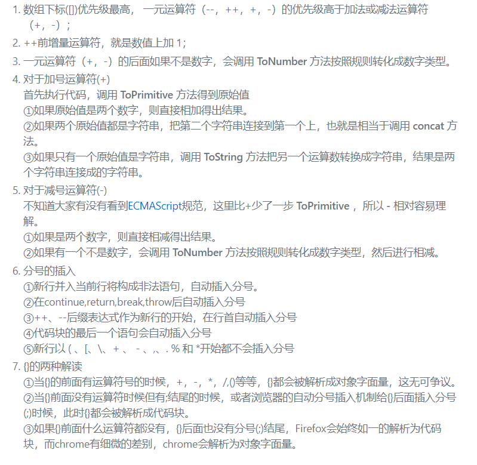

**五、ECMAScript的规范定义的抽象操作**

前面关于ECMAScript规范的解读，涉及到几个重要的抽象操作：

>1. GetValue(v) : 引用规范类型
>2. Type(x) : 获取x的类型
>3. ToNumber(x) : 将x转换为Number类型
>4. ToString(x) : 将x转换为String类型
>5. SameValue(x,y) : 计算非数字类型x,y是否相同
>6. ToPrimitive(x) : 将x转换为原始值

**5.1 原始值**

首先，让我们快速的复习一下。 在 JavaScript 中，一共有两种类型的值(ES6的 symbol 暂不做讨论):

````js
原始值(primitives)

1. undefined
2. null
3. boolean
4. number
5. string

对象值(objects)。
除了原始值外，其他的所有值都是对象类型的值，包括数组(array)和函数(function)等。
````

**5.2 GetValue(v)**

这里的每个操作都有其严格并复杂的定义，可以直接查阅ECMA规范文档对其的详细说明。
附上在线中文文档地址：[ECMAScript](http://yanhaijing.com/es5/#about)

我们先看看GetValue(v) : 引用规范类型，下面是ECMAScript规范的解读：

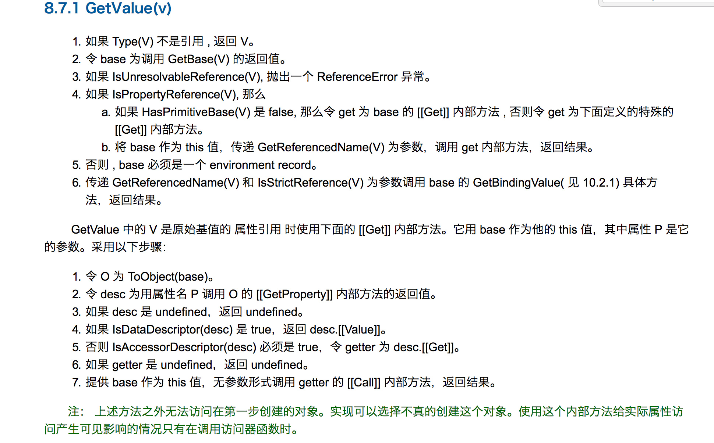

这里我们先看下SameValue()和ToPrimitive()两个操作。

**5.3 SameValue(x,y)**

我们还是先看看ECMAScript5规范（熟读规范，你会学到很多很多）对 SameValue 方法解读，我们翻到9.12。

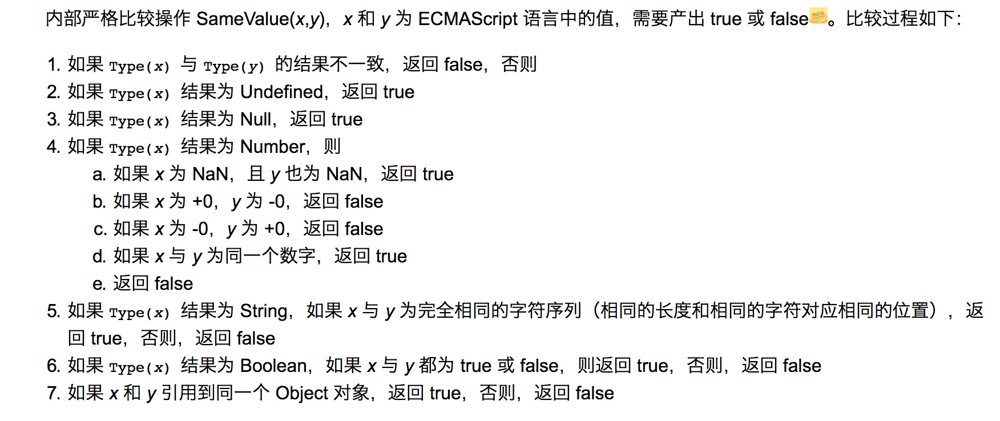

**5.4 ToPrimitive(input [ , PreferredType])**

ToPrimitive() 方法

转换成原始类型方法。

还是来看看 ECMAScript 标准怎么定义 ToPrimitice 方法的:

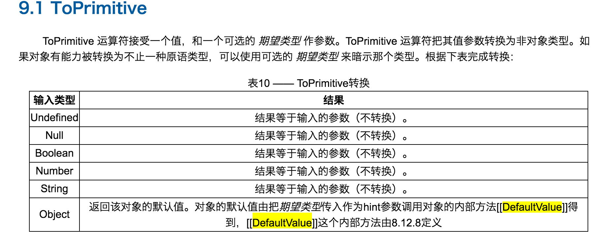

是不是看了这个定义,还是一脸懵逼,ToPrimitive这尼玛什么玩意啊?这不是等于没说吗?

再来看看火狐MDN上面文档的介绍:
JS::ToPrimitive
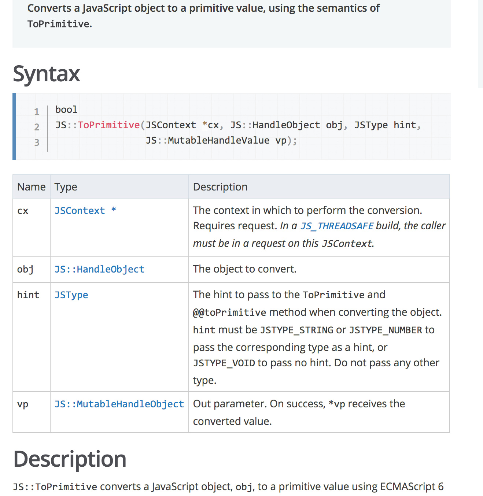

查了一下资料,上面要说的可以概括成:

>ToPrimitive(obj,preferredType)
>
>JS引擎内部转换为原始值ToPrimitive(obj,preferredType)函数接受两个参数，第一个obj为被转换的对象，第二个
preferredType为希望转换成的类型（默认为空，接受的值为Number或String）
>
>在执行ToPrimitive(obj,preferredType)时如果第二个参数为空并且obj为Date的事例时，此时preferredType会
被设置为String，其他情况下preferredType都会被设置为Number如果preferredType为Number，ToPrimitive执
行过程如
下：
>1. 如果obj为原始值，直接返回；
>2. 否则调用 obj.valueOf()，如果执行结果是原始值，返回之；
>3. 否则调用 obj.toString()，如果执行结果是原始值，返回之；
>4. 否则抛异常。
>
>如果preferredType为String，将上面的第2步和第3步调换，即：
>1. 如果obj为原始值，直接返回；
>2. 否则调用 obj.toString()，如果执行结果是原始值，返回之；
>3. 否则调用 obj.valueOf()，如果执行结果是原始值，返回之；
>4. 否则抛异常。

**在这里说一句,如果是看了上一篇文章的js类型转换(1)的小伙伴,应该能够有种恍然大悟的感觉。为什么我们的日期对象转换比较特殊,对象到原始值的转换经历了什么。**

首先我们要明白 obj.valueOf() 和 obj.toString() 还有原始值分别是什么意思,这是弄懂上面描述的前提之一:

**toString用来返回对象的字符串表示。**

````js
var obj = {};
console.log(obj.toString());//[object Object]

var arr2 = [];
console.log(arr2.toString());//""空字符串

var date = new Date();
console.log(date.toString());//Sun Feb 28 2016 13:40:36 GMT+0800 (中国标准时间)
````
**valueOf方法返回对象的原始值，可能是字符串、数值或bool值等，看具体的对象。**

````js
var obj = {
  name: "obj"
};
console.log(obj.valueOf());//Object {name: "obj"}

var arr1 = [1];
console.log(arr1.valueOf());//[1]


var date = new Date();
console.log(date.valueOf());//1456638436303
````

如代码所示，三个不同的对象实例调用valueOf返回不同的数据

**原始值指的是['Null','Undefined','String','Boolean','Number']五种基本数据类型之一，一开始就提到过。**

弄清楚这些以后,举个简单的例子:

````js
var a={};
ToPrimitive(a)

分析:a是对象类型但不是Date实例对象,所以preferredType默认是Number,先调用a.valueOf()不是原始值,继续来调
用a.toString()得到string字符串,此时为原始值,返回之.所以最后ToPrimitive(a)得到就是"[object Object]".
````

如果觉得描述还不好明白,一大堆描述晦涩又难懂,我们用代码说话:

````js
const toPrimitive = (obj, preferredType='Number') => {
    let Utils = {
        typeOf: function(obj) {
            return Object.prototype.toString.call(obj).slice(8, -1);
        },
        isPrimitive: function(obj) {
            let types = ['Null', 'String', 'Boolean', 'Undefined', 'Number'];
            return types.indexOf(this.typeOf(obj)) !== -1;
        }
    };

    if (Utils.isPrimitive(obj)) {
        return obj;
    }

    preferredType = (preferredType === 'String' || Utils.typeOf(obj) === 'Date') ?
     'String' : 'Number';

    if (preferredType === 'Number') {
        if (Utils.isPrimitive(obj.valueOf())) {
            return obj.valueOf()
        };
        if (Utils.isPrimitive(obj.toString())) {
            return obj.toString()
        };
    } else {
        if (Utils.isPrimitive(obj.toString())) {
            return obj.toString()
        };
        if (Utils.isPrimitive(obj.valueOf())) {
            return obj.valueOf()
        };
    }
}

var a={};
ToPrimitive(a);//"[object Object]",与上面文字分析的一致
````

**5.5 ToNumber(x)**

这个就比ToPrimitive() 方法好理解多了，就是把其他类型按照一定的规则转化成数字类型，也就是类似Number()和parseInt()的方法。

还是继续看看ECMAScipt规范中对于Number的转换

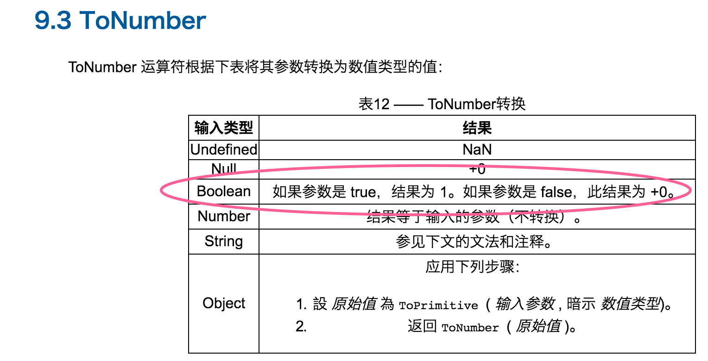

是不是又看到 ToPrimitive() 方法了，是不是看了上面的就好理解多了，如果ToNumber(x)这个x是对象就要调用ToPrimitive方法返回x的原始值，是不是一下子就串起来了。

**5.6 ToString(x)**

这个理解起来跟 ToNumber 方法大同小异，还是继续看看ECMAScipt规范中对于String的转换.

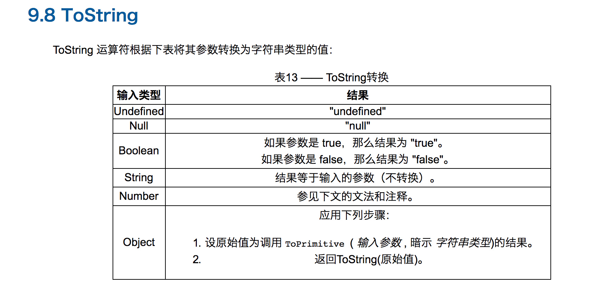

对数值类型应用 ToString

ToString 运算符将数字 m 转换为字符串格式的给出如下所示：

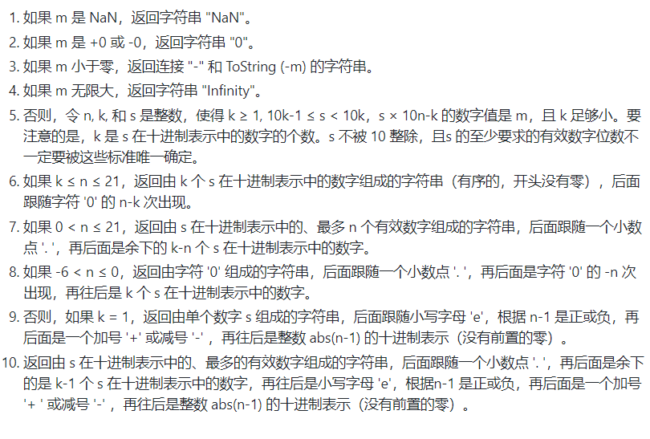

**六、验证分析++[[]][+[]]+[+[]]==10?**

**养兵千日，用兵一时。**

**了解了这么多深入的基础知识，该发挥用武之地了，我已经用完洪荒之力了，是时候表演真正的技术了。**

好像前面忘记讲 == 符号了，不要紧，之前这个我的上一篇博文已经非常详细的分析过了，可以看看我的[这篇博文(点击查看)](https://github.com/jawil/blog/issues/1)。这里就不花篇幅介绍了，感觉越来越坑，越写越多。

这里就简单说一下，总结一下==转换规则：

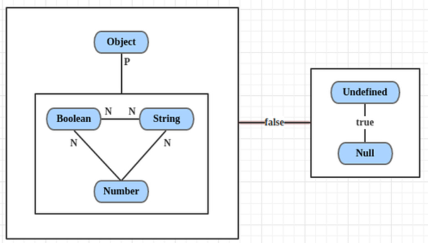

1. undefined == null，结果是true。且它俩与所有其他值比较的结果都是false。

2. String == Boolean，需要两个操作数同时转为Number。

3. String/Boolean == Number，需要String/Boolean转为Number。

4. Object == Primitive，需要Object转为Primitive(具体通过valueOf和toString方法)。

瞧见没有，一共只有4条规则！是不是很清晰、很简单。

**1.首先++[[]][+[]]+[+[]]首先拆分一下：**

根据 4.1 ECMAScript 运算符优先级 可以这样拆分：

相当于这样：

````js
(++[[]][+[]])
+
([+[]])
````

**2.先来分析右边的[+[]]**

先看里面的+[]

根据 4.2 ECMAScript 一元运算符（+、-） 可以知道，一元运算符会调用 ToNumber 方法把 ToNumber([]) 转化成数字。

根据 5.5 ToNumber(x) 的转换规则，x为[]是数组对象，因此会调用 ToPrimitive 方法。

根据 5.4 ToPrimitive(input [ , PreferredType]) 的转换规则，空数组先调用 valueOf() 方法，得到[]不是原始值，继续调用 toString() 方法，得到 ""空字符串 。

递归的调用之后成了 ToNumber("") ,答案显而易见，根据 5.5 ToNumber(x) 的转换规则对照图片可以看出ToNumber("")===0。 那么[+[]]就变相的成了[0] 。

**此时成了(++[[]][+[]])+[0]**

**3.再来分析左边边的++[[]][+[]]**

+[]上面已经分析出来了，结果为0，那么此时就成了++[[]][0]

根据 4.2 ECMAScript 一元运算符（+、-） 可以知道，数组下标的优先级高于一元运算符++，那么理所当然成了这样 ++([[]][0]) ,而[[]][0]可以看出数组下标为0也就是第一个元素，此时为[],那么最后成了++[].

++[]这是什么鬼👻，根据 4.5 ECMAScript 前自增运算符（++） 没有发现任何有调用 ToNumber 的方法，浏览器试了一下，果然有问题，报错啦，到底哪里出问题了呢，为什么走着走着就走偏了。问题出在哪一步呢？

**4.分析问题错误的原因**

为什么++([[]][0])在浏览器不报错，而++[]报错，我知道问题就出在这一步，但是一直相不出原因，光瞎想是没用的，没事继续读读ECMAScript规范,然后中文版的并没有看出什么玩意，最后在github英文版找到原因了。

首先我们在浏览器输出一下++[]

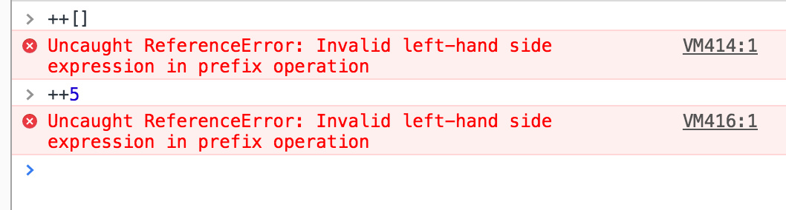

无意之中照着错误搜，搜到了这个后缀自增++：

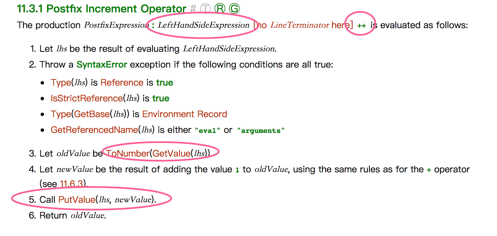

顺便看看大同小异的前缀自增++

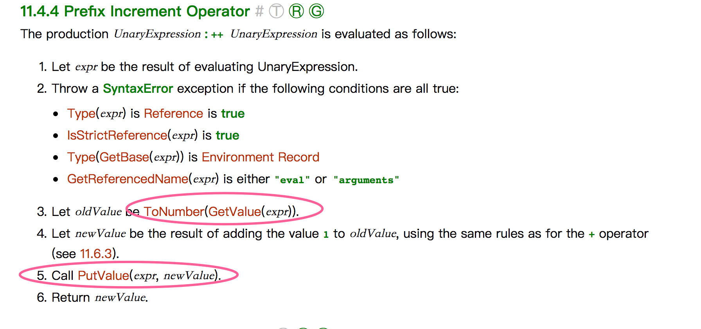

**Increment Operator_操作的第5步PutValue(expr, newValue)要求expr是引用。这就是问题的关键，为什么之前我没发现，因为之前我一直看的是中文版，来看看中文版的截图对比一下**

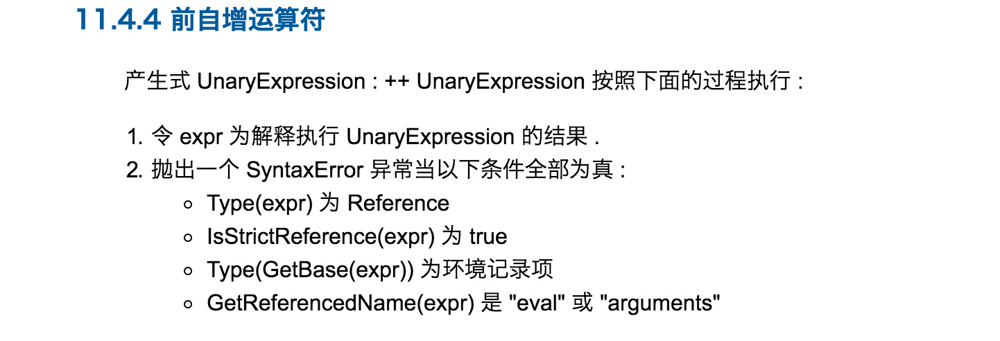

发现后面的3，4，5都没有，我一度以为自己理解错了，为什么这个规则没有调ToNumber()却也能得到数字，原来是翻译中这块内容遗漏了，我该好好补习英语了，尽量多看英文文档。

看到第五条大大的 **Call PutValue(expr, newValue). ，**

阅读[es5英文文档](http://es5.github.io/#x11.4.4)，可以看到_Prefix Increment Operator_操作的第5步PutValue(expr, newValue)要求expr是引用。

我们还是来看看**PutValue** 到底是什么定义，这里我们只需要知道++a,这个a是引用类型才不会报Uncaught ReferenceError: Invalid left-hand side expression in postfix operation这个错误。


**而我们知道[[]][0]是对象的属性访问，而我们知道对象的属性访问返回的是引用，所以可以正确执行。**

**5.进一步拆分**

++[[]][0]可以这么拆分，只要保持引用关系就行：

````js
var refence=[[]][0]；
++refence;
````

再来进一步拆分:

````js
var refence=[];
refence=refence+1;
````
最后就成了

````js
refence=[]+1;
````

根据 **4.3 ECMAScript 加法运算符（+）** ，[]+1可以看成是ToPrimitive([]）+ToPrimitive（1），根据 **5.4 ToPrimitive(input [ , PreferredType])** 的转换规则，空数组先调用 valueOf() 方法，得到[]不是原始值，继续调用 toString() 方法，得到 "" 空字符串。

于是就成了 ""+1 ，根据 **4.3 ECMAScript 加法运算符（+）** ，有一个字符串，另外一个也会变成字符串，所以""+1==="1"。所以 ++[[]][0] === "1" ;

**好像分析的是这么回事，其实错了，大家不要跟着我错误的步骤走，我其实忽略了很重要的一点。**

看看规范有一点遗漏了，就是 Let oldValue be ToNumber(GetValue(expr)).

就是++时候旧的值要进行 **ToNumber()** 运算，最后最后一步应该是这样子的：

````js
refence=ToNumber([])+1;
````

ToNumber([])===0,别问我为什么，照着我上面的分析自己分析一遍，不难，我因为分析多了，所以一眼就看出来了，所以最后成了0+1=1的问题，所以 ++[[]][0] === 1 。

**6. 谜底揭开？**

左边++[[]][0] === 1；
右边[+[]]的值为[0];
所以最后成了1+[0]的问题了。
根据 5.4 ToPrimitive(input [ , PreferredType]) 的转换规则，[0]数组先调用 valueOf() 方法，得到[0]不是原始值，继续调用 toString() 方法，得到 “0” 的字符串。

所以最后就成了 1+"0"==="10" 。

**7.最后的最后**

于是最后就成了 "10" == 10 的问题，根据ECMAScript规范==的对应法则：

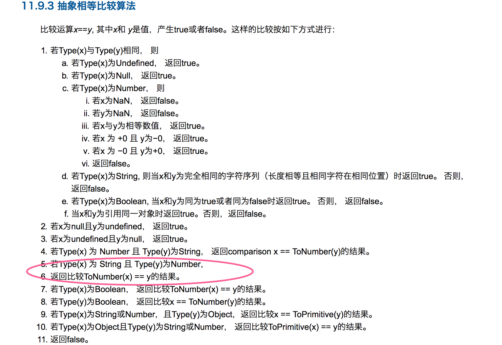

对比第5条，可以发现最后成了ToNumber("10")与10的比较，而ToNumber("10") === 10，
左边最后 === 10，
右边最后 === 10。
10 === 10为true.

所以 ++[[]][+[]]+[+[]]==10 为true,大功告成，可喜可贺，实力分析了一波，有错误还望批评指正。

**七、我的疑惑**

````js
1. {}+{}
//chrome:"[object Object][object Object]"，Firfox:NaN

2. {}+[]//0

3. []+{}//"[object Object]"
````
通过这个例子，我发现刚才4.7 ECMAScript 对{}的解读还不够彻底，首先我们按照前面常规的思维来解答：

**1.第一种思维：第一个{}解析为对面字面量**

第一例子： {}+{} 首先左边{}和右边{}会调用 ToPrimitive 两边都会得到:"[object Object]",所以最后就是这两个相同的字符串相加，得到： "[object Object][object Object]" ，chrome符合，Firefox不符合。

第二个例子： {}+[] 按照这种思维首先左边{}和右边[]会调用 ToPrimitive ,分别得到"[object Object]"和""空字符串，那么相加结果应该是 "[object Object]" ，为什么结果成了 0 ，而且在 chrome 和 Firfox 都是0？

第三个例子： []+{} 按照这种思维首先左边[]和右边{}会调用 ToPrimitive ,分别得到""空字符串和"[object Object]"，最后相加结果 "[object Object]" ，这个没有任何疑惑，chrome和Firefox都符合。

**2.第一种思维：第一个{}解析为代码块**

第一例子： {}+{} 浏览器这么解析，把{}不解析为对象字面量而是代码块，也就是let a={}这种块，代码可以看成是这样 {};+{} ,那么{};执行啥也没有，接下来就是 +{} ，+是一元运算符，上面讲到了，这里+{}执行时候首先会调用ToNumber(),参数{}是object会首先调用 ToPrimitive 得到原始值： "[object Object]" ，这时候就可以发现ToNumber("[object Object]")转化的就是 NaN 了，chrome不符合，Firefox符合。

第二个例子： {}+[] 按照这种思维，最后解析成 {};+[] ,+是一元运算符，上面讲到了，这里+[]执行时候首先会调用ToNumber(),参数[]是object会首先调用 ToPrimitive 得到原始值： ""空字符串 ，最后根据规则ToNumber("")得到数字0.这种思维下没有任何疑惑，chrome和Firefox都符合。

第三个例子： []+{} 首先左边[]和右边{}会调用 ToPrimitive ,分别得到""空字符串和"[object Object]"，最后相加结果 "[object Object]" ，这个没有任何疑惑，chrome和Firefox都符合。


那么问题来了？问题的矛盾就在于第一条和第二条，chrome和Firefox对于{}+{}解析是不一样的，对于第一个{}chrome解析为对象字面量，而Firefox解析为代码块，这无可厚非， 关键是第二个例子{}+[] ，既然第一个例子 {}+{} 的第一个{}chrome解析为对象字面量而第二个例子 {}+[] 中，chrome却解析为代码块，匪夷所思，有谁能扒一扒源码分析一下，chrome对{}的详细解析，到底什么时候解析为代码块，什么时候解析为对象字面量？有点想不明白为什么这么不一致，**而 Firefox始终如一，第一个{}一直解析为代码块，运算符号后面{}解析为对象字面量。**

**3.捉摸不透**

Firefox的我能理解，开头{}一律解析为代码块（block）,而chrome却让人捉摸不透。。。

**八、结束**

前面的十几个例子，大家有兴趣对照着规则自己一个一个做做，看看自己是否真的理解了，理解了也再熟悉一遍，学习本来就是一个重复的过程。

**突然灵机一动：**

````js
    var obj = {
        valueOf: function() {
            return 18;
        }
    };

    console.log(
            1 <= "2",
            "1" <= "a",
            obj >= "17"
    );
````

**这个答案又是多少呢？**

````js
 var obj = {
        valueOf: function() {
            return {a:1};
        },
        toString:function(){
            return 0;
        }
    };

console.log(obj==[]);
````

**最后这个呢？**

````js
 var obj = {
        valueOf: function() {
            return {a:1};
        },
        toString:function(){
            return "0";
        }
    };

console.log(obj==[]);
````
**九、相关资料**

[从 []==![] 为 true 来剖析 JavaScript 各种蛋疼的类型转换](https://github.com/jawil/blog/issues/1)(厚颜无耻的也参考一下自己文章)

[ECMAScript5.1中文版](http://yanhaijing.com/es5/#about)

[Annotated ECMAScript 5.1](http://es5.github.io/#toc)

[JavaScript 秘密花园](https://bonsaiden.github.io/JavaScript-Garden/zh/#types.casting)

[w3school中文文档](http://www.w3school.com.cn/js/pro_js_operators_unary.asp)

[JS魔法堂：ASI(自动分号插入机制)和前置分号](http://www.cnblogs.com/fsjohnhuang/p/4154503.html)

[JavaScript中,{}+{}等于多少?](http://justjavac.com/javascript/2012/12/20/object-plus-object.html)
