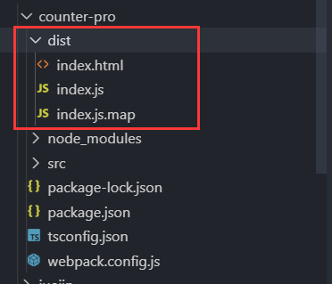
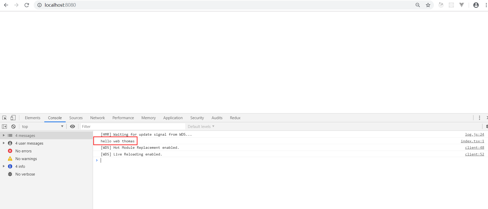
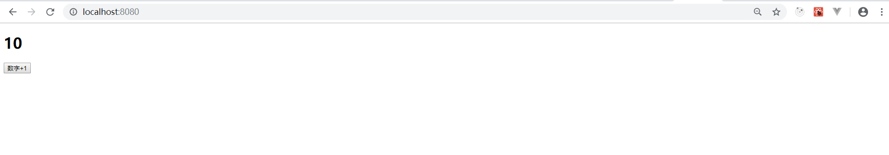
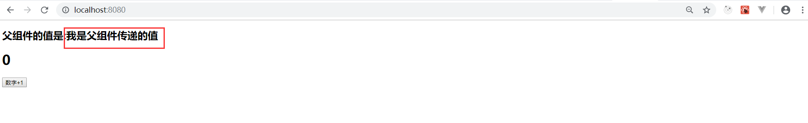

**基于react全家桶和typescript，如何实现一个简单的计数器demo...**

**这里我们不借助脚手架，自己使用webpack配置一个react全家桶 + typescript的项目**

----

**下载安装所需要的包：**

创建一个空的项目文件夹counter-pro。

**第一步：安装webpack** 

在这里我们需要安装webpack相关的一些基本插件：

1. `webpack` webpack的核心
2. `webpack-cli` webpack的工具,4.x后的webpack必须要安装
3. `webpack-dev-server`  配置webpack的开发服务
4. `html-webpack-plugin` 生成内存中的index.html文件


`npm install webpack webpack-cli webpack-dev-server html-webpack-plugin --save-dev`

**第二步：安装react全家桶相关的库**

这里我们需要注意，我们不能像使用javaScript开发时，安装的那样直接安装react全家桶的库。

在typescript中除了安装相应的库外，我们还必须要安装相应的类型定义文件。(原因是因为，我们第三方的库通常都是js来编写的。我们是没有办法直接与ts进行结合的。所以我们要下载相应的类型定义文件以供ts进行查找)

所以安装的步骤如下:

1. `react`  `@types/react` react核心和声明文件
2. `react-dom` `@types/react-dom` dom核心和声明文件
3. `react-router-dom` `@types/react-router-dom` 路由和声明文件
4. `react-redux` `@types/react-redux` 状态管理和声明文件
5. `react-thunk` 中间件
6. `redux-logger` 状态日志

`npm i react react-dom @types/react @types/react-dom react-router-dom @types/react-router-dom react-redux @types/react-redux redux-thunk redux-logger @types/redux-logger --save-dev`

**第三步：安装typescript**

1. `typescript` ts核心文件
2. `ts-loader` ts编译工具，可以替代babel
3. `source-map-loader` 开发环境调试ts代码

`npm i typescript ts-loader source-map-loader --save-dev`

----

**创建项目所需文件夹**

**第一步:** 在项目根目录下创建一个文件夹 src

**第二步:** 在 src 目录下创建一个主文件 `index.html` 文件内容如下：

````html
<!DOCTYPE html>
<html lang="zh-CN">
<head>
    <meta charset="UTF-8">
    <meta name="viewport" content="width=device-width, initial-scale=1.0">
    <meta http-equiv="X-UA-Compatible" content="ie=edge">
    <title>ts项目</title>
</head>
<body>
    <div id='app'></div>
</body>
</html>
````
**第三步：** 在 src 目录下创建一个入口文件 `index.tsx`

**第四步：** 在项目根目录下创建一个webpack的配置文件 `webpack.config.js` 

----

**配置文件**

**第一步：** 在项目根目录下执行命令行`tsc --init`生成 `tsconfig.json` 文件。(这个文件的主要作用是告诉我们的ts-loader怎么样去编译ts的代码。) 修改文件内容如下：

````js
{
  "compilerOptions": {
    /*编译成es5语法*/
    "target": "es5", 
    /*模块的类型*/ 
    "module": "commonjs", 
    /*编译后的文件目录*/ 
    "outDir": "./dist",
    /*生成sourceMap方便我们在开发过程中调试*/ 
    "sourceMap": true, 
    /*每个变量都要标明类型*/ 
    "noImplicitAny": true, 
    /*jsx的版本,使用这个就不需要额外使用babel了，会编译成React.createElement*/
    "jsx": "react", 
  },
  /*为了加快整个编译过程，我们指定相应的路径*/ 
  "include": [
    "./src/**/*"
  ]
}
````
**第二步：** 配置webpack,在webpack.config.js中输入以下配置内容:

````js
/*引入需要的模块*/
const webpack = require("webpack");
/*引入编译html的插件*/
const HtmlWebpackPlugin = require("html-webpack-plugin");
/*引入path*/
const path  = require("path");

const htmlPlugin = new HtmlWebpackPlugin({
    template:"./src/index.html", //需要编译的模板文件
    filename:"index.html" //编译后的文件名
})

module.exports = {
    /*首先配置入口文件*/
    entry:"./src/index.tsx",
    /*指定开发模式*/
    mode:"development",
    /*输出配置*/
    output:{
        /*输出到dist目录，输出文件的名称为index.js*/
        path:path.resolve(__dirname,"dist"),
        filename:"index.js"
    },
    /*配置调试工具*/
    devtool:"source-map",
    /*设置忽略后缀的文件*/
    resolve:{
        extensions:[".js",".ts",".tsx",".json"]
    },
    /*模块化处理,第三方的处理规则放到这里*/
    module:{
        rules:[
            {
                /*如果是以.ts 或者 .tsx结尾的那么ts-loader将其编译成es5的语法*/
                test:/\.tsx?$/, 
                loader:"ts-loader"
            },
            {
                /*使用调试，enforce的意思是 这个loader要在其他的loader执行前去执行*/
                enforce:"pre",
                test:/\.js$/,
                loader:"source-map-loader"
            }
        ]
    },
    /*配置插件*/
    plugins:[
        htmlPlugin,
        /*启动模块热替换的插件*/
        new webpack.HotModuleReplacementPlugin()
    ],
    /*配置开发环境服务*/
    devServer:{
        /*启动热更新*/
        hot:true,
        /*静态资源目录*/
        contentBase:path.resolve(__dirname,"dist"),
        /*自动打开*/ 
        open:true
    }
}
````

**第三步：** 在package.json中配置相应的脚本命令:

````js
···

  "scripts": {
    "test": "echo \"Error: no test specified\" && exit 1",
    "dev":"webpack-dev-server",
    "build":"webpack"
  }

···

````

**第四步：** 在之前创建的index.tsx文件中写入一句打印。然后在项目根目录的命令行中输入`npm run build`,测试webpack是否能够正常编译

````ts
console.log("hello web thomas")
````

如果成功了的话，会在我们的项目根目录生成一个dist文件夹,以及dist文件夹中相应的文件：



没成功的小伙伴自己检查以下问题出在哪儿。


**第五步：** 在根目录命令行输入`npm run dev` 测试一下webpack-dev-server 是否能够正常运行：

将地址复制到浏览器中打开，开启控制台。如下图所示，说明我们的配置已经成功了。



**项目的环境搭建到这里就结束了，接下来就可以开始写我们的项目了**

**到这里的模板源码代码我放置到了我的[github](https://github.com/lmxyjy/react-ts)。如果已经学会了ts+react的朋友并且不想写下面的计数器代码，那么到这里就可以毕业了。接下来自己写好index.tsx文件，然后在src中配置项目文件结构，就可以了。**

----

**写一个计数器demo：**

**第一步：** 在src目录下新建一个叫做components的文件夹，然后在该文件夹中新建一个叫做Counter.tsx的文件。内容如下：

````ts
import * as React from 'react';

export default class Counter extends React.Component {
    state={
        num:0
    }
    change(){
        this.setState({
            num:this.state.num + 1
        })
    }
    render() {
        let {num} = this.state;
        return (
            <div>
                <h1>{num}</h1>
                <button onClick={()=>this.change()}>数字+1</button>
            </div>
        )
    }
}


````
需要注意的是：在ts+react中我们的导入方式变成了:

````ts
import * as React from 'react';
````

**第二步：** 在index.tsx中导入我们的Counter组件,然后`npm run dev`运行项目:

````ts
import * as React from 'react';
import * as ReactDom from 'react-dom';
/*导入Counter组件*/
import Counter from './components/Counter';

ReactDom.render(
    <Counter />,
    document.getElementById("app")
)
````

可以看到：我们项目已经运行成功了：



目前看来，好像和我们平时用js写的react组件没有太大的区别。这是因为ts最强大的地方是它的类型校验。我们再往后看，你就能感受到它们之间的不同了。

**第三步：** 父组件像子组件传值。我们在index.tsx中对Counter组件传递一个值:

````js
import * as React from 'react';
import * as ReactDom from 'react-dom';
/*导入Counter组件*/
import Counter from './components/Counter';

ReactDom.render(
    <Counter data="我是父组件传递的值" />,
    document.getElementById("app")
)
````

这个时候保存会报错，但是不要害怕，因为我们没有对Counter组件中传递的值做类型限定。到Counter组件中去对父组件的传值进行类型限制：

````js
import * as React from 'react';

/*定义一个接口进行类型校验*/
interface IProps{
    data:string
}

export default class Counter extends React.Component<IProps>{
    state={
        num:0
    }
    change(){
        this.setState({
            num:this.state.num + 1
        })
    }
    render() {
        let {num} = this.state;
        let {data} = this.props;
        return (
            <div>
                <h2>父组件的值是:{data}</h2>
                <h1>{num}</h1>
                <button onClick={()=>this.change()}>数字+1</button>
            </div>
        )
    }
}

````


----

**使用redux管理定时器：**

