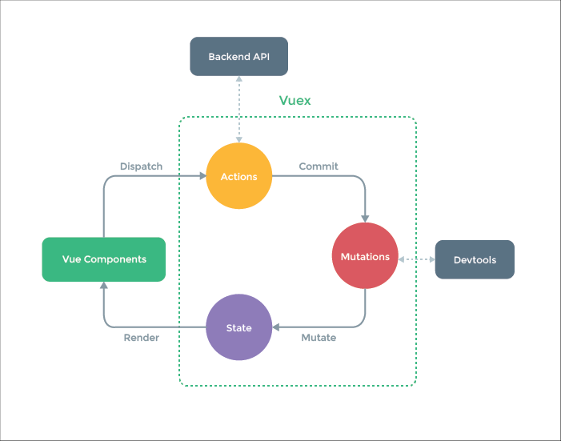
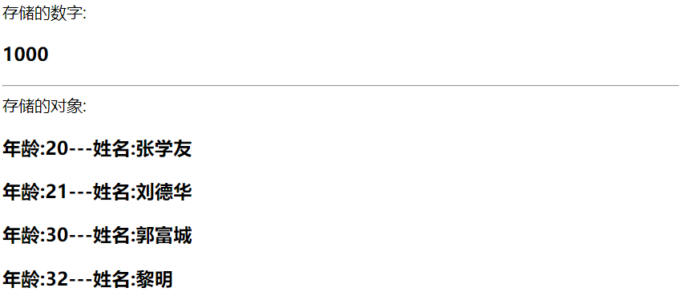
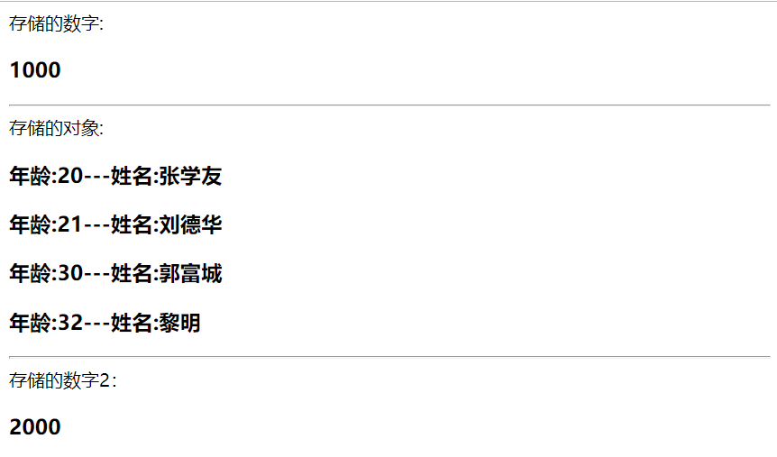
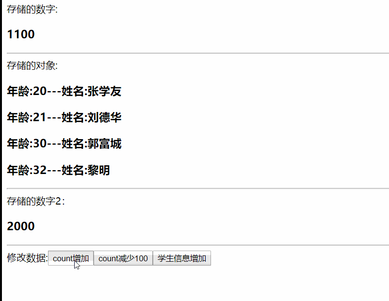
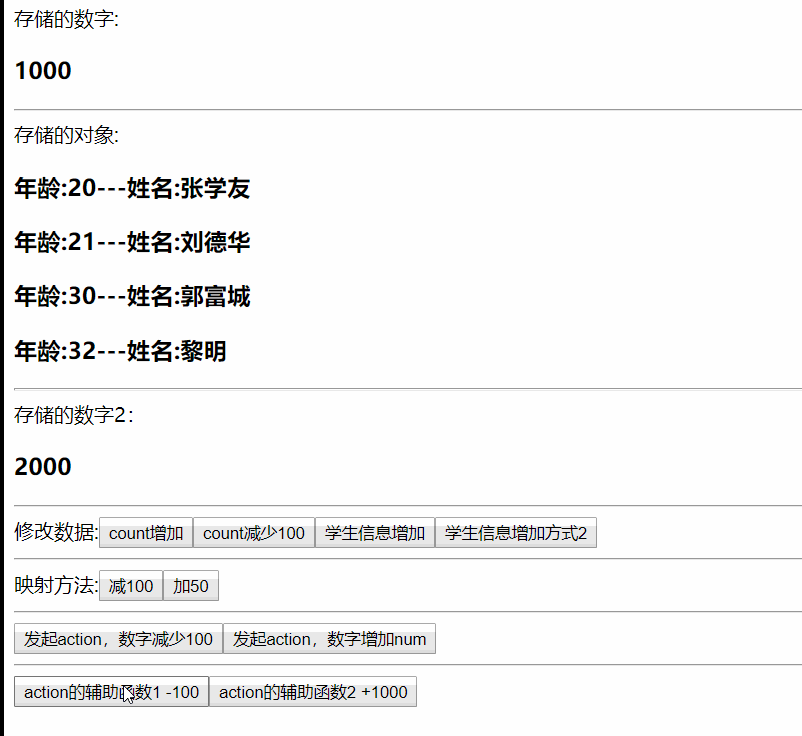
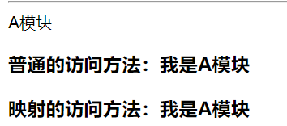
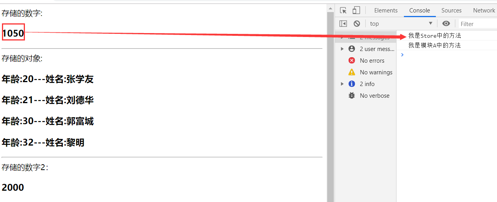
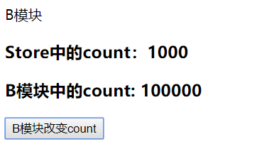

**手摸手带你认识和了解什么是vuex...**

**一、什么是Vuex**

Vuex 是一个专为 Vue.js 应用程序开发的状态管理模式。它采用集中式存储管理应用的所有组件的状态，并以相应的规则保证状态以一种可预测的方式发生变化。这点和我们的redux的思想是一致的。其实vuex的作用和redux的作用是差不多的，就是为我们管理数据。

**vuex的流程图：**



由上图可以知道，vuex运行的整个流程。

**二、vuex的基本原则：**

vuex的基本原则是，单一状态树的概念。简单的来说就是我们一个vue应用中只能有一个store实例，这点和redux是一致的。

**三、vuex的核心api：**

vuex的核心api有以下的5个：

1. `state`:这是我们存放数据的地方
2. `getter`：类似于我们vue的计算属性，可以获取一些特定状态的数据。
3. `action`：这是对mutation的增强，帮助mutation处理异步行为。
4. `mutation`：根据响应如何改变值的方法，类似于redux中reducer函数。
5. `module`：vuex模块，如果有多种复杂数据。vuex允许我们拆分成不同的模块。

**四、开始使用：**


我们使用vuex中的api做一个小的练习：

这部分所有的代码我都上传到了github中，建议直接拉取下来对应查看:[**源代码**](https://github.com/lmxyjy/vuex_demo)

**1.环境搭建：** 使用vue脚手架搭建一个vue项目模板：

`npm install -g @vue/cli` 安装脚手架

`vue create hello-world` 创建一个项目

**2.vuex安装：** 使用vuex的时候，我们必须要做的就是在我们的vue项目的根目录下下载安装vuex:

`npm install vuex --save`

**3.引入vuex：** 在src目录下创建一个store文件夹，在该文件夹下新建一个index.js文件。创建vuex的结构如下：

````js
import Vue from 'vue'
import Vuex from 'vuex';

Vue.use(Vuex);

export default new Vuex.Store({
    state:{
        
    },
    mutations: {
        
    },
    actions: {
        
    },
    getters: {
        
    },
    modules: {
        
    }
})

````
在入口文件的main.js中引入:

````js
import Vue from 'vue'
import App from './App.vue'
import store from './store';//引入

Vue.config.productionTip = false

new Vue({
  render: h => h(App),
  store
}).$mount('#app')
````
到这里我们的vuex就创建引入完毕了，接下来就可以愉快的开始使用了。

**4.state的使用:** state主要就是存放我们的数据，我们在state中可以做如下的数据存储，然后在页面上显示出来。在state中创建数据如下:

````js
...
    state:{
        count:1000,
        students:[
            {id:1,name:"张学友",age:20},
            {id:2,name:"刘德华",age:21},
            {id:3,name:"郭富城",age:30},
            {id:4,name:"黎明",age:32}
        ]
    },
...
````
在App.vue中创建如下对应的标签:

````vue
<template>
  <div id="app">
    <span>存储的数字:</span><h3>{{$store.state.count}}</h3>
    <hr>
    <span>存储的对象:</span>
    <h3 v-for="(item,index) in myStudents" :key="index">年龄:{{item.age}}---姓名:{{item.name}}</h3>
  </div>
</template>

<script>

export default {
  name: 'app',
  components: {

  },
  computed: {
    myStudents(){ //使用计算属性的方式调用在state中的数据
      return this.$store.state.students
    }
  }
}
</script>

<style>

</style>

````
界面显示如下：




**使用mapState:**

vuex还给我们提供了state的辅助函数`mapState`。它的主要作用是：

>当一个组件需要获取多个状态时候，将这些状态都声明为计算属性会有些重复和冗余。为了解决这个问题，我们可以使用 mapState 辅助函数帮助我们生成计算属性

比如我们之前使用计算属性的方式去获得数据，但是如果有很多个这样的写法去获取数据的话就会非常的麻烦。所以为了减少我们的工作量，vuex帮我们推出了mapState这个辅助函数。

我们新增一条数据:

````js
...

    state:{
        count:1000,
        students:[
            {id:1,name:"张学友",age:20},
            {id:2,name:"刘德华",age:21},
            {id:3,name:"郭富城",age:30},
            {id:4,name:"黎明",age:32}
        ],
        count2:2000 //新增一条数据
    },

...
````

然后在App.vue中使用`mapState`方法:

````vue
<template>
  <div id="app">
    <span>存储的数字:</span><h3>{{count}}</h3>
    <hr>
    <span>存储的对象:</span>
    <h3 v-for="(item,index) in myStudents" :key="index">年龄:{{item.age}}---姓名:{{item.name}}</h3>
    <hr>
    <span>存储的数字2：</span>
    <h3>{{count2}}</h3>
  </div>
</template>

<script>

import {mapState} from 'vuex';

export default {
  name: 'app',
  components: {

  },
  computed: {
    myStudents(){ //使用计算属性的方式调用在state中的数据
      return this.$store.state.students
    },
    ...mapState({ //mapState写法1
      count:"count"
    }),
    ...mapState([ //mapState 写法2
      "count2"
    ])
  }
}
</script>

<style>

</style>
````
效果如下：



通过以上的例子，不难看出mapState就是简化了我们以计算属性的方式使用state中的数据的写法。

**5.mutations的使用:**

`mutation` 就是我们更改数据的方法。根据vuex的运行流程，以及代码规范的角度来说。我们任何对数据的更改都必须通过mutations中定义的方法来改变。而不能直接修改，直接修改不仅会导致我们的`dev-tools`工具无法检测，而且会增加我们的维护成本。这是非常危险的事情。

**注意：mutation必须是同步函数**,异步的处理我们不能在mutation去进行，必须要通过actions来处理。

mutation其实就类似于redux中的reducer函数，其中放置的主要是我们数据修改的规则。

修改mutations如下：我们在其中定义3个修改参数的方法

````js
...

    mutations: {
        //mutations中函数的三种使用方式：
        //1，有传参，传参是一个基本类型数据
        addNum(state,payload){
            state.count += payload;
        },
        //2，没有传参
        subNum(state){
            state.count -= 100;
        },
        //3，有传参，传参是一个引用类型数据
        addStudents(state,payload){ 
            state.students.push(payload.info)
        }
    },

...
````
在App.vue中使用如下：

````vue
<template>
  <div id="app">
    <span>存储的数字:</span><h3>{{count}}</h3>
    <hr>
    <span>存储的对象:</span>
    <h3 v-for="(item,index) in myStudents" :key="index">年龄:{{item.age}}---姓名:{{item.name}}</h3>
    <hr>
    <span>存储的数字2：</span>
    <h3>{{count2}}</h3>
    <hr>
    <span>修改数据:</span>
    <button @click="add(50)">count增加</button>
    <button @click="sub">count减少100</button>
    <button @click="addStudent">学生信息增加</button>
  </div>
</template>

<script>

import {mapState} from 'vuex';

export default {
  name: 'app',
  methods: {
    // 增加count
    add(num){
      this.$store.commit("addNum",num); //可以接收2个参数
    },
    // 减少count
    sub(){
      this.$store.commit("subNum");
    },
    // 增加学生信息
    addStudent(){
      const info = {id:5,name:"养了只柯基",age:100};
      // 另外一种提交风格
      this.$store.commit({
        type:"addStudents",
        info
      })
    }
  },
  computed: {
    myStudents(){ //使用计算属性的方式调用在state中的数据
      return this.$store.state.students
    },
    ...mapState({ //mapState写法1
      count:"count"
    }),
    ...mapState([ //mapState 写法2
      "count2"
    ])
  }
}
</script>

<style>

</style>
````



可以看到我们的数据发生了改变。技术总结如下：

mutations中的方法接收2个参数:

1. 第一个是我们的state状态。
2. 第二个是传入的参数，参数可以是基本的数据类型，也可以是引用类型。
   
触发数据修改的方式有以下两种:

1. 使用`this.$store.commit("mutations中的对应方法名",[可选的参数])`
2. 使用`this.$store.commit({type:"mutations中的对应方法名",[可选的参数]})`

mutations除了以上的使用方法外，在一些大型项目中，为了方便管理。还会使用常量的方式去定义：

1. 在src目录下创建一个constant文件夹，并在此文件夹下创建一个index.js文件。内容如下：

````js
export const ADD_STUDENT_INFO = "add_student_info";
````

2. 修改我们的store下的index.js文件:

````js
...
import {ADD_STUDENT_INFO} from '../constant'; //引入定义的常量

...
    //修改mutations如下：
    mutations: {
        //mutations中函数的三种使用方式：
        //1，有传参，传参是一个基本类型数据
        addNum(state,payload){
            state.count += payload;
        },
        //2，没有传参
        subNum(state){
            state.count -= 100;
        },
        //3，有传参，传参是一个引用类型数据
        addStudents(state,payload){ 
            state.students.push(payload.info)
        },
        //4,使用常量的方式定义方法
        [ADD_STUDENT_INFO](state,payload){
            state.students.push(payload.info)
        }
    },

...

````

3. 在App.vue中引入常量，以及增加方法去调用

````vue
<template>
  <div id="app">
    <span>存储的数字:</span><h3>{{count}}</h3>
    <hr>
    <span>存储的对象:</span>
    <h3 v-for="(item,index) in myStudents" :key="index">年龄:{{item.age}}---姓名:{{item.name}}</h3>
    <hr>
    <span>存储的数字2：</span>
    <h3>{{count2}}</h3>
    <hr>
    <span>修改数据:</span>
    <button @click="add(50)">count增加</button>
    <button @click="sub">count减少100</button>
    <button @click="addStudent">学生信息增加</button>
    <button @click="addStudent2">学生信息增加方式2</button>
  </div>
</template>

<script>

import {mapState} from 'vuex';
import {ADD_STUDENT_INFO} from "./constant";

export default {
  name: 'app',
  methods: {
    // 增加count
    add(num){
      this.$store.commit("addNum",num); //可以接收2个参数
    },
    // 减少count
    sub(){
      this.$store.commit("subNum");
    },
    // 增加学生信息
    addStudent(){
      const info = {id:5,name:"养了只柯基",age:100};
      // 另外一种提交风格
      this.$store.commit({
        type:"addStudents",
        info
      })
    },
    // 增加学生信息2
    addStudent2(){
      const info = {id:6,name:"web_thomas",age:101};
      this.$store.commit({
        type:ADD_STUDENT_INFO,
        info
      })
    }
  },
  computed: {
    myStudents(){ //使用计算属性的方式调用在state中的数据
      return this.$store.state.students
    },
    ...mapState({ //mapState写法1
      count:"count"
    }),
    ...mapState([ //mapState 写法2
      "count2"
    ])
  }
}
</script>

<style>

</style>
````
上面的这种方式，在我们的项目中也是非常常用的。这样做的好处是有利于我们对项目的管理。需要注意的地方是，如果我们是直接修改引用类型中的某一个键值不会响应式的去更新。我们需要用到`Vue.set()`方法。具体可以参考文档。[mutation需要遵守响应规则](https://vuex.vuejs.org/zh/guide/mutations.html)

我们如果有多个参数需要修改的时候，如果通过`this.$store.commit()`的方式的话，势必太过于麻烦。所以与state相同，mutations也有自己的辅助函数`mapMutations`。同mapState一样的，它的作用也是简化我们的代码。

在App.vue中:导入mapMutations并且在methods中增加对应的代码。

````js
...
    <hr>
    <span>映射方法:</span>
    <button @click="newSub">减100</button>
    <button @click="addNum(50)">加50</button>
...

import {mapState,mapMutations} from 'vuex';

...
    methods:{
        ...//other code

        // mapMutations的用法1
        ...mapMutations({
            newSub:"subNum" // 将 `this.newSub()` 映射为 `this.$store.commit('subNum')`
        }),
        // mapMutations的用法2
        ...mapMutations([
            'addNum' // 将 `this.addNum(num)` 映射为 `this.$store.commit('addNum',num)` 一样可以正常的传参
        ])
    }
````
其实不难发现，它的用法和我们之前的mapState是基本一致的。我们只需要调用映射方法就能修改我们的数据。

**6.actions的使用:**

actions的主要作用就是处理我们的异步操作，比如数据请求等。它类似于我们redux中的中间件。这里我们用定时器模拟异步请求：

1. 在actions中添加异步操作:
   
````js
...

    actions: {
        changeCount(context){
            setTimeout(()=>{
                //context就是我们当前的store实例
                console.log("context==>",context) //如果console.log出错，请在package.json中配置'rules:{"on-console":"off"}'
                context.commit("subNum") //点击1s后数字减少100
            },1000)
        },
        changeCount2(context,num){
            setTimeout(()=>{
                context.commit("addNum",num) //点击1s后数字增加num
            },1000)
        }
    },

...

````

2. 在App.vue中加入如下代码：

````js
...

    <hr>
    <button @click="changeMyCount">发起action，数字减少100</button>
    <button @click="changeMyCount2(1000)">发起action，数字增加num</button>
    <hr>
    <button @click="changeCount">action的辅助函数1 -100</button>
    <button @click="changeCount2(1000)">action的辅助函数2 +1000</button>
...

import {mapState,mapMutations,mapActions} from 'vuex';

...

methods:{
    ... //other code

    /*发起action请求-减少数字*/ 
    changeMyCount(){
      this.$store.dispatch("changeCount");
    },
    /*发起action请求-增加数字*/  
    changeMyCount2(num){
      this.$store.dispatch("changeCount2",num);
    },

    /*action的辅助函数*/ 
    ...mapActions([
        "changeCount"
    ]),
    ...mapActions({
       changeCount2:"changeCount2"
    })
}
...
````
效果如下：


actions中的方法接收2个参数:

1. 第一个是context上下文,也就是我们的store实例
2. 第二个是我们调用方法的时候传入的参数

我们action的用法和mutations基本是相同的。他们之间的区别主要是在于mutations使用commit方式触发，而actions使用dispatch触发。这里有一个非常重要的知识点需要注意：**vuex中任何值的修改都必须通过mutation，当然这也包括了我们actions，所以我们在actions中并没有直接去修改状态值。而是通过commit的方式去调用mutation中的方法**

**7、getters的使用:**

getters其实就类型于我们的计算属性，我们可以使用它对数据进行处理后再返回。例如我们有一个需求是：求出学生中所有大于30岁的人的信息。这部分的代码不再赘述，查看源码即可知道。其辅助函数的用法同mapState可以说是一模一样。

**8、module的使用:**

由于使用单一状态树，应用的所有状态会集中到一个比较大的对象。当应用变得非常复杂时，store 对象就有可能变得相当臃肿。

为了解决以上问题，Vuex 允许我们将 store 分割成模块（module）。每个模块拥有自己的 state、mutation、action、getter、甚至是嵌套子模块————从上至下进行同样方式的分割。

>注意：模块内部的 action、mutation 和 getter 默认可是注册在全局命名空间的，这样使得多个模块能够对同一 mutation 或 action 作出响应。如果模块中的方法名和store中的相同，那么会优先调用store中的方法，并且模块A中修改的数据无效。

**模块中的State：**

1. 在Store/index.js中创建一个模块A，在模块A中创建一个name数据

````js
...

//创建一个模块A
const moduleA = {
    state: {
        name:"我是A模块"
    },

}

...

// 在store中引入模块A
modules: {
    A:moduleA
}

...
````

2. 在App.vue中使用模块A的数据

````js
...
    <h3>普通的访问方法：{{$store.state.A.name}}</h3>
    <h3>映射的访问方法：{{Aname}}</h3>
...
// 配置映射的方式:
...mapState({ //mapState写法1
  count:"count", 
  Aname:state=>state.A.name //映射A模块中的数据 
}),

...
````
效果如下：



**模块中的mutations:**

模块中的mutations和store中的mutations区别不大，需要注意的地方就是，我们注意方法名称的唯一性。以我们增加count的值的函数`addNum`为例：如果我们两个方法的名称相同的时候，那么会优先调用store中的addNum然后再调用模块A中的。而且我们模块A中的方法对数据做的修改不会生效。



如上图所示，A模块中是数字加1000，但是实际上只加了store中addNum方法中的50.

**模块中的getters:**

模块中的getters和store中的getters区别不大，唯一的区别在于模块中的getters函数可以接收第三个参数，而这第三个参数就是store中的数据。

**模块中的actions:**

和store中actions的使用方法一致，前面已经说了，模块除了state以外其余的都是注册在全局。所以这里的actions中拿到的第一个上下文参数一样的全局的。

**模块命名空间：**

前面我们已经知道了，模块内部的 action、mutation 和 getter 默认是注册在全局命名空间的。如果我们只想让他们在当前的模块中生效，应该怎么办呢？

`通过添加 namespaced: true 的方式使其成为带命名空间的模块。`当模块被注册后，它的所有 getter、action 及 mutation 都会自动根据模块注册的路径调整命名。

我们在模块B中添加 namespaced: true。

````js
...

const moduleB = {
    namespaced: true,
    state: {
        count:0
    },
    mutations: {
        addNum(state){
            console.log("我是模块A中的方法")
            state.count += 100000;
        },
    },
    actions: {
        bUpateCount(context,payload){
            console.log("context==>",context) //拿到的一样是模块B自己的store
            setTimeout(()=>{
                context.commit("addNum",payload); //1s后模块B自己的count增加payload
            },1000)
        }
    },
}

...

  modules: {
      A:moduleA, //引入模块A
      B:moduleB //引入模块B
  }

...
````
App.vue中的操作在此不细写了，可以翻看对应的源代码。

效果如下：我们点击改变B模块的count，即使名称都是addNum,但是因为命名空间的关系。我们只会更改B模块中的数据。



关于modules的详细内容这个文章已经讲解得很好。[**传送门**](https://www.jianshu.com/p/83d5677b0928)

**最后**

vuex的基本知识点和使用方法基本到这里基本就说完了。文章很长，写起来确实很费力气。但是也算是给自己记笔记了，看看自己是否真的学会了vuex的使用。
