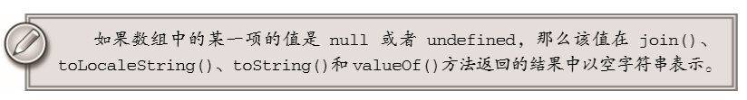
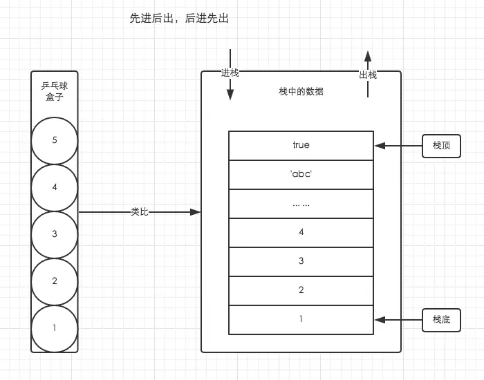
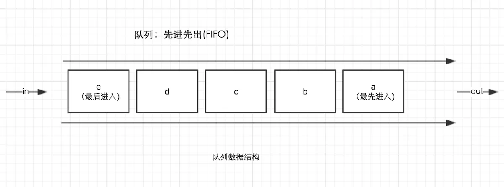
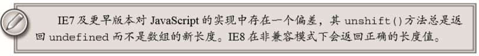
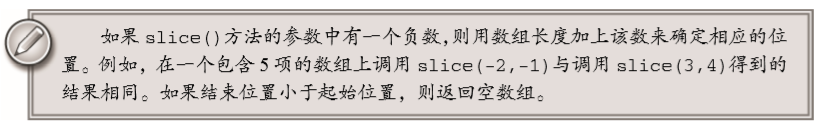

**JS高阶教程第三版读书笔记：引用类型中数组部分。数组的基本概念和常用方法：**

**创建对象的两种方式：**

1. 使用对象的构造函数

````js
let obj = new Object();
obj.name = "thomas";
obj.age = 20;
````

2. 使用对象字面量

````js
let person = {
    name:"thomas",
    age:20
}

let person2 = {};
person2.name = "渣渣辉";
person2.age = 20;
````
对象字面量表示方法是对象定义的一种简写形式，可以简化包含多个属性的对象的创建过程。

这里有一个需要注意的点：在IE7以及更早版本和Opera中，对象字面量的最后一个属性不能再加`,` 。不然会导致报错。

**在通过对象字面量定义对象时，实际上不会调用object构造函数(Firefox2及更早版本会调用Object构造函数;但是Firefox3之后就不会了)**

**在对象中如果key值为数字，那么这个key值会被自动转换为字符串**

````js
let person = {
    name:"渣渣辉",
    5:true //key值会被自动转换为字符串
}
````
----

**对象的两种访问形式：**

````js
/*1. 使用方括号*/ 
console.log(person["name"]);
/*2. 使用.*/ 
console.log(person.name);
````

使用方括号的优势在于，可以通过变量来访问属性：

````js
let varName = "name";
console.log(person[varName]);
````

如果属性名中包含会导致语法错误的字符，或者属性名使用了关键字或者保留字，推荐使用方括号表示法：

````js
person["first name"] = "thomas";
````
因为"first name"中包含一个空格，所有没办法使用点表示法进行访问。这个时候可以使用方括号表示法来访问。

**通常来说，除非必须使用变量来访问属性，否则建议使用点表示法**

----

**Array类型：**

**数组创建的两种基本方式：**

**1. 使用Array构造函数：**

````js
let colors1 = new Array(); //[]
````
可以省略到new关键词：

````js
let colors1 = Array(); //[]
````

如果预先知道数组要保存的项目数量，我们可以通过给构造函数传递数量:

````js
let colors2 = new Array(20); //[ <20 empty items> ] 创建一个length为20的空数组
````

但是如果传入的是其他类型的值，那么就会生成对应元素的数组:

````js
let colors3 = new Array("呵呵");//["呵呵"]
````

但是如果传入多个参数，那么就会被创建成一个带有该参数的数组:

````js
let colors4 = new Array(1,2,3,4,5); // [1,2,3,4,5]
````


**2. 使用数组字面量表示法:**

````js
let colors5 = ["red","blue","green"]; //["red","blue","green"]
````

创建一个空数组：

````js
let colors = []; //[]
````

需要注意的是，不推荐使用以下的方式创建数组。因为会在不同的浏览器下有不同的表示：

````js
let values = [1,2,];// 不要这样！这样会创建一个包含 2 或 3 项的数组
let options = [,,,,,];//不要这样！这样会创建一个包含 5 或 6 项的数组 
````

**与对象一样，在使用数组字面量表示法时，也不会调用 Array 构造函数（Firefox 3 及更早版本除外）。**

**数组访问的方式：**

在方括号中写上要访问的索引值。

````js
let colors = ["red","blue","green"];

console.log(colors[0]);//显示第一项 "red"

colors[2] = "black"; //修改第三项

colors[3] = "brown"; //新增第四项

console.log(colors);//[ 'red', 'blue', 'black', 'brown' ]
````

**数组中的length属性：**

````js
let colors = ["red", "blue", "green"];
colors.length = 2;
console.log(colors[2]); //undefined

var colors = ["red", "blue", "green"];    // 创建一个包含 3 个字符串的数组 
colors.length = 4; alert(colors[3]); //undefined
````

可以发现，当我们改变数组的length属性的值的时候。数组的元素也会随之变化。原本有值的数组项变成了undefined，原本没有值的数组项也变成了undefined

可以利用length属性方便的在数组末尾添加新项：

````js
let colors = ["red", "blue", "green"];// 创建一个包含 3 个字符串的数组 
colors[colors.length] = "black";//（在位置 3）添加一种颜色 
colors[colors.length] = "brown";//（在位置 4）再添加一种颜色
````

数组的length属性是动态的，每当数组的元素个数发生变化的时候。length属性都会相应的改变：

````js
let colors = ["red", "blue", "green"];// 创建一个包含 3 个字符串的数组 
colors[99] = "black";// （在位置 99）添加一种颜色 alert
(colors.length); // 100

/*在这个例子中，我们向 colors 数组的位置 99插入了一个值，结果数组新长度（length）就是 100 （99+1）。而位置 3到位置 98实际上都是不存在的，所以访问它们都将返回 undefined。*/ 
````


**数组的检测：**

1. instanceof

````js
if(value instanceof Array){}
````

2. isArray

````js
if(Array.isArray(value)){}
````

**数组的转换方法：**

每个对象都具有toLocaleString(),toString()和valueOf()方法。

1. 其中，调用数组的toString()方法会返回由数组中每个值的字符串形式拼接而成的一个以逗号分隔的字符串。
2. valueOf:返回的还是数组。

````js
let colors = ["red", "blue", "green"];
console.log(colors.toString())  // red,blue,green 
console.log(colors.valueOf())  // [ 'red', 'blue', 'green' ] 
console.log(colors) //[ 'red', 'blue', 'green' ]
````
3. toLocaleString()方法经常也会返回与toString()和valueOf()方法相同的值。但是也不总是如此。当调用数组的toLocaleString()方法时，它也会创建一个数组值的以逗号分隔的字符串。

4. join:使用 join()方法，可以使用不同的分隔符来构建这个字符串。join()方 法只接收一个参数，即用作分隔符的字符串，然后返回包含所有数组项的字符串。

````js
let colors = ["red","green","blue"];
console.log(colors.join(",")); //red,green,blue
console.log(colors.join("||")); //red||green||blue
````
**如果不给join()方法传入任何值，或者给它传入 undefined，则使用逗号作为分隔符。IE7及更早版本会错误的使用字符串"undefined"作为分隔符**



**数组的栈方法：push,pop** 

ES数组提供了一种让数组的行为类似于其他数据结构的方法。简单的来说，数组可以表现得像栈一样。

栈的特点是：先进后出，后进先出。也就是说最新添加的项目，最早被移除。在栈中元素的插入（叫做推入）和移除（叫做弹出），只会发生在栈的顶部。



数组有push()和pop()两个方法，可以模拟栈的行为。

1. push：可以接收任意数量的参数，把他们逐个添加到数组末尾，并**返回修改后的数组长度。**
2. pop：从数组末尾移除最后一项，减少数组的length值，然后**返回移除的项。**

````js
var colors = new Array(); //创建一个数组
var count = colors.push("red","green");//推入两项
console.log(count); //返回当前数组的长度 2

count = colors.push("black"); //推入一项
console.log(count); //返回当前数组的长度 3 

var item = colors.pop();
console.log(item);//返回被弹出的值 black
console.log(colors.length);//当前的数组长度 2
````

**可以将栈方法于其他的数组方法一起连用：**

````js
var colors = ["red","blue"];
colors.push("brown");
colors[3] = "black"; 
console.log(colors.length); //4

var item = colors.pop();
console.log(item) //black
````

**数组的队列方法:shift,unshift**

与栈数据的访问规则不一致，队列数据结构的访问规则是先进先出：



队列是在列表的末端添加项，从列表的前端移除项。由于push是向数组末端添加项的方法，因此要模拟队列只需一个从数组前端取得项的方法。实现这一操作的数组方法就是shift。

shift：它能够移除数组中的第一个项并**返回该项**，同时将数组的长度减1.

结合使用shift()和push()方法，可以像使用队列一样使用数组。

````js
var colors = new Array();
var count  = colors.push("red","green"); //推入2项
console.log(count);//2

count = colors.push("black") //推入另一项
console.log(count); //3

var item = colors.shift();//取得第一项
console.log(item); //red
console.log(colors.length); //2
````

unshift：向数组前端添加任意个项并**返回新数组的长度**。unshift和shift的用途是相反的。所有unshift结合pop方法可以反向实现队列。(也就是在数组前端添加项，然后从数组末端移除项)

````js
var colors = new Array();
var count  = colors.unshift("red","green"); //推入两项
console.log(count);//2

count = colors.unshift("black") //推入另外一项
console.log(count);//3

var item = colors.pop(); //取得最后一项
console.log(item);//green
console.log(colors.length);//2
````



**数组重排序：reverse,sort**

1. reverse:颠倒数组,**返回颠倒后的数组**。

````js
var colors = new Array();
var count  = colors.unshift("red","green"); //推入两项

let value = colors.reverse() //颠倒数组
console.log(value); // [ 'green', 'red' ]
````

2. sort:在默认情况下，sort方法按照升序排列数组项（也就是从小到大排序）。**并且返回排序后的数组**。
   
>为了实现排序，sort方法会调用每个数组项的toString转型方法，然后比较得到的字符串，以确定如何排序。需要注意的是：即使数组的每一项都市数值，sort方法比较的也是字符串：

````js
var values = [0,1,5,10,15];
var s = values.sort();
console.log(s); //[ 0, 1, 10, 15, 5 ]
console.log(values);//[ 0, 1, 10, 15, 5 ]
````

需要注意的是：sort的排序并不是完全准确的：

````js
var values = [0,1,5,10,15];
values.sort();
console.log(values) //[ 0, 1, 10, 15, 5 ]
````
可以发现，数字5排序到了10和15后面。这是因为，虽然数值5小于10，但是在进行字符串比较时，"10"则位于"5"的前面，于是数组的顺序就被修改了。所有为了准确的排序，我们可以给sort方法传递一个比较函数。

sort方法可以接收一个比较函数作为参数，以便我们指定哪个值位于哪个值的前面。

比较函数接收两个参数，如果第一个参数应该位于第二个之前则返回一个负数，反之则返回一个正数。如果两个参数相等则返回0，

````js
//比较函数1
function compare(value1,value2){
    if(value1 < value2){
        return -1;
    }else if(value1 > value2){
        return 1;
    }else{
        return 0;
    }
}

//比较函数2
function compare2(value1,value2){
    return value2 - value1
}

var values = [0,1,5,10,15];
values.sort(compare)
console.log(values); //[ 0, 1, 5, 10, 15 ]
````


**数组操作方法:concat,slice,splice**

1. concat:复制当前数组的一个副本，然后将接收到的参数添加到这个副本的末尾，最后返回新构建的数组。如果没有给concat传参，那么就会简单的返回一个当前数组副本。

````js
var colors =["red", "green", "blue"];
var colors2 = colors.concat("yellow",["black","brown"])

console.log(colors);//[ 'red', 'green', 'blue' ]
console.log(colors2); //[ 'red', 'green', 'blue', 'yellow', 'black', 'brown' ]
````
2. slice:它能够基于当前数组中的一或多个项创建一个新数组。slice()方法可以接受一或两个参数，即要返回项的起始和结束位置。在只有一个参数的情况下，slice()方法返回从该参数指定位置开始到当前数组末尾的所有项。如果有两个参数，该方法返回起始和结束位置之间的项,但不包括结束位置的项。slice()方法不会影响原始数组。

````js
var colors = ["red", "green", "blue", "yellow", "purple"]; 
var colors2 = colors.slice(1); //截取从第一项到最后一项
var colors3 = colors.slice(1,4); //截取第一项到第四项之前
 
console.log(colors2);   //[ 'green', 'blue', 'yellow', 'purple' ]
console.log(colors3);   //[ 'green', 'blue', 'yellow' ]
````



3. splice方法非常的强大：它主要有以下三个功能:
   
   1. 删除：可以删除任意数量的项，只需指定 2 个参数：要删除的第一项的位置和要删除的项数。 例如，splice(0,2)会删除数组中的前两项
   
   2. 插入：可以向指定位置插入任意数量的项，只需提供 3个参数：起始位置、0（要删除的项数） 和要插入的项。如果要插入多个项，可以再传入第四、第五，以至任意多个项。例如， splice(2,0,"red","green")会从当前数组的位置 2开始插入字符串"red"和"green"。 
   
   3. 替换：可以向指定位置插入任意数量的项，且同时删除任意数量的项，只需指定 3 个参数：起 始位置、要删除的项数和要插入的任意数量的项。插入的项数不必与删除的项数相等。例如， splice (2,1,"red","green")会删除当前数组位置 2 的项，然后再从位置 2 开始插入字符串 "red"和"green"。 

splice()方法始终都会返回一个数组，该数组中包含从原始数组中删除的项（**如果没有删除任何项，则返回一个空数组**）。下面的代码展示了上述3种使用splice()方法的方式：

````js
var colors = ["red", "green", "blue"]; 

//删除
var removed = colors.splice(0,1);                // 删除第一项 alert(colors);     // green,blue 
console.log(removed);    // [ 'red' ]，返回的数组中只包含一项 

//插入
removed = colors.splice(1, 0, "yellow", "orange");   // 从位置 1 开始插入两项 
console.log(colors);     // [ 'green', 'yellow', 'orange', 'blue' ] 
console.log(removed);    //[] 返回的是一个空数组 

//替换
removed = colors.splice(1, 1, "red", "purple");      // 插入两项，删除一项 
console.log(colors);     // [ 'green', 'red', 'purple', 'orange', 'blue' ]
console.log(removed);    // [ 'yellow' ] 返回的数组中只包含一项 
````

**数组的位置方法：indexOf，lastIndexOf** 

这两个方法都是返回要查找的项在数组中的位置，并且两个参数都能接收到两个参数。其中第一个参数是可选的，表示进行查找的初始位置。如果没有找到则返回-1。比较的时候采用的是全等操作符。


1. indexOf:是返回在数组中首先出现的位置
2. lastIndexOf:是返回在数组中最后出现的位置

````js
var numbers = [1,2,3,4,5,4,3,2,1]
console.log(numbers.indexOf(4)); //3
console.log(numbers.lastIndexOf(4)); //5

console.log(numbers.indexOf(4, 4));//5 
console.log(numbers.lastIndexOf(4, 4)); //3
````

**数组迭代方法:every,filter,forEach,map,some**

数组的5个迭代方法都接收2个参数：

1. 要在每一项上运行的函数
2. （可选的）运行该函数的作用域对象

传入这些方法的函数会接收三个参数：

1. 数组项的值
2. 对应的索引值
3. 数组对象本身

1. every:对数组的每一项运行给定函数，如果该函数对每一项都返回true，则返回true。
2. filter：对数组中的每一项都运行给定函数，返回该函数会返回true的 项组成的数组。
3. forEach：对数组中的每一项运行给定函数，这个方法没有返回值。
4. map：对数组中的每一项运行给定函数，返回每次函数调用的结果组成的数组。
5. some：对数组中的每一项运行给定函数，如果该函数对任一项返回true，则返回true。

这些方法都不会修改数组中的包含的值：

`every和some：`

````js
var numbers = [1,2,3,4,5,4,3,2,1];

var everyResult = numbers.every(function(item,index,array){
    return (item > 2)
})
console.log(everyResult); //false

var someResult = numbers.some(function(item,index,array){
    return (item > 2)
})
console.log(someResult); //true

````
以上代码调用了every()和some()，传入的函数只要给定项大于2就会返回true。对于every()， 它返回的是 false，因为只有部分数组项符合条件。对于 some()，结果就是 true，因为至少有一项 是大于 2的。

`filter：`

````js
var numbers = [1,2,3,4,5,4,3,2,1];

var filterResult = numbers.filter(function(item,index,array){
    return (item > 2)
})
console.log(filterResult); //[ 3, 4, 5, 4, 3 ]
````

这里，通过调用 filter()方法创建并返回了包含 3、4、5、4、3的数组，因为传入的函数对它们 每一项都返回 true。这个方法对查询符合某些条件的所有数组项非常有用。 

`map：`

````js
var numbers = [1,2,3,4,5,4,3,2,1];

var mapResult = numbers.map(function(item,index,array){
    return item*2;
})

console.log(mapResult); //[2, 4, 6, 8, 10, 8, 6, 4, 2]
````
以上代码返回的数组中包含给每个数乘以 2之后的结果。这个方法适合创建包含的项与另一个数组 一一对应的数组。 在我们的react中这个map经常会用于遍历我们的标签。

`forEach：` 它只是对数组中的每一项运行传入的函数。这个方法没有返回值， 本质上与使用 for 循环迭代数组一样。来看一个例子。 

````js
var numbers = [1,2,3,4,5,4,3,2,1]; 
 
numbers.forEach(function(item, index, array){     
    //执行某些操作  
}); 
````

**数组归并方法：reduce，reduceRight**

1. reduce()：方法从数组的第一项开始，逐个遍历到后。
2. reduceRight()：从数组的后一项开始，向前遍历到第一项。
   
这两个方法都会迭代数组的所有项，然后构建一个终返回的值。这两个方法都接收两个参数：

1. (可选的)在每一项上调用的函数
2. 归并基础的初始值

第一函数参数都是接收4个值：
 
1. 前一个值
2. 当前值
3. 项的索引
4. 数组对象

这个函数返回的任何值都会作为第一个参数自动传给下一项。第一次迭代发生在数组的第二项上，因此第一个参数是数组的第一项，第二个参数就是数组的第二项。

````js
/*使用 reduce()方法可以执行求数组中所有值之和的操作:*/
var values = [1,2,3,4,5]; 
var sum = values.reduce(function(prev,cur,index,array){
    return prev + cur;
})
console.log(sum); //15

/*使用 reduce()方法给基础数组添加元素:*/
var values2 = ["呵呵","哈哈"]; 
var sum2 = values.reduce(function(prev,cur,index,array){
    prev.push(cur);
    return prev
},["嘿嘿"])
console.log(sum2); //[ '嘿嘿', '呵呵', '哈哈' ]
````
 
reduceRight()的作用类似，只不过方向相反而已：

````js
var values = ["1","2","3"]; 
var sum = values.reduceRight(function(prev,cur,index,array){
    prev.push(cur);
    return prev
},["0"])
console.log(sum); //[ '0', '3', '2', '1' ]
````
