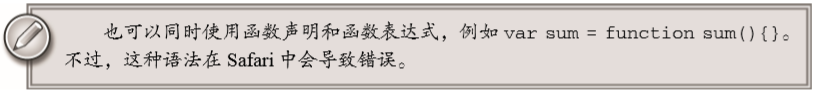
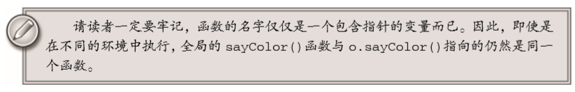

**JS高阶教程第三版读书笔记，关于函数的基本概念......**

函数实际也是一个对象，每个函数都是Function类型的实例。同其他引用类型一样具有属性和方法。因为函数是对象，所以函数名实际上也是一个指向函数对象的指针，不会与某一个函数绑定。

**函数声明语法:**

````js
/*第一种方式:*/
function sum (num1,num2){
    return num1 + num2;
}

/*第二种方式:*/ 
var sum = function(num1,num2){
    return num1 + num2;
}

````

Function 构造函数可以接收任意数量的参数， 但后一个参数始终都被看成是函数体，而前面的参数则枚举出了新函数的参数

````js
/*第三种方式：*/
var sum = new Function("num1","num2","return num1 + num2"); //不推荐
````

>从技术角度讲，这是一个函数表达式。但是，我们不推荐读者使用这种方法定义函数，因为这种语 法会导致解析两次代码（第一次是解析常规ECMAScript代码，第二次是解析传入构造函数中的字符串） ， 从而影响性能。不过，这种语法对于理解“函数是对象，函数名是指针”的概念倒是非常直观的。 

因为函数的名仅仅只是指向函数的指针，因此函数名与包含对象指针的其他变量没有任何不同。例如，数组、对象等。也就是说一个函数对象能够被不同的变量所引用：

````js
function sum(num1, num2){     
    return num1 + num2; 
} 
console.log(sum(10,10));//20 
 
var anotherSum = sum; 
console.log(anotherSum(10,10)); //20 
 
sum = null; 
console.log(anotherSum(10,10)); //20 
````

**JS中是没有函数的重载的：** 

在js中没有函数重载，因为js中的函数名只是一个指针。当两个同名函数出现的时候，那么后一个会覆盖前一个。

````js
function addSomeNumber(num){return num + 100;} 
 
function addSomeNumber(num) {return num + 200;} 
 
var result = addSomeNumber(100); //300
````

**函数的声明和函数的表达式:**

解析器在向执行环境中加载数据的时候，对于函数声明和函数表达式并非一视同仁。解析器会率先读取函数声明，并使其在执行任何代码之前可用（可以访问）。对于函数表达式，则必须等到解析器执行到它所在的代码和，才会真正被解释执行。

````js
func1() //func1
func2() //报错
function func1(){
    console.log("func1");
}

var func2 = function(){
    console.log("func2");
}
````
执行代码不难发现，func1可以正常运行。但是func2没办法执行。这就是因为在代码开始执行之前，**解析器就已经通过了一个函数声明提升的过程。读取并将函数声明添加到执行环境中。** 代码求值的时候，JS引擎在第一遍会声明函数并将他们放到源代码树的顶部。

函数表达式之所以会报错，原因是在于函数位于一个初始化的语句中，而不是一个函数声明。换句话来说，在执行到函数所在的语句之前，变量func2中不会保存有对函数的引用。

**其实，除了函数声明能够被函数声明提升外。函数表达式和函数声明的语法是等价的。**



**函数作为值：**

因为 ECMAScript中的函数名本身就是变量，所以函数也可以作为值来使用。也就是说，不仅可以 像传递参数一样把一个函数传递给另一个函数，而且可以将一个函数作为另一个函数的结果返回。

````js
/*把函数作为参数传入另外一个函数*/
function add(num1,num2){
    return num1 + num2;
}

function getSum(fn,num1,num2){
    return fn(num1,num2)
}   

console.log(getSum(add,1,2)); //3

/*一个函数的返回结果是另外一个函数*/
function sum(){
    return function(){
        console.log("hello")
    }
}
sum()() //hello
````

**函数内部属性:arguments,this,callee,caller**

在函数内部，有两个特殊的对象：

1. arguments：它是一个类数组对象，包含着传入函数中的所有参数。虽然arguments的主要用途是保存函数参数，但这个对象还有一个名叫callee的属性。该属性是一个指针，指向拥有这个arguments对象的函数。

````js
function foctorial(num){
    if(num<=1){
        return 1;
    }else{
        return num * foctorial(num - 1)
    }
}
console.log(foctorial(5)); //120
````
>定义阶乘一般都要用到递归算法；如上的代码所示，在函数有名字，而且名字以后也不会变化的情况下，这样定义是没有问题的。但是存在的问题是：这个函数的执行与函数名factorial紧紧耦合在了一起。为了消除这种紧密耦合的现象，可以使用arguments.callee(指向函数)

````js
function foctorial(num){
    if(num<=1){
        return 1;
    }else{
        return num * arguments.callee(num - 1)
    }
}
console.log(foctorial(5)); //120
````

2. this：引用的是函数据以执行的环境对象。

关于this的部分，可以参考之前我自己的文章:[ES5中的this指向](https://lmxyjy.github.io/ES5%E4%B8%AD%E7%9A%84this%E6%8C%87%E5%90%91/)





ECMAScript 5也规范化了另一个函数对象的属性：caller。除了 Opera的早期版本不支持，其他 浏览器都支持这个 ECMAScript 3并没有定义的属性。

caller:这个属性中保存着调用当前函数的函数的引用，(也就是说，函数caller指向调用它的函数)。如果是在全局作用域中调用当前函数，它的值为null。

````js
function  outer(){
    inner();
}

function inner(){
    console.log(inner.caller);
}

outer() 
/*ƒ outer(){
        inner();
    }*/
````
以上代码会显示 outer()函数的源代码。因为 outer()调用了 inter()，所以 inner.caller 就指向 outer()。为了实现更松散的耦合，也可以通过 arguments.callee.caller 来访问相同的信息。


````js
function  outer(){
    inner();
}

function inner(){
    /*因为arguments.callee 指向 inner*/
    console.log(arguments.callee.caller);
}

outer() 
/*ƒ outer(){
        inner();
    }*/
````

除此以外，需要明确的知道。函数的caller和arguments.caller不是同一个概念。不要混淆。

>当函数在严格模式下运行时，访问 arguments.callee 会导致错误。ECMAScript 5 还定义了 arguments.caller 属性，但在严格模式下访问它也会导致错误，而在非严格模式下这个属性始终是 undefined。定义这个属性是为了分清 arguments.caller 和函数的 caller 属性。以上变化都是为 了加强这门语言的安全性，这样第三方代码就不能在相同的环境里窥视其他代码了。 严格模式还有一个限制：不能为函数的 caller 属性赋值，否则会导致错误。 

**函数的属性和方法:length,prototype,call,apply,bind**

因为函数是对象，所以函数也有自己的属性和方法。每个函数都有2个属性：

1. length:length属性表示函数希望接收的命名参数的个数，如下面的例子所示。

````js
function sayName(name){
    console.log(name);
}

function sum(num1,num2){
    return num1 + num2;
}
function sayHi(){
    console.log("hi");
}
console.log(sayName.length);//1
console.log(sum.length);//2
console.log(sayHi.length);//0
````

2. protorype:对于 ECMAScript 中的引用类型而言，prototype 是保存它们所有实例方法的真正所在。在创建自定义引用类型以及实现继承时，prototype 属性的作用是极为重要的。在 ECMAScript 5中，prototype 属性是不可枚举的，因此使用 for-in 无法发现。 

----

`**prototype会在之后的学习后形成博客,在这里留个未来的连接。**`

----

每个函数都包含两个非继承而来的方法：`apply()`和 `call()`。这两个方法的用途都是在特定的作用域中调用函数，实际上等于设置函数体内 this 对象的值

关于`apply`,`call`,`bind`这三个函数方法，可以参考自己的文章:[箭头函数和Call、Apply、Bind](https://lmxyjy.github.io/%E7%AE%AD%E5%A4%B4%E5%87%BD%E6%95%B0%E5%92%8CCall-Apply-Bind/)

**函数的基本篇到这里就结束了。**