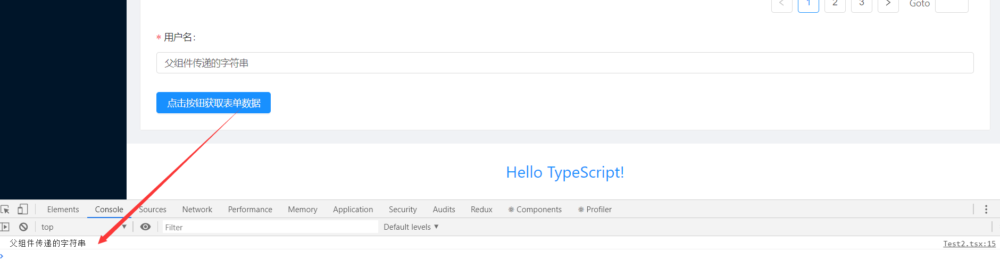

**最近在练习使用react-hooks + ts + antd制作一个项目，在过程中出现不少的问题，特此记录下来：**

>问题一：函数组件中，初始化的函数方法拿不到最新的状态值(已解决)

>问题二，在函数组件中，给antd的级联选择器初始化options的时候，改变options状态值，但是级联选择器中的数据依旧是初始值。(未解决)

>问题三，在函数组件中，父组件如何调用子组件中的方法。(已解决)
   
>问题四，在被Form.create()()包装过后的子组件，父组件无法直接传递值到子组件中去,同时也无法调用子组件中的方法(已解决)

**问题一：函数组件中，初始化的函数方法拿不到最新的状态值**

当时我的业务场景是，我在点击商品下架后，去后台请求我当前页码的数据，实现刷新当前页码商品的状态的效果。但是我发现我在函数中所得到的页码总是初始化的值。没办法实现我想要的效果。我写了一个简单的示例代码还原当时的状态值问题：


````jsx
import React,{useState,useEffect,useRef} from 'react';

const App=()=>{
	/*button click*/
	const btnClick = ()=>{
		console.log("initButton getting state is====>",nowState); //can't get now state ,all is init value
	}
	/*init a button*/ 
	const initTitle = ()=>{
		return (
			<button onClick={btnClick}>click</button>
		)
	}
	const [title, settitle] = useState();

	/*now state*/
	const [nowState, setNowState] = useState(0);
    console.log("now state is====>",nowState);
    
	useEffect(()=>{
		settitle(initTitle());
	},[])

	return (
		<>
			{title}
			<button onClick={()=>setNowState(nowState + 1)}>change now state</button>
		</>
	);
}

export default App;
````

可以发现，当在我们点击按钮改变状态值后，我们初始化的button按钮的点击事件中拿到的总是初始化的值0；很明显这不是我们想要的。出现的原因很简单，经过我的观察后，我发现我们初始化的btnClick方法实际上形成了闭包。

再来对闭包的知识点做一个复习：

这里推荐波神的文章[**超性感的React Hooks（二）再谈闭包**](https://juejin.im/post/5dde6ac26fb9a0715d3cb194)

1. 当我们组件第一次挂载的时候，它保存了初始化的值0。
2. 闭包的特质就是能延长我们的作用域，保存我们的状态值。
3. 因为我们是在useEffect中模拟的生命周期componentDidMount,所以初始化后它并不会再次执行。也就没办法获得最新的状态值。

所以，我们每次访问的时候，方法中的状态值总是初始值。

**解决办法：**

使用hooks中的useRef。

````jsx
import React,{useState,useEffect,useRef} from 'react';

const App=()=>{
	const refBox = useRef(null);
	/*button click*/
	const btnClick = ()=>{
		console.log("initButton getting state is====>",nowState); //can't get now state ,all is init value
		console.log(`ref=======>${refBox.current}`); //get now state
	}
	/*init a button*/ 
	const initTitle = ()=>{
		return (
			<button onClick={btnClick}>click</button>
		)
	}
	const [title, settitle] = useState();

	/*now state*/
	const [nowState, setNowState] = useState(0);
	console.log("now state is====>",nowState);
	refBox.current = nowState;
	useEffect(()=>{
		settitle(initTitle());
	},[])

	return (
		<>
			{title}
			<button onClick={()=>setNowState(nowState + 1)}>change now state</button>
		</>
	);
}

export default App;
````
react官方对其的解释是:

>useRef 返回一个可变的 ref 对象，其 .current 属性被初始化为传入的参数（initialValue）。返回的 ref 对象在组件的整个生命周期内保持不变。

也就是说：useRef就像是一个盒子，可以在它的.current的属性中保存任何可变的值。附上官方文档的详细说明，在此不做赘述。

[**官方useRef说明**](https://zh-hans.reactjs.org/docs/hooks-reference.html#useref);

当我们使用useRef.current保存状态后，我们就可以拿到最新的状态值了。

**问题二，在函数组件中，给antd的级联选择器初始化options的时候，改变options状态值，但是级联选择器中的数据依旧是初始值。**

该问题暂时没找到解决的方法，mark一下。解决了再来记录。

**问题三，在函数组件中，父组件如何调用子组件中的方法。**

这个问题在我们之前的类组件写法中其实很简单，就是使用React.create()的方式创建一个ref对象。然后将这个对象挂载到我们对应的子组件上即可。

但是在我写函数组件的时候，我发现这个方法不好使了。控制台直接报了警告，告诉我们不能使用以前的方式去获取函数组件的方法了。建议我们使用React.forwardRef方法去创建组件。

在函数组件中父组件如果想要调用子组件中的方法，整个的流程就是如下demo所示：

````tsx
//父组件
import React from 'react'
import Child from "./App2";


const Demo:React.FC = ()=>{
	const refBox = useRef<HTMLInputElement>(null);

	//点击按钮调用方法，执行子组件中的函数
	const focusTextInput =():void=>{
		if(refBox.current){
			refBox.current.hehe();//调用子组件的hehe方法
		}
	}
	return(
		<>
			<button onClick={focusTextInput}>点击</button>
			<Child ref={refBox} >click me!</Child>
		</>
	)
}

export default Demo;
````

````tsx
//子组件
import React,{useImperativeHandle,Ref} from 'react';

export interface IFunc{
    hehe:()=>void
}

const Child = React.forwardRef((props:any,ref:Ref<IFunc>)=>{
        useImperativeHandle(ref,()=>({
            hehe : ()=>{
                console.log("我是子组件的呵呵方法");
            }            
        }))

    return (
        <button ref={ref}>
            {props.children}
        </button>
    )
})
export default Child;
````
**流程如下：**

1. 父组件中使用`useRef`创建一个ref对象。并且将这个对象挂载到子组件上。
2. 子组件中调用`useImperativeHandle` 方法暴露出需要提供给父组件使用的方法。
3. 父组件使用`refBox.current.hehe()` 的方式调用子组件中的`hehe`方法。

**这里引入了两个新的api：**

`forwardRef` :会创建一个React组件，这个组件能够将其接受的 ref 属性转发到其组件树下的另一个组件中。这种技术并不常见，但在以下两种场景中特别有用：

1. 转发 refs 到 DOM 组件
2. 在高阶组件中转发 refs

这里我们就使用了它的转发，将我们需要的方法转发到了我们的父级组件中

`useImperativeHandle` : 可以让你在使用 ref 时自定义暴露给父组件的实例值。在大多数情况下，应当避免使用 ref 这样的命令式代码。useImperativeHandle 应当与 forwardRef 一起使用

[**这里附上别人对这两个API的详解：**](https://mp.weixin.qq.com/s/7Vuy_zzJnYpBiGBK5ps09A)

**问题四，在被Form.create()()包装过后的子组件，父组件无法直接传递值到子组件中去,同时也无法调用子组件中的方法**

我的需求是：调用子组件中的表单方法发送数据。但是这里遇到了一个问题：

1. 子组件是antd的表单组件。当子组件被Form.create包装过后，父组件直接给子组件传值会导致ts报错。
2. 父组件调用表单子组件中的方法。


解决的办法其实就在antd的文档当中：

[**antd Form表单如何在ts中使用**](https://ant.design/components/form-cn/#components-form-demo-validate-other)

**首先对于父子组件传值的问题：**

这里我们需要导入antd定义的form表单的接口定义，也就是:

`import { FormComponentProps } from 'antd/lib/form/Form';`

示例demo如下:

````tsx
// 子组件child
import React from 'react'
import {Form,Input} from "antd";
import {FormComponentProps} from "antd/es/form";

const Item = Form.Item;

//集成form表单的接口
interface IProps extends FormComponentProps{
    propsValue:string //父组件传递过来的值
}

const App:React.FC<IProps> =({form,propsValue})=>{
    const {getFieldDecorator} = form;
    
    return (
		<Form>
			<Item label="用户名：">
                {getFieldDecorator('username', {
                    initialValue:propsValue,
                    rules: [
                        {required: true,whitespace:true,message: '账号不能为空或者空格!' },
                    ],
                })(
                    <Input
                        placeholder="输入用户名"
                    />,
                )}
			</Item>
		</Form>
    )
}
export default Form.create<IProps>({})(App); //这里需要使用定义好的接口
````
**父组件传值如下:**

````tsx
//父组件
import React from 'react'
import Child from "./Test";

const Parent:React.FC<any>=()=>{
	return (
		<Child
			propsValue="父组件传递的字符串"
		/>
	)
}
````
以上我们就解决了antd表单子组件中的父子组件传值的问题，接下来比如我们想要调用子组件中的`getFieldDecorator`方法那么我们应该这么做：

首先明确知道的是：函数组件中想要父组件调用子组件的方法我们必须要借助`useRef`、`useImperativeHandle` 、`forwardRef` 的力量。在antd的form表单组件中我们可以通过暴露表单form实例的方法去实现需求。具体的demo如下:

````tsx
//子组件
import React,{forwardRef,Ref,useImperativeHandle} from 'react'
import {Form,Input} from "antd";
import {FormComponentProps} from "antd/es/form";

const Item = Form.Item;

 //父组件传递过来的值
interface IProps{
    propsValue:string,
    ref:Ref<any>,
    form:any
}

const App = forwardRef<FormComponentProps,IProps>(({form,propsValue},ref)=>{
    const {getFieldDecorator} = form;
    useImperativeHandle(ref,()=>({
        form,
    }))
    return (
		<Form>
			<Item label="用户名：">
                {getFieldDecorator('username', {
                    initialValue:propsValue,
                    rules: [
                        {required: true,whitespace:true,message: '账号不能为空或者空格!' },
                    ],
                })(
                    <Input
                        placeholder="输入用户名"
                    />,
                )}
			</Item>
		</Form>
    )
})
export default Form.create<IProps>({})(App);
````

````tsx
//父组件
import React,{useRef} from 'react'
import Child from "./Test";
import {Button} from "antd"

interface IValues{
    username:string
}

const App:React.FC<any>=()=>{
    const refBox = useRef<any>(null);
    //点击调用子组件的方法得到表单的值
    const getInputValue = ():void=>{
        refBox.current.validateFields((err:any,values:IValues)=>{
            if(!err){
                console.log(values.username);
            }
        })
    }
    return (
        <>
        <Child 
        ref={refBox}
        propsValue="父组件传递的字符串"
        />
        <Button onClick={getInputValue} type="primary">点击按钮获取表单数据</Button>
        </>
    )
}
export default App;
````

**结果如下：** 点击按钮，控制台成功拿到了表单收集器中拿到的值。需求完美解决：

