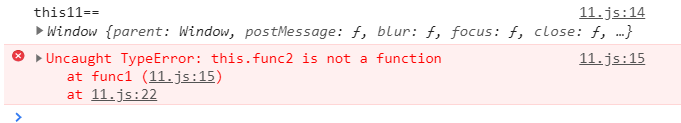

**js中this一直是我们前端程序员的一个痛点。今天下定决心给它安排明白了......**

**首先，我们必须明确的一点是：在ES5中this的指向不是在函数声明或者函数定义时就确定的。而是在函数执行的时候才能确定。**

**需要牢记一句话：this的指向取决于最后调用它的对象。** 如果这篇博文有幸被人看到，那么在这里肯定有人会说。你TM不是在说废话，我看了还是不能理解。

不用捉急，这里我们干说肯定是不行，所以上代码来真真切切的体会一下这句话的意思。

第一个例子：

````js
function getThis(){
    console.log("this====",this)
}
getThis()
//this==== Window
````

这个例子中，我们执行函数`getThis`可以得出this的指向是Window。为什么呢?因为我们的函数是被Window调用的。也就是说代码等同于：

````js
function getThis(){
    console.log("this====",this)
}
window.getThis()
//this==== Window
````
这个时候，我们回过头去看之前那句话`this的指向取决于最后调用它的对象。` 所以这个时候我们的this指向的就是window。

第二个例子：

````js
var name = "我是属于window的"
let obj = {
    name:"我是obj的对象",
    getThis:function(){
        console.log("this===",this.name)
    }
}
obj.getThis()
//this=== 我是obj的对象
````
在上一个例子的基础上，我们不难看出this是指向obj的。因为我们最后的getThis方法是被obj调用的。所以这个时候我们再感受一下这句话`this的指向取决于最后调用它的对象。`你是不是有点感觉了。

第三个例子：

````js
var name = "我是属于window的"
let obj = {
    name:"我是obj的对象",
    getThis:function(){
        console.log("this===",this.name)
    }
}
var newFunc = obj.getThis;
newFunc();
//this=== 我是属于window的
````
这个例子相比于之前的两个例子来说会比较坑。可能有人会说为什么this是指向的window。那是因为newFunc只是被赋值了。实际这个函数最终是被window调用的。所以它指向的是window。实际的调用相当于如下的代码所示：

````js
...
newFunc();
window.newFunc();
````
再看看这里例子，想想为什么

````js
var obj = {
    name:'kak',
    func1:function(){
        console.log("this11==",this);
        this.func2()
    },
    func2:function(){
        console.log("this22==",this);
    }
}
var newFunc1 = obj.func1;
newFunc1()
````
结果如下：



根据例三不难得知，这个时候的this指向的是window。然后我们通过this去调用func2。很明显咱们的全局window上并没有这个方法。所以会导致报错。这也说明了：`this总是指向最后一个调用它的函数`

第四个例子：

````js
var name = "我是属于window的"
let obj = {
    name:"我是obj的对象",
    getThis:function(){
        setTimeout(function(){
            console.log(this.name)
        },10)
    }
}
obj.getThis()
//我是属于window的
````

这个例子好像看起来推翻了我们之前的准则`this指向的总是最后一个调用它的对象`。实际并不是。因为在这里我们确实是通过window来调用setTimeout的。所以我们setTimeout中的this是指向window的。

**这里我们补充一个知识点，函数的调用规则是什么？**

函数的调用规则一共有以下的四种方式：

1. 作为一个函数调用
2. 函数作为方法调用
3. 使用构造函数调用函数
4. 作为函数方法调用函数（call、apply）

第一种：作为一个函数调用

````js
function getThis(){
    console.log("this====",this)
}
getThis()
````
这是一个全局函数，直接挂载到了全局对象window上面。很明显在直接调用的时候this指向的就是window。

第二种：作为方法调用

````js
var obj = {
    fn:function(){
        console.log("hello javaScript")
    }
}
obj.fn()
````
这里我们在对象obj上挂载了一个fn方法。我们使用`.`的方式调用了这个方法。其实方法一和方法二并没有太大的区别。因为全局对象也是对象，全局函数就是全局对象的方法。我们调用全局函数的时候只是省略了`window`而已。

第三种：使用构造函数的方式调用

````js
function Person(name,age){
    this.name = name;
    this.age = age;
}
var man = new Person("thomas",25);
````

这种调用方式和其他的调用方式最明显的区别就是我们需要使用`new`关键字。

第四种：使用函数方法调用

>什么是函数方法?

我们知道js中万物皆对象。不可避免的函数在js中也可以被归为对象，所以函数必然也有自己的属性和方法。

其中我们所熟知的`call`,`apply`就是函数的方法。它可以改变咱们this的指向。这个我们之后再讲。

````js
var name = "window"
var obj = {
    name:"obj",
    fn:function(){
        console.log("this===",this.name)
    }
}
var newFn = obj.fn;
newFn() //作为函数调用
newFn.apply(obj) //使用函数方法调用
//this=== window
//this=== obj
````
当我们使用`call`,`apply`进行函数调用时。就是使用函数方法调用函数。

**函数的调用方式讲完了，这个时候我们再回头看以下第四个例子**

````js
var name = "我是属于window的"
let obj = {
    name:"我是obj的对象",
    getThis:function(){
        console.log(this.name)
        setTimeout(function(){
            console.log(this.name)
        },10)
    }
}
obj.getThis()
//我是属于window的
````
**过程分析：**

在getThis方法中：

1. 当我使用`obj.getThis()`调用函数的时候，我是把函数getThis作为对象obj的一个方法去调用。
2. 这个时候我们如果在`getThis`方法中定时器`setTimeout`外加一个`console.log(this.name)`的话。根据咱们之前的this原则`this总是指向最后一个调用它的对象`。不难得知这个打印的结果是`我是obj的对象`。

接下来我们分析一下在`setTimeout`中发生了什么。

1. 我们知道在`setTimeout`中我们会在10ms后执行一个匿名函数。

那么问题来了。之前的`getThis`方法是有名字的。所以它能够被`.`的方式去调用。我们很容易就知道它的this是指向什么。但是匿名函数是没有名字的所以我们不可能使用`.`去调用它。那么它的this指向是什么呢？

再来回顾一下我们之前的this准则`this总是指向最后一个第调用它的对象`。但是匿名函数我们没办法通过其他对象去调用。所以匿名函数的this是指向的window。

因为匿名函数的特殊性，我们不能直接调用它，但是我们可以通过类似于`setTimeout`等方式去调用它。很明显`setTimeout`是把匿名函数作为一个回调函数去调用，这里属于函数调用方式一。

记住这句话：**在非严格模式下，没有直接的挂载者（或称调用者）的函数中this是指向window，这是约定俗成的。在“use strict”严格模式下，没有直接的挂载者的话，this默认为undefined**

咱们再来看一个例子：

````js
    var name = "window";
    function fn() {
        var name = 'fn';
        func();
        function func() {
            console.log(this.name);
        }
    }
    fn()
    // window
````

在这个例子中，为什么输出的window。咱们回顾一下函数的四种调用方式。不难看出`func`函数的调用属于方式一。在方式一中我们知道它相当于是全局window对象的方法。所以this是指向的window。

我们可以写个例子测试一下：

````js
var name = "window";

function fn() {
    var name = 'fn';
    func1();
    function func1() {
        func2()
        function func2(){
            console.log(this.name);
        }  
    }
}
//window

 let obj = {
        name : "obj",
        func1:function(){
            this.func2()
        },
        func2:function(){
            func3()
            function func3(){
                console.log(this.name);
            }
        }
 }
obj.func1()
//window
````
可以看到两个函数都是以方式一的模式调用的。所以都是指向的window。

**尾巴**

留一个作业：(下一篇文章来解答)

>提示：函数的调用方式二：使用方法的形式调用函数

````js
    var length = 10

    function fn() {
        console.log(this.length);
    }
    var obj = {
        length: 5,
        method: function (fn) {
            fn()
            arguments[0]()
        }
    }
    obj.method(fn, 1)   
````

关于es5中的this指向性问题，暂时先总结到这里。下一篇的内容暂时定为
1. `箭头函数`中的this指向性问题。
2. 如何改变this的指向。
3. `call`,`apply`,`bind`的作用和它们互相之间的区别。