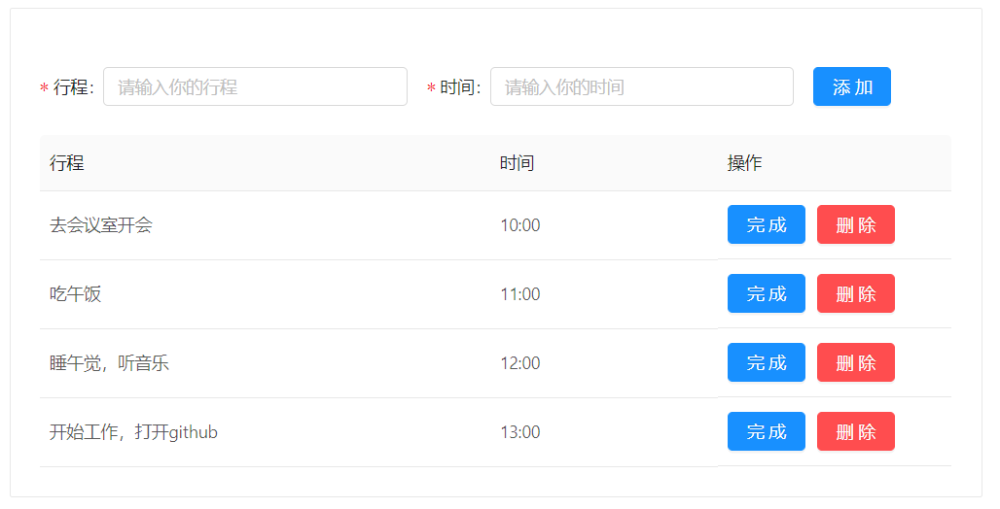
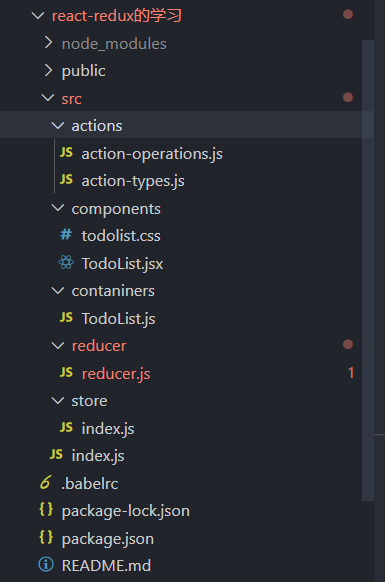
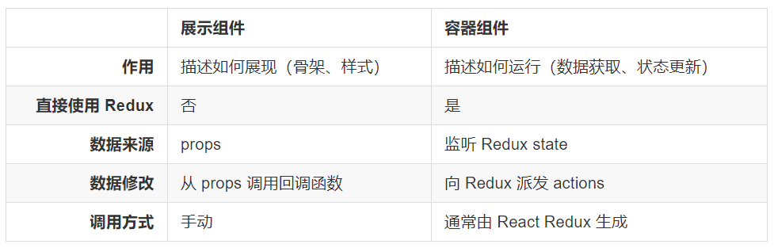

**react中的状态管理模式，react-redux的基本概念和使用方法....**

**react-redux 是一个专为 React 应用程序开发的状态管理模式。相对于redux，react-redux多了几个新的概念：**

1. connect([mapStateToProps], [mapDispatchToProps], [mergeProps], [options]):接收四个参数，它们分别是：
   
   1. `mapStateToProps`：mapStateToProps(state, ownProps)，这个函数允许我们将store中的数据作为props绑定到组件上
   2. `mapDispatchToProps`：它的功能是，将 `action` 作为 `props` 绑定到我们的组件上。
   3. `mergeProps`：不管是 stateProps 还是 dispatchProps ，都需要和 ownProps merge 之后才会被赋给 我们的组件 。 connect 的第三个参数就是用来做这件事。通常情况下，你可以不传这个参数， connect 就会使用 Object.assign 替代该方法。
   4. `options`：这个参数很少会用到，这里附上中文文档的定义:[文档地址](https://segmentfault.com/a/1190000017064759#item-2)
   
2. Provider：<Provider/>使得每一个被connect()函数包装过的嵌套组件都可以访问到Redux store。简单的来说，它就是react-redux提供的容器组件。

----

**示例：使用react-redux实现一个todoList**

**效果如下：**



**第一步：安装所需要的依赖：** 

1. `npm install redux react-redux --save-dev`
2. `npm install antd --save`
3. `npm install babel-plugin-import -S`

[antd配置按需加载](https://juejin.im/post/5c85dd51e51d453bfd3dc611)

**第二步：创建如下项目结构的文件和文件夹：**



**第三步：** 在src/actions/action-types.js目录下创建如下内容:(这里主要放置的是我们定义的action类型)

````js
//定义action-type
/*添加的action*/
export const ADD = "add";
/*删除的action*/ 
export const DEL = "del";
````
**第二步：** 在src/actions/action-operations.js 目录下创建如下内容:(这里放置的主要是我们对action-type响应的函数，我们可以通过调用这些方法，返回我们所需要的action对象。这些对象可以在组件中通过隐式调用dispatch方法，传递到我们的store中)

````js
import {ADD,DEL} from './action-types'

/*添加日程*/
export const addAction = msg =>{
    return {
        type:ADD,
        msg
    }
}

/*删除*/
export const delAction = id =>{
    return {
        type:DEL,
        id
    }
}
````

**第三步：** src/reducer/reducer.js 中输入以下内容：(这里就是我们的reducer函数，根据我们传入的action对象做出对应的处理。)

````js
/*引入action-types*/ 
import {ADD,DEL} from '../actions/action-types';
/*引入antd提示窗*/
import {message} from 'antd';

/*初始化值*/
const initState = {
    /*初始化列表内容*/
    list:[
        {key:0,id:0,title:"去会议室开会",time:"10:00"},
        {key:1,id:1,title:"吃午饭",time:"11:00"},
        {key:2,id:2,title:"睡午觉，听音乐",time:"12:00"},
        {key:3,id:3,title:"开始工作，打开github",time:"13:00"},
    ],
}

export default (state=initState,action)=>{
    let newState = JSON.parse(JSON.stringify(state));
    const type = action.type;
    switch (type) {
        /*如果action的类型是ADD，说明是添加。那么执行相应的添加逻辑*/
        case ADD:
            newState.list.push(action.msg)
            message.success("添加成功");
            return newState;
        /*如果action的类型是DEL，说明是删除，那么执行相应的是删除逻辑*/ 
        case DEL:
            newState.list.forEach((item,index)=>{
                if(item.id === action.id){
                    newState.list.splice(index,1)
                }
            })
            message.success("删除成功");
            return newState;
        default:
            /*其他情况下，默认返回*/
            return newState;
    }
}
````

**第四步：** 在src/store/index.js 中创建以下内容：(这里同redux一样，也是创建仓库并且把我们的reducer函数同仓库绑定起来)

````js
/*引入创建仓库*/
import {createStore} from 'redux';
/*引入reducer函数*/
import reducer from '../reducer/reducer';

/*创建仓库*/
const store = createStore(reducer);

/*导出仓库*/
export default store;
````

**第五步：** 在src/components/TodoList.jsx 目录下输入以下内容：(这一部分主要就是创建UI组件，在react-redux中我们通常都会常用这种方式：将一个react组件拆分成UI组件和容器组件。容器组件也就是我们处理逻辑和业务的组件，UI组件主要就是负责试图层的显示。)



````js
import React from 'react';
import { Form, Input, Button,Table,Card } from 'antd';
import "./todolist.css"

const TodoListUI= props =>{
    let {
        list,
        columns,
        flagId,
        getFieldDecorator,
        handleSubmit
    } = props;
    return (
        <Card style={{width:"800px",margin:"20px auto"}}>
            <div style={{margin:"20px",marginLeft:"0px"}}>
                <Form layout="inline" onSubmit={handleSubmit}>
                    <Form.Item label="行程">
                        {getFieldDecorator('title', {
                            rules: [{ required: true, message: '行程不能为空' }],
                        })(
                            <Input
                                style={{width:"250px"}}
                                placeholder="请输入你的行程"
                            />,
                        )}
                    </Form.Item>
                    <Form.Item label="时间">
                        {getFieldDecorator('time', {
                            rules: [{ required: true, message: '时间不能为空' }],
                        })(
                            <Input
                            style={{width:"250px"}}
                            placeholder="请输入你的时间"
                            />,
                        )}
                    </Form.Item>
                    <Form.Item>
                        <Button type="primary" htmlType="submit">
                            添加
                        </Button>
                    </Form.Item>
                </Form>
            </div>
            <Table 
                columns={columns} 
                dataSource={list} 
                size="middle" 
                pagination={false}
                rowClassName={item=> flagId.indexOf(item.id) !== -1 ? "table-style" : ""}
            />                

        </Card >
    )
}
export default TodoListUI
````

**第五步：** 在src/components/todolist.css 目录下输入以下内容：(这一部分，主要是创建样式。当我们点击完成按钮后，就改变对应行数据的样式)

````css
.table-style{
    text-decoration: line-through;
    color: #cccccc;
}
````

**第六步：** 在src/containers/TodoList.js 目录下输入以下内容：(这部分，主要是容器组件。容器组件就是沟通redux，然后帮助UI组件处理各种业务逻辑)

````js
import React, { Component } from 'react'
import { connect } from 'react-redux'
import TodoListUI from '../components/TodoList';
import {Button,Form} from 'antd';
/*引入action*/
import {addAction,delAction} from '../actions/action-operations';

export class TodoList extends Component {
    state={
        flagId:[] /*已经被的点击了完成的表格选择id值*/
    }
    /*点击完成按钮执行，将点击的id值存储到数据中*/
    complete(id){
        const {flagId} = this.state;
        flagId.push(id);
        this.setState({
            flagId
        })
    }
    /*点击添加执行的回调函数*/
    handleSubmit = e => {
        e.preventDefault();
        this.props.form.validateFields((err, values) => {
          if (!err) {
            const length = this.props.list.length;
            values.key = length;
            values.id = length;
            /*将表单获取到的数据，通过action的函数隐式调用dispatch。传递到store中*/
            this.props.addAction(values);
          }
        });
    };
    render() {
        let {
            list,
            delAction,
        }=this.props;
        const { getFieldDecorator } = this.props.form;
        const columns = [
            {
                title: '行程',
                dataIndex: 'title',
                width:400,
            },
            {
                title: '时间',
                dataIndex: 'time',
                width:200,
            },
            {
                title: '操作',
                width:200,
                render:(item)=>(
                    <div>
                        <Button onClick={()=>{this.complete(item.id)}} style={{marginRight:"10px"}} type="primary">完成</Button>
                        <Button onClick={()=>{delAction(item.id)}} type="danger">删除</Button>
                    </div>
                )
                
            }, 
        ];
        return (
            <div>
                <TodoListUI 
                    list={list}
                    columns={columns}
                    flagId={this.state.flagId}
                    getFieldDecorator={getFieldDecorator}
                    handleSubmit={this.handleSubmit}
                />
            </div>
        )
    }
}

/*将store管理的state，映射到组件的props上*/
const mapStateToProps = ({list}) => ({
    list,
})

/*将返回的action对象通过隐式调用dispatch传送到store中*/
const mapDispatchToProps = {
    addAction,
    delAction,
}
/*antd的表单组件连接*/
const TodoListForm = Form.create()(TodoList);
export default connect(mapStateToProps, mapDispatchToProps)(TodoListForm)
````

**第七步：** 在src/index.js 文件中输入以下内容：(在我们的入口js文件中，使用react-redux的Provider容器组件使每个被connect连接的容器组件都能访问到redux的store仓库)

````js
import React from 'react';
import ReactDOM from 'react-dom';
import TodoList from './contaniners/TodoList';
import {Provider} from 'react-redux';
import store from './store';

const App = (
    <Provider store={store}>
        <TodoList />
    </Provider>
)

ReactDOM.render(
    App, 
    document.getElementById('root')
);
````
**项目的源码我放置到了github的仓库中的`react-redux的学习`文件夹下** [源码地址](https://github.com/lmxyjy/redux_base)


