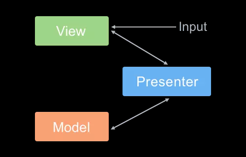

**常用的软件架构设计模式,MVC,MVP,MVVM的基本介绍和对比：**

首先，`MVC` `MVP` `MVVM` 都是常见的软件架构设计模式，它是通过分离业务关注点的方式来改进代码的组织方式。`MVC`和`MVP`模式主要是用在后台部分，而前端部分常用的是`MVVM`。

我们需要了解到它们互相之间不同的部分是：`C(Controller)`、`P(Presenter)`、`VM(View-Model)`，而相同的部分则是`MV(Model-View)`。

**下面具体的来解释一下什么叫做MVC:**

`MVC` :MVC是Model-View- Controller的简写。即模型-视图-控制器。`M`代表的就是数据，`V`代表的就是视图，`C`代表的就是页面业务逻辑。使用`MVC`的目的就是为了将数据(M)与视图(v)进行分离。它是单向通信的，也就是说`V`层不能直接与`M`层进行通信。两者之间必须要依靠`C`层承上启下。

是不是有点抽象，下面看一张简单的图片来理解一下：


如图所示：实线代表方法调用，虚线代表事件通知。

通过图片我们可以知道，`V`和`M`直接不能够直接进行方法的调用，这一切都必须通过我们的`C`层的调用来实现。也就是说`MVC`改变了视图对用户输入的响应方式。

**流程如下：**

1. 用户在View层中发起操作。
2. Controller响应View的事件，调用Model中的接口对数据进行操作。
3. Model发生变化，随后通知相关的视图进行更新。

接下来通过简单的代码模拟一下`MVC`的工作模式：

首先创建一个View，这里的View引入了Controller的实例来实现特定的响应策略。比如我们点击了按钮就会调用Controller实例的对应方法。

````js
        function g(id){
            return document.getElementById(id)
        }
        let project = {};
        /*视图View*/
        project.View = function(controller){
            let num = g("num");
            let incBtn = g("increase");
            let decBtn = g("decrease");

            /*接收model的通知更新视图*/
            this.render = function(model){
                let value = model.getValue();
                num.setAttribute("value",value)
            };

            /*View的操作事件*/ 
            incBtn.addEventListener('click',controller.increase,false)
            decBtn.addEventListener('click',controller.decrease,false)
        }
````

创建一个Controller控制器。它是模型和视图之间的纽带，MVC将响应机制封装在controller对象中，当用户和你的应用产生交互时，控制器中的事件触发器就开始工作了。

````js
        /*控制器Controller*/
        project.Controller = function(){
            let model = null;
            let view = null;

            /*初始化函数:新建View和Model的实例*/
            this.init = function(){
                model = new project.Model();
                view = new project.View(this);

                /*View向Model注册，当Model更新时就会通知到View*/
                model.register(view);
                model.notify();
            }

            /*使Model更新数值并且通知View更新视图*/
            this.increase = function(){
                model.add(1);
                model.notify();
            };
            this.decrease = function(){
                model.sub(1);
                model.notify();
            }
        }
````

创建一个Model:Model主要是用来了存储业务的数据，一旦业务发生了变化，就会通知相关的视图去进行更新。在Model和View之间使用了观察者模式，View事先在此Model上注册，进而观察Model，以便更新在Model上发生改变的数据。
````js
        /*Model*/ 
        /*Model*/ 
        project.Model = function(){
            let val = 0;

            this.add = function(v){
                if(val < 100){val += v}
            };

            this.sub = function(v){
                if(val>0){val -= v}
            };

            this.getValue = function(){
                return val;
            };

            /*观察者模式*/
            let self = this;
            let views = [];

            this.register = function(view){
                views.push(view)
            };

            this.notify = function(){
                for(let i in views){
                    views[i].render(self)
                }
            }
        }
````
完整的代码如下，执行即可知道流程：

````html
<!DOCTYPE html>
<html lang="zh-CN">
<head>
    <meta charset="UTF-8">
    <meta name="viewport" content="width=device-width, initial-scale=1.0">
    <meta http-equiv="X-UA-Compatible" content="ie=edge">
    <title>MVC模式</title>
</head>
<body>
    <input type="text" id="num" />
    <button id="increase">+</button>
    <button id="decrease">-</button>
    <script>
        function g(id){
            return document.getElementById(id)
        }
        let project = {};
        /*视图View*/
        project.View = function(controller){
            let num = g("num");
            let incBtn = g("increase");
            let decBtn = g("decrease");

            /*接收model的通知更新视图*/
            this.render = function(model){
                let value = model.getValue();
                num.setAttribute("value",value)
            };

            /*View的操作事件*/ 
            incBtn.addEventListener('click',controller.increase,false)
            decBtn.addEventListener('click',controller.decrease,false)
        }

        /*控制器Controller*/
        project.Controller = function(){
            let model = null;
            let view = null;

            /*初始化函数:新建View和Model的实例*/
            this.init = function(){
                model = new project.Model();
                view = new project.View(this);

                /*View向Model注册，当Model更新时就会通知到View*/
                model.register(view);
                model.notify();
            }

            /*使Model更新数值并且通知View更新视图*/
            this.increase = function(){
                model.add(1);
                model.notify();
            };
            this.decrease = function(){
                model.sub(1);
                model.notify();
            }
        }

        /*Model*/ 
        project.Model = function(){
            let val = 0;

            this.add = function(v){
                if(val < 100){val += v}
            };

            this.sub = function(v){
                if(val>0){val -= v}
            };

            this.getValue = function(){
                return val;
            };

            /*观察者模式*/
            let self = this;
            let views = [];

            this.register = function(view){
                views.push(view)
            };

            this.notify = function(){
                for(let i in views){
                    views[i].render(self)
                }
            }
        }
        let controller = new project.Controller();
        controller.init();
    </script>
</body>
</html>
````
经过了以上的流程后，不难看出。在MVC中大量的业务处理还是在Controller中。随着技术的发展，现在我们前端已经能够去处理用户操作的事件。如果所有的事情都去经过Controller层的话，那么会在这层产生大量的逻辑代码。也使View和Controller的联系过于紧密，Controller变得难以复用。所以这个时候就产生了MVP模式。

**了解一下MVP模式:** 全称是，Model-View-Presenter。MVP模式其实就是为了解决MVC模式的问题所诞生的,它对MVC模式进行了性能改良。它们的基本思想有相同的地方。比如：

1. Controller/Presenter 都是负责逻辑的处理。
2. Model提供数据。
3. View负责显示。




如图可知与`MVC`不同，`MVP`中`Model`和`View`实现了完全解耦。`Model`中的数据更新不再去通知到`View`层。所有的交互都是通过`Presenter`去完成。这样我们就可以很方便的将`View`层抽离出来作为组件。


模拟MVP模式：

创建View：与MVC中相同，View一样负责视图的展示。在执行初始化的时候得到了`Presenter`的实例。

````js
        function g(id){
            return document.getElementById(id)
        }
        let project = {};
        /*视图View*/
        project.View = function(){
            let num = g("num");
            let incBtn = g("increase");
            let decBtn = g("decrease");

            /*接收model的通知更新视图*/
            this.render = function(model){
                let value = model.getValue();
                num.setAttribute("value",value)
            };

            /*View的操作事件*/ 
            this.init=function(){
                //将View与Presenter进行绑定
                let presenter = new project.Presenter(this);

                incBtn.addEventListener('click',presenter.increase,false)
                decBtn.addEventListener('click',presenter.decrease,false)
            }
        }
````
创建Presenter：与`Controller`相似，它也是起到了调用方法的作用。处理了对象的业务逻辑。

````js
        project.Presenter = function(view){
            let _model = new project.Model();
            let _view = view;

            _view.render(_model);

            this.increase = function(){
                _model.add(1);
                _view.render(_model);
            };

            this.decrease = function(){
                _model.sub(1);
                _view.render(_model);
            }
        }
````

创建Model:Model一样，也只是负责数据的处理。

````js
        project.Model = function(){
            let val = 0;

            this.add = function(v){
                if(val < 100){val += v}
            };

            this.sub = function(v){
                if(val>0){val -= v}
            };

            this.getValue = function(){
                return val;
            };

        }
````

完整的代码如下：

````html
<!DOCTYPE html>
<html lang="zh-CN">
<head>
    <meta charset="UTF-8">
    <meta name="viewport" content="width=device-width, initial-scale=1.0">
    <meta http-equiv="X-UA-Compatible" content="ie=edge">
    <title>MVP模式</title>
</head>
<body>
    <input type="text" id="num" />
    <button id="increase">+</button>
    <button id="decrease">-</button>
    <script>

        function g(id){
            return document.getElementById(id)
        }
        let project = {};
        /*视图View*/
        project.View = function(controller){
            let num = g("num");
            let incBtn = g("increase");
            let decBtn = g("decrease");

            /*接收model的通知更新视图*/
            this.render = function(model){
                let value = model.getValue();
                num.setAttribute("value",value)
            };

            /*View的操作事件*/ 
            this.init=function(){
                //将View与Presenter进行绑定
                let presenter = new project.Presenter(this);

                incBtn.addEventListener('click',presenter.increase,false)
                decBtn.addEventListener('click',presenter.decrease,false)
            }
        }

        /* 中间商Presenter*/
        project.Presenter = function(view){
            let _model = new project.Model();
            let _view = view;

            _view.render(_model);

            this.increase = function(){
                _model.add(1);
                _view.render(_model);
            };

            this.decrease = function(){
                _model.sub(1);
                _view.render(_model);
            }
        }

        project.Model = function(){
            let val = 0;

            this.add = function(v){
                if(val < 100){val += v}
            };

            this.sub = function(v){
                if(val>0){val -= v}
            };

            this.getValue = function(){
                return val;
            };

        }
        let view = new project.View()
        view.init()
    </script>
</body>
</html>
````
**分析一下：**

我们来模拟一次用户的点击事件，我们不难发现。`MVC`和`MVVM`之间有明显区别。

首先在`MVC`中：

>1. 我们从View发起点击操作。
>2. 在Controller去执行相应回调函数逻辑。
>3. 在Model中改变相应的数据。
>4. **Model中直接将数据推送到View中。**
>5. View得到数据完成更新。

在`MVP`中：

>1. 从View发起点击点击操作。
>2. 在Presenter中去执行相应的回调函数逻辑。
>3. 在Model中改变相应的数据。
>4. **在Presenter中调用View的接口函数推送数据。**
>5. View得到数据完成更新。

通过点击流程，我们可以得知。`MVC`中我们改变数据后，`Model`就直接通知`View`去更新了。但是在`MVP`中，我们还需要再从`Presenter`中去通知`View`。

举一个简单的例子，`MVC`中的`Controller`和`MVP`中的`Presenter`都起到了一个中间商的作用。就像你去买二手车，`Controller`就只会给你和卖家牵线搭桥,卖家是可以联系到你的。但是`Presenter`就是一条龙服务,你买了车到后面连卖家是谁都不知道。

相信到这里，你们对`MVC`和`MVP`之间的区别和特点有了较为清晰的认识。接下来我们再来学习一下`MVVM`。
