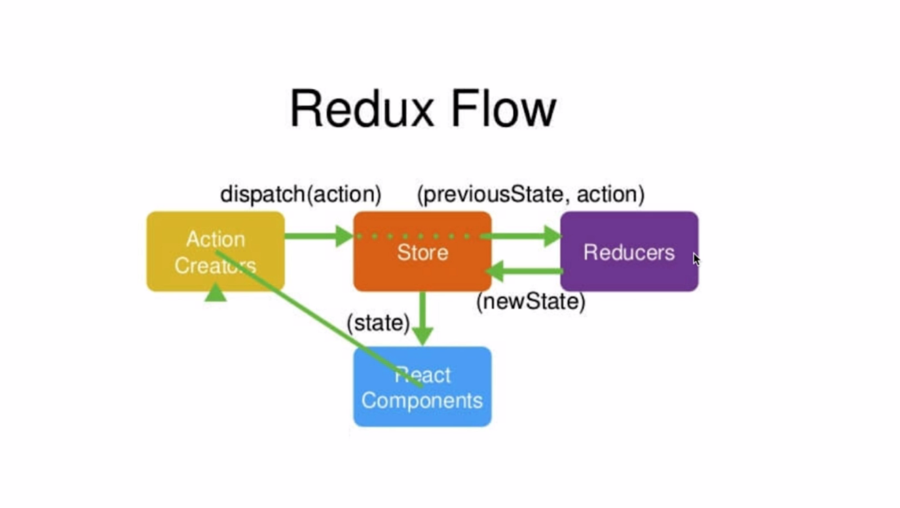
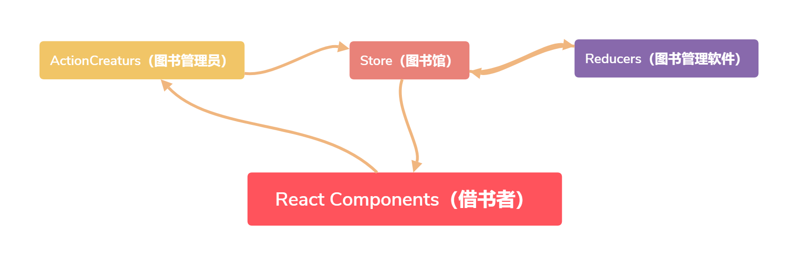
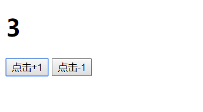
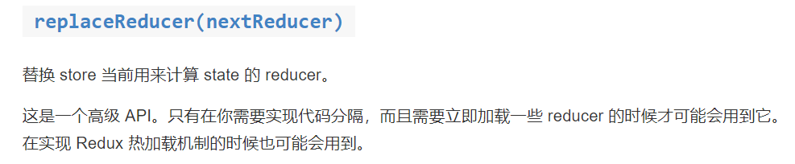
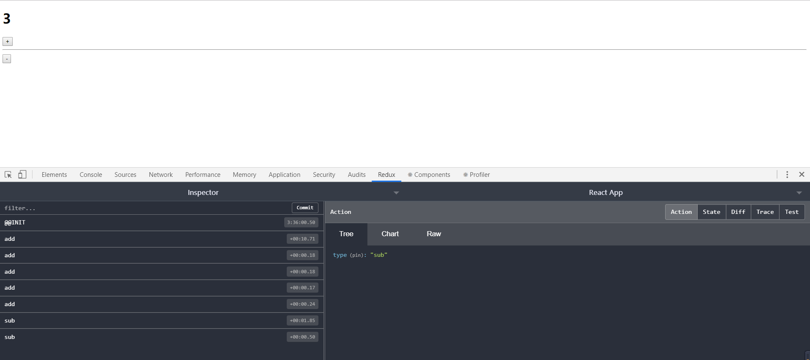
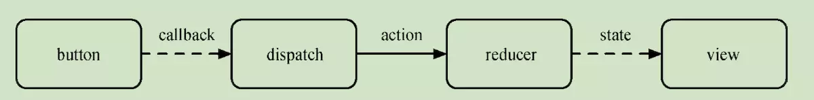
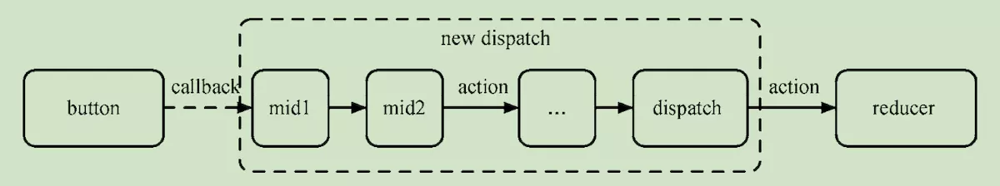
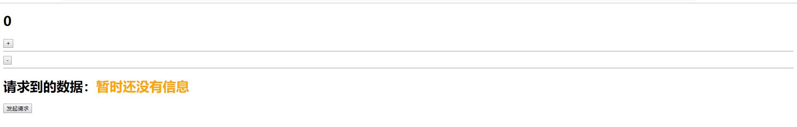
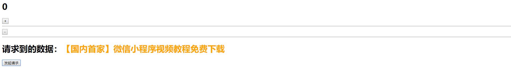

**redux和react-redux的概念以及在项目中如何去使用redux和react-redux...**

**什么是Redux:** Redux是一个用来管理管理数据状态和UI状态的JavaScript应用工具。简单的来说，Redux就是我们的数据管家。

**为什么要用Redux:** 这个问题，其实很简单。因为在我们react的开发过程中，我们肯定要使用组件传值。当然父子组件之间的传值是非常方便的。但是，试想一下如果当前组件想要拿到曾曾曾曾孙子组件的中的数据时，是不是就非常痛苦了。那么这个时候我们的Redux的作用就体现出来了。可以用一张图来描述上诉过程：


可以看到，在没有redux的时候。我们组件之间的传值简直是让人痛苦不堪。那么我们再看看有redux管理之后，我们的数据传递流程：


有了redux后，咱们的状态和数据都交给了仓库去管理。我们可以很方便的去仓库中获取咱们需要的数据。

**Redux的基本组成：** redux中有几个重要的组成部分：

1. store仓库
2. reducer函数
3. action行为

**store：** 这里就是存放我们数据的仓库。他主要是负责
1. 存储我们的数据
2. 订阅action的行为
3. 连接reducer函数

**reducer函数:** 它是一个纯函数，它的主要作用是
1. 初始化state,
2. 对我们对应的action行为进行响应，并且将处理好的数据传送到store中

**action:** 它是返回一个对象，它的作用是：
1. 将用户的行为传递到store中

**图解store、reducer、action之间的关系：**



上面这张图片展示了redux各个部分之间的关系。

我们根据图片可以得知，我们要改变一次状态，会经过以下流程：

1. `React`组件发送对应的`action`对象
2. `store`提供`dispatch`方法将`action`对象发送到`store`中
3. `store`将旧的`state`和当前触发的`action`发送到`reducer`中
4. `reducer`根据`action`对象,返回处理后的新`state`到`store`中
5. `store`将新的`state`推送到`React`组件中

再用一张简单图片来描述store、action、reducer之间的关系：



1. react组件就相当于我们的`借书者`,它告诉`图书管理员`我之前借了一本《JS高阶教程第二版》我将这本书还了，现在重新借一本《JS高阶教程第三版》。这就相当于发送了一个action。
2. 因为我们的`store图书馆`很大,`图书管理员`要去图书馆找书。步行太累了，那么这个时候就要借用我们的`dispatch平衡车`将管理员带到图书馆中去。
3. 当管理员到达图书馆后，发现可以使用图书馆管理软件`reducer`。于是管理员就将用于之前借的书的信息`旧的state` 和新要借的书的信息 `action` 发送到系统中去。
4. `reducer`系统将新书摆放的位置告诉到管理员，管理员找到书后，将这本书给到借书者。

以上大概就是我们三者之间关系的简略描述。

**示例一：说的一万遍不如手写一遍，接下来我们写一个计数器的demo：**

````html
<!DOCTYPE html>
<html lang="zh-CN">
<head>
  <meta charset="UTF-8">
  <title></title>
</head>
<body>
    <div>
        <h1 id="textBox"></h1>
        <button id="btn1">点击+1</button>
        <button id="btn2">点击-1</button>
    </div>
  <script src="https://cdn.bootcss.com/redux/4.0.0/redux.js"></script>
  <script>
        window.onload = function(){
            const h1 = document.getElementById("textBox");

            const redux = Redux;
            /*action types*/
            const ADD="add";
            const SUB="sub";

            /*reducer函数*/
            const initDefault = 0;

            const reducer = (state=initDefault,action)=>{
                let newState = JSON.parse(JSON.stringify(state));
                switch (action.type) {
                    case ADD:
                        return newState+=1;
                    case SUB:
                        return newState-=1;
                    default:
                        return state
                }
            }

            /*store仓库*/
            const store = redux.createStore(reducer)

            /*改变界面显示的值*/
            const changeH1Value = ()=>{
                h1.innerText = store.getState();
            }
            /*初始化调用，以显示默认值*/
            changeH1Value()
            
            /*订阅store仓库,只要仓库发生改变。那么这个api就会被调用*/
            store.subscribe(changeH1Value)

            /*发送action到store中*/
            document.getElementById("btn1").addEventListener("click",function(){
                //action对象
                const actionAdd = {
                    type:ADD
                }
                //发送action
                store.dispatch(actionAdd);

            },false)

            document.getElementById("btn2").addEventListener("click",function(){
                //action对象
                const actionSub = {
                    type:SUB
                }
                //发送action
                store.dispatch(actionSub)
            },false)

        }
  </script>
</body>
</html>
````



在上述的定时器中，我们使用了store中2个非常重要的api：

1. `subscribe(listener)` 传入一个函数，当store仓库中的数据变化时。它就会被调用，所以这里我们用来改变值。
2. `getState()` 得到当前最新的数据
3. `dispatch(action)` 发送action到store中，这个我们在前面已经介绍过了

除此以外store还有一个api叫做: `replaceReducer(nextReducer)` 它的主要作用是:



----

**示例二：现在我们已经简单的理解了redux的工作流程，接下来我们在react中去使用一下redux。这次同样实现一个计数器：**

**首先：** 使用create-react-app脚手架搭建模板，然后执行命令行安装redux:

`npm install redux --save-dev`

**第一步：** 在脚手架搭建的src目录下，创建一个action-types.js,内容如下：

````js
export const ADD = "add";
export const SUB = "sub";
````

**第二步：** 在src目录下，创建一个reducer.js,内容如下:

````js
import {ADD,SUB} from './action-types';

//初始化默认值
const initDefault = {num:0}

export default (state=initDefault,action)=>{
    /*因为reducer函数是一个纯函数。纯函数是不能直接修改传入的参数的。所以在这里我们使用了一次深拷贝*/
    let newState = JSON.parse(JSON.stringify(state));
    switch (action.type) {
        case ADD:
            newState.num += 1;
            return newState
        case SUB:
            newState.num -= 1;  
            return newState
        default:
            return newState;
    }
}
````

**第三步：** 在src目录下，创建一个store.js,内容如下：

````js
import {createStore} from 'redux';

//导入reducer函数
import reducer from './reducer';

//创建仓库
const store  = createStore(reducer);

//暴露
export default store
````

**第四步：** 在src目录下的App.js中，输入以下内容：

````js
import React from 'react';
import store from './store';
import {ADD,SUB} from './action-types';


class App extends React.Component{
  constructor(props){
    super(props)
    this.state = store.getState();

    /*subscribe:这个函数是在store中发生改变时进行调用*/
    store.subscribe(this.getNowState.bind(this));
  }
  
  //数字加
  numAdd(){
    store.dispatch({type:ADD})
  }
  //数字减
  numSub(){
    store.dispatch({type:SUB})
  }
  //获取当前最新的state
  getNowState(){
    this.setState(store.getState())
  }
  
  render(){
    return (
      <div>
        <h1>{this.state.num}</h1>
        <button onClick={()=>this.numAdd()}>+</button>
        <hr/>
        <button onClick={()=>this.numSub()}>-</button>
      </div>
    )
  }
}

export default App;
````

通过以上的代码，我们就实现了一个简单的react版本的由redux管理状态的计数器demo。

----

有的时候，redux管理的状态是非常多的。那么为了方便我们的调试，redux也有相应的浏览器插件。这个插件的名称叫做：`Redux DevTools`

**用法如下：**

[github地址:](https://github.com/zalmoxisus/redux-devtools-extension#usage)

**这里我们将扩展程序下载安装好后，在示例二中的store.js中进行配置，即可使用我们的调试工具:**

````js
import {createStore} from 'redux';

//导入reducer函数
import reducer from './reducer';

//创建仓库
const store  = createStore(
    reducer,
    window.__REDUX_DEVTOOLS_EXTENSION__&&window.__REDUX_DEVTOOLS_EXTENSION__() //配置redux调试工具
);

//暴露
export default store
````



在调试工具中，我们可以很方便的对我们的状态进行检测和分析。

----

**在redux中还有一个非常重要的东西，就是我们的中间件。中间件的作用主要就是为了用来处理我们的异步操作。它增强了我们的dispatch.**

**这里引用别人的描述，我感觉非常清晰了：** 

[**原文地址**](https://www.jianshu.com/p/ae7b5a2f78ae)

>简单来讲，Redux middleware 提供了一个分类处理 action 的机会。在 middleware 中，我们可以检阅每一个流过的 action,并挑选出特定类型的 action 进行相应操作，以此来改变 action。这样说起来可能会有点抽象，我们直接来看图，这是在没有中间件情况下的 redux 的数据流：



>上面是很典型的一次 redux 的数据流的过程，但在增加了 middleware 后，我们就可以在这途中对 action 进行截获，并进行改变。且由于业务场景的多样性，单纯的修改 dispatch 和 reduce 人显然不能满足大家的需要，因此对 redux middleware 的设计是可以自由组合，自由插拔的插件机制。也正是由于这个机制，我们在使用 middleware 时，我们可以通过串联不同的 middleware 来满足日常的开发，每一个 middleware 都可以处理一个相对独立的业务需求且相互串联：



>如上图所示，派发给 redux Store 的 action 对象，会被 Store 上的多个中间件依次处理，如果把 action 和当前的 state 交给 reducer 处理的过程看做默认存在的中间件，那么其实所有的对 action 的处理都可以有中间件组成的。值得注意的是这些中间件会按照指定的顺序一次处理传入的 action，只有排在前面的中间件完成任务之后，后面的中间件才有机会继续处理 action，同样的，每个中间件都有自己的“熔断”处理,当它认为这个 action 不需要后面的中间件进行处理时，后面的中间件也就不能再对这个 action 进行处理了。

>而不同的中间件之所以可以组合使用，是因为 Redux 要求所有的中间件必须提供统一的接口，每个中间件的尉氏县逻辑虽然不一样，但只要遵循统一的接口就能和redux以及其他的中间件对话了。

**这里我使用的中间件是redux-thunk,除此以外还有redux-saga,redux-promise。但是因为另外2个都没有使用过，所以这里就不再赘述。将来如果有使用到，再回来记录**

**这里我们使用中间件进行一次数据请求：**

**第一步，安装redux-thunk和axios** 

`npm install redux-thunk --save-dev`

`npm install axios --save-dev`

**第二步，改写示例二中的store.js的内容如下：**

````js
import {createStore,applyMiddleware} from 'redux';
import thunk from 'redux-thunk';

//导入reducer函数
import reducer from './reducer';

//创建仓库
const store  = createStore(
    reducer,
    // window.__REDUX_DEVTOOLS_EXTENSION__&&window.__REDUX_DEVTOOLS_EXTENSION__() //配置redux调试工具
    
    /*如果只是使用中间件，不使用扩展程序*/ 
    applyMiddleware(thunk)
);

//暴露
export default store
````

**第三步:** 在src目录下action-types中，修改内容如下： 

````js
export const ADD = "add";
export const SUB = "sub";
/*中间件添加的数据请求*/
export const GET_DATA="get_data";
````

**第四步:** 在src目录下新建一个action-operations.js,内容如下：

````js
import {GET_DATA} from './action-types';
import axios from 'axios';

export const getDataAction = ()=>{
    //返回一个增强的action对象
    return async dispatch =>{
        const result = await axios.get("http://www.phonegap100.com/appapi.php?a=getPortalList&catid=20&page=1")
        const data = result.data.result[0].title;
        const action = {
            type:GET_DATA,
            data
        }
        dispatch(action)        
    }

}
````

**第五步：** 修改reducer.js中的内容如下：

````js
import {ADD,SUB,GET_DATA} from './action-types';

//初始化默认值
const initDefault = {num:0,data:"暂时还没有信息"}

export default (state=initDefault,action)=>{
    /*因为reducer函数是一个纯函数。纯函数是不能直接修改传入的参数的。所以在这里我们使用了一次深拷贝*/
    let newState = JSON.parse(JSON.stringify(state));
    switch (action.type) {
        case ADD:
            newState.num += 1;
            return newState;
        case SUB:
            newState.num -= 1;  
            return newState;
        case GET_DATA:
            newState.data = action.data;
            return newState;
        default:
            return newState;
    }
}
````

**第六步:** 修改App.js组件中的内容如下：

````js
import React from 'react';
import store from './store';
import {ADD,SUB} from './action-types';
import {getDataAction} from './action-operations';


class App extends React.Component{
  constructor(props){
    super(props)
    this.state = store.getState();
    /*subscribe:这个函数是在store中发生改变时进行调用*/
    store.subscribe(this.getNowState.bind(this));
  }
  
  //数字加
  numAdd(){
    store.dispatch({type:ADD})
  }
  //数字减
  numSub(){
    store.dispatch({type:SUB})
  }

  //发起请求
  getData(){
    //得到经过中间件处理的action对象
    const action = getDataAction();
    //发送到store中
    store.dispatch(action)
  }
  
  //获取当前最新的state
  getNowState(){
    this.setState(store.getState())
  }
  
  render(){
    return (
      <div>
        <h1>{this.state.num}</h1>
        <button onClick={()=>this.numAdd()}>+</button>
        <hr/>
        <button onClick={()=>this.numSub()}>-</button>
        <hr/>
        <h1>请求到的数据：<span style={{color:"orange"}}>{this.state.data}</span></h1>
        <button onClick={()=>this.getData()}>发起请求</button>
      </div>
    )
  }
}


export default App;
````

**效果如下：**

初始化状态：



请求数据后的状态：



**总结：** 当我们使用中间的时候，明显的区别就是。我们调用了两次`dispatch`。

1. 第一次是在我们调用`getDataAction`这个方法的时候。我们请求了接口的数据，然后对数据进行了一些过滤的处理，生成了一个新的action对象。然后调用`dispatch(action)`将这个action对象传递到了调用的地方。
2. 在调用函数的地方，我们使用`const action = getDataAction()` 接收到了中间件处理完毕的action对象，然后通过`store.dispatch(action)` 将这个增强的action对象发送到了store中。

由以上流程，再对比之前的图片：


可以发现，其实中间件就是对我们dispatch方法进行了增强，使其能够处理一些复杂的逻辑。

