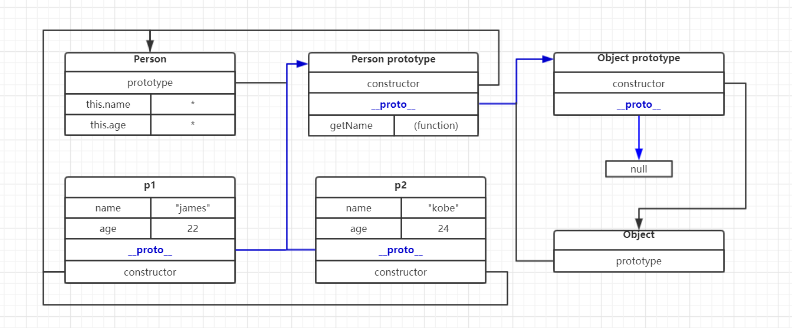
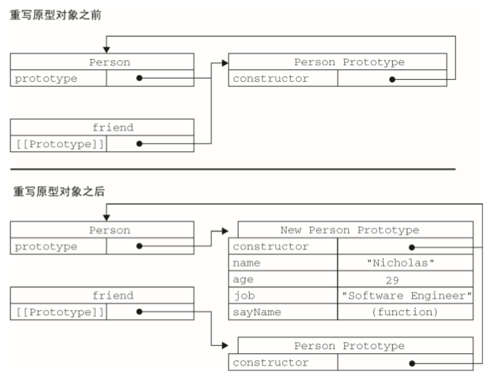

**神马是原型和原型链，探究原型的秘密...**

原型和原型链是我们js中非常重要的部分，它涉及到了对象创建和继承。所以我们必须要对它有清晰的认识。

导读：


**1，什么是原型**

我们创建的每一个函数都有一个叫做prototype的属性，这个属性指向一个对象。这个对象就是我们所说的原型。当我们在创建对象的时候，我们可以根据需求将一些属性和方法通过prototype属性挂载到原型对象上面去。

明确2个知识点：

1. 原型就是一个对象，和普通对象没有区别。不用把它看得过于高大上，和任何函数都能作为构造函数一样，任何对象都能作为一个原型对象。
2. prototype只是一个指向对象的指针，因为对象是引用类型。所以我们只是通过指针也就是这个protoype属性去访问原型对象。

**2，基本属性：constructor、[[ prototype ]]、__proto__是什么?**

`constructor`:在默认情况下，所有的原型对象都能获得一个叫做constructor的属性。这个属性包含一个指针，指向的是这个拥有这个prototype属性的构造函数。我们new出来的实例对象也有这个属性，它指向的就是创建它的构造函数。

`[[ prototype ]]`:通过new创建的出来的实例对象内部包含一个指针，指向构造函数的原型对象。这个指针叫做`[[ prototype ]]` 默认我们是没办法以标准的对象属性形式来访问到它的。

`__proto__`:实际上`__proto__`就相当于`[[ prototype ]]`。因为我们没办法以标准的对象调用形式来使用它，所以浏览器提供了一个`__proto__`的属性供我们访问这个指针所指向的原型对象。因为`__proto__`的存在，所以我们所有的实例对象都能够访问到构造函数原型对象上的方法和属性。这就实现了我们公用方法和共用属性的效果。

文字看起来太枯燥，我们用代码和示意图来描述文字：

````js
    function Person(name,age){
        this.name = name;
        this.age = age;
    }
    Person.prototype.getName = function(){
        return this.name
    }

    let p1 = new Person("james",22)
    let p2 = new Person("kobe",24)

    //constructor
    // 每个实例都有一个constructor属性
    console.log(p1.constructor ===  Person) //true
    // 原型对象也有自己的constructor,指向拥有这个prototype属性的构造函数
    console.log(Person.prototype.constructor === Person) //true

    //__proto__
    //new 出来的实例对象中的__proto__属性指向创建这个对象的构造函数的原型对象
    console.log(p1.__proto__ === Person.prototype) //true
    //原型对象也有自己的__proto__属性，指向创建这个构造函数的原型对象
    console.log(Person.prototype.__proto__ === Object.prototype) //true

    // 实例对象p1和实例对象p2的__proto__属性指向的都是同一个原型对象
    console.log(p1.__proto__ === p2.__proto__) //true
````

他们之间的流程关系如下:



关系看起来非常的复杂，但是只要仔细捋捋肯定都能看清他们互相之间的关系。

**3，什么是原型链：**

每一个原型对象都有一个`__proto__`属性,这个属性指向一个原型对象，而这个对象又有自己的`__proto__`属性这样一个一个的找下去就形成了原型链，而原型链的末端是null。 结合一下上面的那张图蓝色的线条再体会一下这句话。

````js
//以demo代码中为例：
    console.log(p1.__proto__ === Person.prototype); //true
    console.log(Person.prototype.__proto__ === Object.prototype) //true
    console.log(Object.prototype.__proto__ === null) //true
````

原型链构成就是:`p1.__proto__ --- Person.prototype.__proto__ --- Object.__proto__ --- null`

**查找实例化对象的方法和属性的顺序实际上是：** 

1. 先在实例对象的实例上查找，找到了就使用这个属性或者方法。否则继续查找。
2. 沿着原型链进行查找，找到了就使用这个属性或者方法。找不到就抛出异常。

引用JS高阶教程中的过程解释：

>每当代码读取某个对象的某个属性时，都会执行一次搜索，目标是具有给定名字的属性。搜索首先 从对象实例本身开始。如果在实例中找到了具有给定名字的属性，则返回该属性的值；如果没有找到， 则继续搜索指针指向的原型对象，在原型对象中查找具有给定名字的属性。如果在原型对象中找到了这 个属性，则返回该属性的值。也就是说，在我们调用 person1.sayName()的时候，会先后执行两次搜 索。首先，解析器会问：“实例 person1 有 sayName 属性吗？”答：“没有。”然后，它继续搜索，再 问：“person1 的原型有 sayName 属性吗？”答：“有。”于是，它就读取那个保存在原型对象中的函 数。当我们调用 person2.sayName()时，将会重现相同的搜索过程，得到相同的结果。而这正是多个 对象实例共享原型所保存的属性和方法的基本原理。 

也就是说如果在我们构造函数上的方法或则属性如果和原型对象上的方法或则属性名称一致的话，会调用构造函数中的。而不会调用原型对象上的。这就是 **实例对象上无法改写原型上的方法和属性**

````js
    function Anmail(name,age){
        this.name = name;
        this.age = age;
        this.getName = function(){
            console.log("constructor")
        }
    }
    Anmail.prototype.getName = function(){
        console.log("prototype")
    }

    let dog = new Anmail("keji",22)
    dog.getName() //constructor
````

**4，原型的常用方法：isPrototypeOf()、Object.getPrototypeOf()和hasOwnProperty()**

`isPrototypeOf()` ：可以通过这个方法判断对象之间是否存在[[ prototype ]]这个指针的引用关系。如果被检测对象的[[ prototype ]]指向检测对象的原型对象。那么返回值为true.

````js
    function Person(name,age){
        this.name = name;
        this.age = age;
    }

    function Animal (name,age){
        this.name = name;
        this.age = age;
    }

    let p1 = new Person("呵呵",22)
    let dog = new Animal("狗",1);
    
    console.log(Person.prototype.isPrototypeOf(p1)) //true
    console.log(Person.prototype.isPrototypeOf(dog)) //false
    console.log(Animal.prototype.isPrototypeOf(dog)) //true
````

`Object.getPrototypeOf()`:返回当前对象[[ prototype ]]的值，也就是返回其所指的原型对象。如下的demo所示，使用Object.getPrototypeOf()可以方便地取得一个对象的原型。

````js
    function Person(name, age) {
        this.name = name;
        this.age = age;
    }

    function Animal(name, age) {
        this.name = name;
        this.age = age;
    }

    let p1 = new Person("呵呵", 22)
    let dog = new Animal("狗", 1);

    console.log(Object.getPrototypeOf(p1))

    /**
    { constructor: ƒ } 
        constructor: ƒ Person(name, age)
            arguments: null
            caller: nulll
            ength: 2
            name: "Person"
            prototype: { constructor: ƒ } 
            __proto__: ƒ()
            [[FunctionLocation]]: 404.html: 11
            [[Scopes]]: Scopes[2]
            __proto__: Object
        * */ 
  
    console.log(Object.getPrototypeOf(p1) === Person.prototype) //true
````

`hasOwnProperty()` : 可以检测一个属性是存在于实例中，还是存在于原型中。只有当属性处于实例中的时候才返回true。

````js
    function Person(){}
    Person.prototype.name = "hehe"

    let p1 = new Person()
    let p2 = new Person()

    console.log(p1.hasOwnProperty("name")) //false
    p1.name = "我是实例上的名称"
    console.log(p1.hasOwnProperty("name")) //true
````

注意：在对象中我们常用`Object.getOwnPropertyDescriptor()` 方法获取对象属性的特征属性。但是默认只能获取到实例上的属性，而原型对象上的不能直接获取。必须要传入原型对象才行：

````js
    function Person(){}
    Person.prototype.name = "hehe"

    let p1 = new Person()
    let p2 = new Person()

    console.log(p1.hasOwnProperty("name")) //false
    p1.name = "我是实例上的名称"
    console.log(p1.hasOwnProperty("name")) //true

    console.log(Object.getOwnPropertyDescriptor(p1,"name")); //{value: "我是实例上的名称", writable: true, enumerable: true, configurable: true}
    console.log(Object.getOwnPropertyDescriptor(p2,"name")); //undefined
    console.log(Object.getOwnPropertyDescriptor(p2.__proto__,"name"))  //{value: "hehe", writable: true, enumerable: true, configurable: true}
````

**5，原型操作符：in**

`in` : 与hasOwnProperty不同，in操作符单独使用的时候，如果通过对象能够访问到给定的属性的时，则返回true。无论该对象处于实例上还是原型上。

````js
    function Person(){}
    Person.prototype.name = "hehe"

    let p1 = new Person()
    let p2 = new Person()

    p1.name = "我是实例上的名称"

    console.log(p1.hasOwnProperty("name")) //true 实例上有这个属性
    console.log("name" in p1) //true 能访问到这个属性
    console.log(p2.hasOwnProperty("name")) //false 实例上没有这个属性
    console.log("name" in p2) //true 能访问到这个属性
````

**6，对象的枚举：for in 、 Object.keys()和Object.getOwnPropertyNames()**

`for in` 和 `Object.keys()` 都能够返回对象中所有能够被枚举的属性。

````js
        function Person(){}
        Person.prototype.name="呵呵"
        Person.prototype.age = 22
        Person.prototype.job = "se"
        Person.prototype.sayName = function(){
            console.log(this.name)

        }
        
        var p1 = new Person()
        p1.name = "rob"
        p1.age = 32;

        // 使用for in
        var _keys = [];
        for(var key in Person.prototype){
            _keys.push(key)
        }
        console.log(_keys) //["name", "age", "job", "sayName"]

        // 使用Object.keys
        var keys = Object.keys(Person.prototype)
        console.log(keys) //["name", "age", "job", "sayName"]

        var p1Keys = Object.keys(p1)
        console.log(p1Keys) //["name", "age"]
````
`Object.getOwnPropertyNames()` 返回的是对象中所有的属性，无论它是否能够被枚举。

````js
        function Person(){}
        Person.prototype.name="呵呵"
        Person.prototype.age = 22
        Person.prototype.job = "se"
        Person.prototype.sayName = function(){
            console.log(this.name)

        }
        
        var p1 = new Person()
        p1.name = "rob"
        p1.age = 32;

        var keys = Object.getOwnPropertyNames(Person.prototype)
        var _keys = Object.getOwnPropertyNames(p1)
        console.log(keys) //["constructor", "name", "age", "job", "sayName"]
        console.log(_keys) //["name", "age"]
````

**7，更简单的原型语法：**

用上面的方式给原型对象挂载属性和方法会显得过于繁琐，所以还有一个种更加简单的方式：

````js
    function Person(){}
    Person.prototype = {
        constructor:Person, //必须手动的执行构造器属性的指向
        name:"hehe",
        age:25,
        job:"SE",
        sayName:function(){
            console.log(this.name)
        }
    }
````
用这种方式添加原型对象的属性必须要注意：`constructor` 属性的指向我们必须自己手动指定。并且还有一个非常重要的点就是：`constructor`的属性由默认的不可枚举变成了可枚举：

````js
        function Person(){}
        Person.prototype = {
            constructor:Person, //必须手动的执行构造器属性的指向
            name:"hehe",
            age:25,
            job:"SE",
            sayName:function(){
                console.log(this.name)
            }
        }

        function Animal(){}
        Animal.prototype.name = "动物",
        Animal.prototype.age = 1,
        Animal.prototype.job = "zoo",
        Animal.prototype.sayName = function(){
            console.log(this.name)
        }

        var keys = Object.keys(Person.prototype);
        var _keys = Object.keys(Animal.prototype)
        
        //constructor变成了可以枚举
        console.log(keys) //["constructor", "name", "age", "job", "sayName"]
        console.log(_keys) //["name", "age", "job", "sayName"]

````

所以为了符合原生的constructor的设计规则，我们可以使用`Object.defineProperty()`方法配置constructor的特征属性为不可枚举.

````js
        function Person(){}
        Person.prototype = {
            name:"hehe",
            age:25,
            job:"SE",
            sayName:function(){
                console.log(this.name)
            }
        }

        Object.defineProperty(Person.prototype,"constructor",{
            enumerable:false, //设置为不可枚举
            value:Person //设置指向
        })

        var keys = Object.keys(Person.prototype);
        console.log(keys) //["name", "age", "job", "sayName"]
````

**8，原型是动态的:**

````js
        function Person(){}
        var p1 = new Person() //实例化对象
        // 在构造函数的原型上挂载方法
        Person.prototype.sayHi = function(){
            console.log("hi")
        }
        p1.sayHi() //hi
````
如上面的demo所示，即使我们先实例化对象，再给构造函数的原型挂载方法。我们一样能正常使用这个方法。这是因为我们实例对象中只是包含一个对原型对象的引用指针。并不是复制了原型对象的副本，根据js引用类型的特点我们不难得知只要指向没变，我们就能正常访问引用类型中的属性。

````js
        function Person(){}
        var friend = new Person() //实例化对象

        console.log("init==>",Person.prototype) //init==> {constructor: ƒ}
        // 重写整个原型对象
        Person.prototype = {
            sayHi:function(){
                console.log("hi2")
            },
            name:"kaka"
        }
        Object.defineProperty(Person.prototype,"constructor",{
            enumerable:false,
            value:Person
        })
        console.log(friend.__proto__) //{constructor: ƒ} 还是原本的指向
        console.log("end==>",Person.prototype) //end==> {name: "kaka", sayHi: ƒ, constructor: ƒ}
        friend.sayHi() //Uncaught TypeError: friend.sayHi is not a function
````
如上面的代码所示，我们重写prototype对象后，就导致了报错。这是因为，调用构造函数时会为实例添加一个指向初原型的 [[ Prototype ]]指针，而把原型修改为另外一个对象就等于切断了构造函数与初原型之间的联系。



从图可以看出，重写原型对象切断了现有原型与任何之前已经存在的对象实例之间的联系；它们引用的仍然是初的原型。

**9，原型的问题：**

没有任何的东西是完美无缺的，原型也不例外。虽然原型很方便，但是它同样有个非常明显的缺点：

1. 它省略了为构造函数传递初始化参数这一环节，结果所有实例在默认情况下都将取得相同的属性值。也就是说，再构造函数中。我们可以初始化参数，让每个实例对象都得到不同的属性值。但是原型对象却不行，它是共享的属性，每个实例对象获取到的值都是一样的。
2. 我们知道原型上的属性是共享的，但是这也是导致这个问题的原因所在。对于简单的数据类型，如果实例化对象需要不同的值，那么我们直接在实例对象上挂载同名属性即可。但是对于引用类型，确实很大的麻烦，如下代码所示：

````js
        function Person(){}
        Person.prototype.name="default name";
        Person.prototype.age = 22;
        Person.prototype.skills = ["js","ts"]

        let xiaohong = new Person();
        
        let xiaozhang = new Person();
        //不同的实例需要不同的值： 基本数据类型，可以通过挂载同名属性到实例对象上解决
        xiaozhang.name = "xiaozhang";
        xiaozhang.age = 23;
        // 假设xiaozhang是从java转型的web开发，那么他比xiaohong多一项技能。这个时候我们就要添加xiaozhang的技能
        xiaozhang.skills.push("java");
        
        // 结果如下：
        console.log(xiaohong.name,xiaohong.age,xiaohong.skills) //default name 22 ["js", "ts", "java"]
        console.log(xiaozhang.name,xiaozhang.age,xiaozhang.skills) //xiaozhang 23 ["js", "ts", "java"]

````
由上的代码不难看出，xiaozhang修改了挂载再原型上的引用类型的数据。结果导致小红也"被迫"掌握了java。很明显这是不合理的。

**最后**

以上就是JS中原型的基本知识点，写起来很累。但是收获也非常大，很多之前不明白的点现在也找到了答案。如果你看到了这句话并且对我有任何的建议或者意见，欢迎通过我的邮箱与我联系。