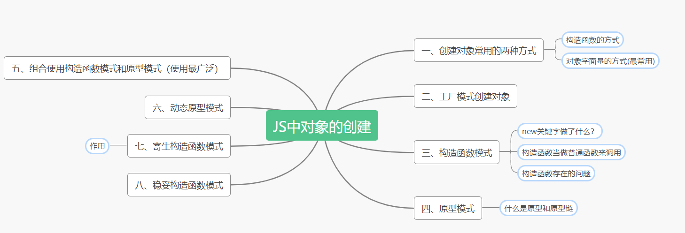

**专题一:创建对象的方式:常用模式,工厂模式,构造函数模式等**

在js中对象无疑是最有趣最值得探究的板块,所以准备记录几篇对象的学习笔记,从创建对象到面向对象形成一个系列.今天开始是第一部分:对象的创建.

导读:



**首先：对象是什么？**

>在ECMA-262中把对象定义为：“无序属性的集合，其属性可以包含基本值、对象或者函数。”

也就是说：对象是一组没有特定顺序的值。对象的每个属性或者方法都有一个名字，而且每个名字都映射一个值。

**一、创建对象常用的两种方式:**

1. 构造函数的方式:

````js
var person = new Object();
person.name = "养了只柯基";
person.age = 100;
````

2. 对象字面量的方式(最常用):

````js
var person = {
    name:"养了只柯基",
    age:100
}
````
**二、工厂模式创建对象：**

举个例子：
````js
var kobe={
    number:24,
    age:32,
    job:"basketball player",
    home:"USA",
    sayJob:function(){
       return this.job
    }
}

var james={
    number:23,
    age:22,
    job:"basketball player",
    home:"USA",
    sayJob:function(){
       return this.job
    }
}
````
如果像上面这种方式去定义对象，在我们对象的属性都是差不多的情况下。会使得定义对象的工作变得过于繁琐。于是，工厂模式就应运而生了。

````js
function createObj(number,age,job,home){
    var o = new Object(); //创建一个中间对象
    o.number = number;
    o.age = age;
    o.job = job;
    o.home = home;
    o.sayJob = function(){
        return this.job;
    }
    return o;
}

let alean = createObj(3,21,"basketball player","USA")
let lindan = createObj(10,23,"badminton player","China")

console.log(alean instanceof Object) //true
//工厂模式没办法准确的识别对象的实例是什么

````
如上所示，我们定义一个工厂函数。它就会像模具一样给我们创造出多个相似的对象。但是工厂模式也有自己的局限性，就是我们没有办法识别对象的实例是什么。因此，又出现了另外一种模式叫做构造函数模式.

**三、构造函数模式：**

接下来我们使用构造函数创建上面的两个对象：
````js
    function CreateObj(number,age,home,job){
        this.number = number;
        this.age = age;
        this.home = home;
        this.job = job;
        this.sayName = function(){
            return this.job
        }
    }
    let alean =new CreateObj(3,21,"basketball player","USA")
    let lindan =new CreateObj(10,23,"badminton player","China")

    //同工厂模式的不同,构造函数可以将它的实例标识为一种特定的类型。
    // constructor:指向构造这个实例的构造函数
    console.log(alean.constructor === CreateObj) //true
    console.log(alean instanceof CreateObj) //true
    console.log(lindan instanceof CreateObj) //true
````
使用构造函数模式和工厂模式不同的地方有4个：

1. 实例化对象的时候使用了new关键词，这是整个构造函数的精髓，使用new关键词就区分了正常调用还是实例化对象。
2. 构造函数的首字母是大写，这点是约定俗成的。主要是为了使构造函数和普通函数区分开，但是实际上构造函数也是函数。同样能够被正常的调用。
3. 构造函数并不一定需要`return`关键词返回对象。
4. 在构造函数中，将传入函数中的属性都直接赋值给了this对象。

**new关键字做了什么？**

在构造函数中，new关键词起到了非常重要的作用。实际上以new关键词调用函数会经历以下的4个步骤：

1. 创建一个中间对象
2. 将中间对象的原型指向构造函数的原型。`(这也就是为什么构造函数创建的实例对象是共享原型对象上的属性和方法)`
3. 将构造函数中的this，指向该中间对象。实际上就是执行构造函数中的代码,为这个对象添加属性。`（这也就是为什么每个实例对象中的属性和方法都是自身独有的）`
4. 返回中间对象

按照以上的4个步骤使用伪代码模拟构造函数中new的过程：

````js
    function New(func){
        // 1.创建一个中间对象
        var o = new Object();
        // 2.将o.__proto__指向func.prototype
        if(func.prototype !== null){
            o.__proto__ = func.prototype
        }
        // 3.将构造函数中的this指向中间对象，实际上就是执行构造函数将传入的参数挂载到中间对象上面去
        var retO = func.apply(o,[].slice.call(arguments,1));
        //这一步的主要作用是，如果构造函数执行的时候返回了一个不会空的对象那么就直接返回这个对象
        if((typeof retO === "object" || typeof retO === "function") && retO !== null){
            return retO
        }
        //4,返回中间对象
        return o;
    }

    function Person(name,age){
        this.name = name;
        this.age = age;
        this.sayName=function(){
            return this.name
        }
    }
    let p1 = New(Person,"咖咖",1)
    let p2 = New(Person,"丢丢",2)

    // 测试一下是否相同
    console.log(p1.constructor === Person) //true
    console.log(p1 instanceof Person) //true
    console.log(p2 instanceof Person) //true
````
通过伪代码我们不难看出大概的过程，但是实际上new关键词远远不止这么简单。我们了解其大概过程就好了。

**构造函数当做普通函数来调用：** 构造函数也可以作为普通函数调用，参数挂载的对象取决于构造函数被调用的时候的this。全局调用就是给window挂载，在此不做赘述。

**构造函数存在的问题:** 构造函数虽然很可以很方便的创建对象，但是同时也造成了资源的浪费。因为我们每个实例对象中的属性和方法实际上都是独立的，如下面的代码所示：

````js
    function Player(name,age){
        this.name = name;
        this.age = age;
        // this.sayName = function(){
        //     return this.name
        // }
        // 等同于
        this.sayName = new Function("return this.name");
    }
    let p1 = new Player("kaka",11)
    let p2 = new Player("hehe",22)
    console.log(p1.sayName()) //kaka
    console.log(p2.sayName()) //hehe
````
虽然构造函数解决了判断实例类型的问题，但是，说到底，还是一个对象的复制过程。跟工厂模式颇有相似之处。也就是说，当我们声明了100个p1对象，那么就有100个sayName方法被重新生成。即使我们每个实例中的sayName的功能实际上都是一样的。这势必会导致我们内存资源的浪费，为了使这种重复的逻辑被共用，又出现了一种全新的创建模式————原型模式。

**四、原型模式：**

因为原型模式中的原型部分只是涉及到的知识点和内容过多，所以这个部分就单独提出记录。推荐阅读我自己的这篇文章[**什么是原型和原型链**](https://lmxyjy.github.io/%E4%BB%80%E4%B9%88%E6%98%AF%E5%8E%9F%E5%9E%8B%E5%92%8C%E5%8E%9F%E5%9E%8B%E9%93%BE/)

**五、组合使用构造函数模式和原型模式（使用最广泛）**

创建自定义类型的常见方式，就是组合使用构造函数模式与原型模式。构造函数模式用于定义实例属性，而原型模式用于定义方法和共享的属性。

这样的好处是每个实例都能有自己独立的属性和方法，同时也可以共享一些属性和方法。极大的节省了内存空间。

````js
        function Person(name,age){
            this.name = name;
            this.age = age;
        }
        Person.prototype.job = "前端开发";
        
        let xiaohong = new Person("小红",22)
        let xiaoming = new Person("小明",23)
        console.log(xiaohong,xiaohong.job) //{name: "小红", age: 22} "前端开发"
        console.log(xiaoming,xiaoming.job) //{name: "小明", age: 23} "前端开发"
````
如上代码所示，实例对象既有自己的属性。同时也共享了原型上的属性。并且这种模式还解决了一个问题，就是单使用原型模式的时候没办法初始化实例对象的属性。

**六、动态原型模式**

动态原型模式实际上就是：将构造函数的原型对象属性的挂载放到了构造函数中去。并且增加了判断，判断是否需要在原型上添加方法：

JS高阶教程中的解释：

>可以通过 检查某个应该存在的方法是否有效，来决定是否需要初始化原型

````js
        function Person(name,age){
            this.name = name;
            this.age = age;
            
            if(typeof this.sayName !== "function"){  //判断是否存在sayName这个属性并且是一个函数
                Person.prototype.sayName = function(){
                    return this.name
                }
            }

        }
        
        let p1 = new Person("呵呵",22);
        console.log(p1.sayName()) //呵呵
````

**七、寄生构造函数模式**

这种模式上实际上和我们的工厂模式一模一样，就是创建中间对象然后给中间对象挂载属性和方法然后返回中间对象。但是区别在于工厂模式不使用`new`关键词，而寄生构造模式使用`new`关键词。

````js
        function Person(name,age,job){
            var o = new Object();
            o.name = name;
            o.age = age;
            o.job = job;
            o.sayName = function(){
                return this.name
            }
            return o
        }

        //使用new关键词
        var p1 = new Person("咖咖", 29, "Software Engineer");  
        console.log(p1.sayName())//"咖咖" 
````

与构造函数相比，构造函数在不返回值的情况下，默认会返回新对象实例。而通过在构造函数的末尾添加`return` 语句可以重写调用构造函数的时候返回的实例对象。


**作用：**

这个模式可以在特殊的情况下用来为对象创建构造函数。假设我们想创建一个具有额外方法的特殊数组。由于不能直接修改 Array 构造函数，因此可以使用这个模式。 

````js
function SpecialArray(){
    // 创建一个数组
    var arr = new Array();
    //添加传入的值
    [].push.apply(arr,arguments);
    // 添加方法,将数组元素分割为字符串
    arr.toPipedString = function(){
        return this.join("|")
    }

    return arr;
}

var colors = new SpecialArray("red", "blue", "green"); 
console.log(colors.toPipedString()); //"red|blue|green"
````
这个模式其实非常不常用,也不建议使用.在JS高阶教程中对于这个模式是这么解释的:

>关于寄生构造函数模式，有一点需要说明：首先，返回的对象与构造函数或者与构造函数的原型属性之间没有关系；也就是说，构造函数返回的对象与在构造函数外部创建的对象没有什么不同。为此，不能依赖 instanceof 操作符来确定对象类型。由于存在上述问题，我们建议在可以使用其他模式的情 况下，不要使用这种模式


**八、稳妥构造函数模式**

实际上稳妥构造函数的出现的目的是为了安全性的考虑,其遵循与寄生构造函数类似的模式，但有两点不同：

1. 一是新创建对象的实例方法不引用this；
2. 是不使用 new 操作符调用构造函数;

````js
        function Person(name,age){
            //创建要返回的对象
            var o = new Object();

            //可以在这里定义私有变量和函数 

            //添加方法
            o.sayName = function(){
                console.log(name)
            }
            //返回对象 
            return o
        }

        var friend = Person("Nicholas", 29, "Software Engineer"); 
        friend.sayName();  //"Nicholas"
````
从代码来看:实际上sayName方法和Person函数之间形成了一个闭包,保存下了传入到函数Person中的值.在以这种模式创建的对象中,除了使用sayName()方法之外，没有其他办法访问name的值。

来自JS高阶教程的解释:

>这样，变量 friend 中保存的是一个稳妥对象，而除了调用 sayName()方法外，没有别的方式可 以访问其数据成员。即使有其他代码会给这个对象添加方法或数据成员，但也不可能有别的办法访问传 入到构造函数中的原始数据。稳妥构造函数模式提供的这种安全性，使得它非常适合在某些安全执行环 境——例如，ADsafe（www.adsafe.org）和 Caja（http://code.google.com/p/google-caja/）提供的环境—— 下使用

**尾巴**

以上就是JS对象创建的常用方式,内容和方式都很多.但是实际上常用的也就是那几个方式.如果你看到了这里,并且你有任何意见或者建议.欢迎你通过我的邮箱与我联系.