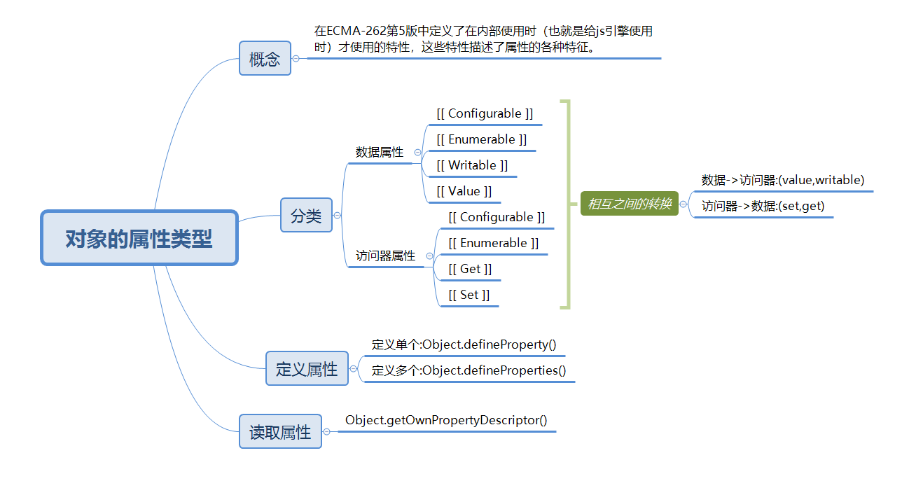

**专题二:对象的属性类型的概念,定义方法,查询方法...**

导读:



**对象的属性类型** 

对象属性类型就是：在ECMA-262第5版中定义了在内部使用时（也就是给js引擎使用时）才使用的特性，这些特性描述了属性的各种特征。

对象的属性类型分为2种：

**1.数据属性** :包含一个数据值的位置。主要有以下4个描述行为的特性：
   1. [[ Configurable ]]:表示属性能否被删除，能否修改属性的特性，能否把属性修改为访问器属性。简单的来说就是对象属性能否被配置.默认值为true;
   2. [[ Enumerable ]]：表示这个属性能否被枚举。默认值为true；
   3. [[ Writable ]]：表示属性的值能否被修改。默认为ture；
   4. [[ Value ]] ：包含这个属性的数据值，默认是undefined;

以上的属性都是使用`[[]]` 包裹起来，这是因为它们都是内部的属性。如果我们想要修改这些属性的值，那我们可以使用`Object.defineProperty()`方法。

`Object.defineProperty()` ：接收3个参数:

1. 属性所在的对象
2. 属性的名字
3. 一个描述该属性的对象

例子：修改一个对象中的name属性的特征：

````js
// 修改person.name的值为不可修改
    var person = {}
    Object.defineProperty(person, "name", {     
        writable: false,  //值无法被修改    
        value: "thomas",
        enumerable:false, //无法被枚举
        configurable:false //无法被删除 
    }); 
    console.log(person.name) //thomas
    person.name = "james" //非严格模式下，赋值被忽略，严格模式下报错
    console.log(person.name) //thomas
    console.log(delete person.name) //false  非严格模式下，赋值被忽略，严格模式下报错
    console.log(Object.keys(person)) //[]
````

**注意点一**：可以多次调用`Object.defineProperty()`方法修改同一个属性，但是如果在其中一次使用中把configurable设置为false之后，那么之后就只能修改这个属性的writable.否则就会出错:

````js
var person = {}; 
Object.defineProperty(person, "name", {     
    configurable: false,     
    value: "Nicholas" 
}); 
 
//抛出错误 :Uncaught TypeError: Cannot redefine property: name
Object.defineProperty(person, "name", {     
    configurable: true,     
    value: "Nicholas" 
}); 
````

**注意点二:**: 在调用`Object.defineProperty()`方法时，如果不指定，configurable、enumerable 和 writable 特性的默认值都是 false。

````js
    var person = {}
    Object.defineProperty(person,"name",{
        value:"咖咖",
    })
    console.log(person.name) //咖咖
    person.name = "丢丢";
    console.log(person.name) //咖咖
    console.log(delete person.name) //false
````

**2.访问器属性** :访问器属性不包含数据值；它们包含一对儿 getter和 setter函数（不过，这两个函数都不是必需的）。在读取访问器属性时，会调用 getter函数，这个函数负责返回有效的值；在写入访问器属性时，会调用 setter函数并传入新值，这个函数负责决定如何处理数据。

访问器属性也有4个属性描述符,其中2个和数据属性一样:

1. [[ Configurable ]]：表示能否通过 delete 删除属性从而重新定义属性，能否修改属性的特性，或者能否把属性修改为数据属性。对于直接在对象上定义的属性，这个特性的默认值为 true。 
2. [[ Enumerable ]]：表示能否通过 for-in 循环返回属性。对于直接在对象上定义的属性，这个特性的默认值为 true。 
3. [[ Get ]]：在读取属性时调用的函数。默认值为 undefined。 
4. [[ Set ]]：在写入属性时调用的函数。默认值为 undefined.

同样的,我们只能通过`Object.defineProperty`来定义访问器属性.

````js
    var person = {}
    //定义访问器属性,不能出现数据属性中的属性 
    Object.defineProperty(person,"name",{
        configurable:true,
        enumerable:true,
        // value:"咖咖", //报错,设置了不是访问器属性中的属性
        get:function(){
            console.log("getter")
            return this.value
        },
        set:function(value){
            console.log("setter")
            this.value = value
        }
    })
    //访问属性,调用get方法 //getter
    console.log(person.name) //undefined
    //设置属性,调用set方法 //setter
    person.name = "咖咖2" 
    //访问属性,调用get方法 //getter
    console.log(person.name) // 咖咖2
````
通常建议getter和setter都要一起写,否则就会导致只能读或则只能写.在严格模式下甚至会报错.

**数据属性与访问器属性的相互转换:** 通过上面的学习,我们已经知道对象的属性类型包括了数据属性和访问器属性.我们需要知道的知识点是:`属性的特性只能是数据属性或者是访问器属性,当我们给数据属性加set或者get的时候,其属性的value,writable都会被废弃掉` 

这也就是为什么我们在上个访问器属性设置的demo代码中设置`value = "咖咖"`会导致报错.

1. **数据属性->访问器属性**:数据属性到访问器的转换也就是设置`set`或者`get`.如我们之前所说,只要转换为了访问器属性后,我们就不能将数据属性中的`value`和`writable`再定义了.

例子:

````js
    var person = {}
    // 这是一个典型的数据属性定义
    Object.defineProperty(person,"name",{
        configurable:true,
        value:"咖哥",
        writable:true,
        enumerable:true
    })
    //转换为访问器属性定义 ,
    // 报错:Uncaught TypeError: Invalid property descriptor. Cannot both specify accessors and a value or writable attribute, #<Object>
    Object.defineProperty(person,"name",{
        // 不能把数据属性中的特征属性定义放到访问器属性中
        value:"咖哥",
        writable:true,

        configurable:true,
        enumerable:true,
        set:function(value){
            this.value = value
        },
        get:function(){
            return this.value || "养了只柯基"
        }
    })
````
2. **访问器属性->数据属性**:访问器属性到数据属性的转换也就是设置`value`或者`writable`就行了.同之前一样我们已经知道了`value`,`writable` 与 `set`,`get`是互斥的.所以我们不能让它们同时存在.

例子:

````js
    var person = {}
    // 这是一个典型的访问器属性定义
    Object.defineProperty(person,"name",{
        configurable:true,
        enumerable:true,
        set:function(value){
            this.value = value
        },
        get:function(){
            return this.value || "养了只柯基"
        }
    })
    //转换为数据属性定义 ,
    Object.defineProperty(person,"name",{
        // 不能把数据属性中的特征属性定义放到访问器属性中
        value:"咖哥",
        writable:true,
        configurable:true,
        enumerable:true,

        // 不能共存
        // set:function(value){
        //     this.value = value
        // },
        // get:function(){
        //     return this.value || "养了只柯基"
        // }
    })
````

**定义多个属性:** 一个一个定义属性太过麻烦,所以ES5定义了一个新的 `Object.defineProperties()`方法。利用这个方法我们可以一次定义多个属性.

 `Object.defineProperties()` 接收2个参数:

 1. 要添加或则修改属性的对象
 2. 要给对象添加或则修改的属性

例子如下:

````js
    var zoo = {};
    Object.defineProperties(zoo,{
        tiger:{
            value:"老虎",
            configurable:false,
            enumerable:true,
            writable:true
        },
        panda:{
            value:"熊猫",
            configurable:false,
            enumerable:true,
            writable:true
        }
    })
    console.log(zoo);//{tiger: "老虎", panda: "熊猫"}
    
````
**读取属性的方法:** ES5提供了一个方法让我们可以读取对象中的特征属性.

`Object.getOwnPropertyDescriptor()`: 接收2个参数:

1. 需要读取的对象
2. 对象中需要被读取的属性

例子:

````js
    var zoo = {};
    Object.defineProperties(zoo,{
        tiger:{
            value:"老虎",
            configurable:false,
            enumerable:true,
            writable:true
        },
        panda:{
            value:"熊猫",
            configurable:false,
            enumerable:true,
            writable:true
        }
    })
    console.log(zoo);//{tiger: "老虎", panda: "熊猫"}
    
    var desc = Object.getOwnPropertyDescriptor(zoo,"tiger") //读取zoo对象中的 tiger属性
    console.log(desc); //{value: "老虎", writable: true, enumerable: true, configurable: false}
    
````
以上就是我们对象属性类型的基本知识点和一些相关的方法,接下来的方向就是关于对象的继承.