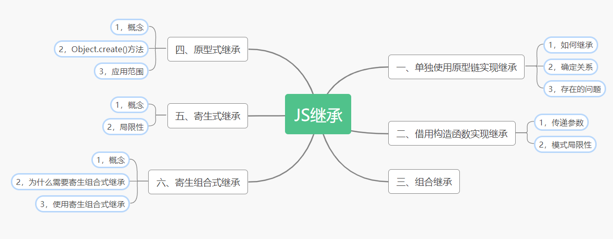
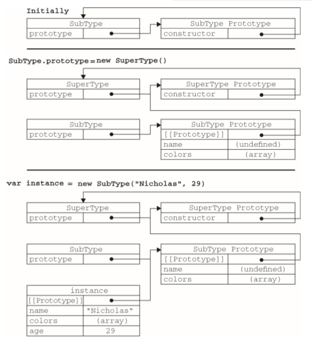

**js中继承的概念，继承的实现以及继承的方式...**

导读：



在许多面向对象的语言中，继承是一个非常重要的概念。通常它们的继承分为两种：

1. 接口继承：定义好继承的规则，继承的话只是继承一个规则。（JS中没有这个概念，TS中可以实现）
2. 实现继承：继承实际的方法。（JS中实现继承主要是依靠原型链来实现）

**一、单独使用原型链实现继承**

原型链的基本概念和理解之前我们已经介绍过了，这里不再赘述。如果这部分有问题，可以参考我的文章：[**什么是原型和原型链**](https://lmxyjy.github.io/%E4%BB%80%E4%B9%88%E6%98%AF%E5%8E%9F%E5%9E%8B%E5%92%8C%E5%8E%9F%E5%9E%8B%E9%93%BE/)

**1，如何继承**

当我们把子构造函数的的prototype属性指向父构造函数的实例对象的时候就能实现继承。示例如下：

````js
    function Parent(){}
    Parent.prototype.sayHi = function(){
        console.log("hello")
    }

    function Child(){}
    // 将Child的prototype属性指向Parent的实例对象实现继承
    Child.prototype = new Parent()

    let c1 = new Child()
    c1.sayHi() //hello 
````

**2，确定关系**

以上的代码为例：
````js
        function Parent(){}
        Parent.prototype.sayHi = function(){
            console.log("hello")
        }

        function Child(){}
        // 将Parent的实例对象挂载到Child原型上 实现继承
        Child.prototype = new Parent()

        let c1 = new Child()

        console.log(c1 instanceof Object) //true
        console.log(c1 instanceof Parent) //true
        console.log(c1 instanceof Child) //true

        console.log(Object.prototype.isPrototypeOf(c1)) //true
        console.log(Parent.prototype.isPrototypeOf(c1)) //true
        console.log(Child.prototype.isPrototypeOf(c1)) //true
````
1. 由于原型链的关系，我们可以说 instance 是 Object、SuperType 或 SubType 中任何一个类型 的实例。因此，测试这三个构造函数的结果都返回了 true。
2. 同样，只要是原型链中出现过的原型，都可以说是该原型链所派生的实例的原型，因此 isPrototypeOf()方法也会返回 true

**3，存在的问题**

单用原型链实现继承有2个明显的缺点：

1. 实例对象属性被挂载为原型对象的方法。
2. 无法在初始化调用构造函数的时候传入参数。

````js
    function Parent(){
        this.colors = ["red","blue","black"]
    }
    Parent.prototype.sayHi = function(){
        console.log("hello")
    }

    function Child(){}
    // colors这个属性被挂载到Child的原型对象上
    Child.prototype = new Parent()

    let c1 = new Child()
    let c2 = new Child()

    console.log(c1.colors) //["red", "blue", "black"]
    console.log(c2.colors) //["red", "blue", "black"]
    c1.colors.push("orange")
    console.log(c1.colors) //["red", "blue", "black", "orange"]
    console.log(c2.colors) //["red", "blue", "black", "orange"]
````
可以看到，原本我们的colors只是Parent构造函数中的一个实例属性，但是因为原型链的继承模式的影响，它成了我们Child原型对象上的一个属性。因为实例对原型对象的共享规则，然后就导致我们的c1实例修改了colors后，c2实例的colors也发生了改变。所以我们在开发过程中，通常不会单独使用原型链实现继承。

除此以外，我们还有一个问题，就是继承后字类的prototype原型中的constructor指向并不是指向的字类的构造函数，而是父类。我们可以手动修改过来。

````js
    function Parent(){
        this.colors = ["red","blue","black"]
    }
    Parent.prototype.sayHi = function(){
        console.log("hello")
    }

    function Child(){}
    // colors这个属性被挂载到Child的原型对象上
    Child.prototype = new Parent()

    console.log(Child.prototype.constructor === Child) //false
    console.log(Child.prototype.constructor === Parent) //true

    // 重新指定constructor指向
    Object.defineProperty(Child.prototype,"constructor",{
        value:Child,
        enumerable:false
    })

    console.log(Child.prototype.constructor === Child) //true
    console.log(Child.prototype.constructor === Parent) //calse
````

**二、借用构造函数实现继承**

借用构造函数实现继承实际上就是：在子构造函数中通过函数方法调用父构造函数

````js
    function Parent (){
        this.colors = ["red","blue","green"]
    }
    function Child (){
        Parent.call(this); //继承了Parent 
    }
    let c1 = new Child()
    let c2 = new Child()
    console.log(c1.colors) //["red", "blue", "green"]
    console.log(c2.colors) //["red", "blue", "green"]
    c1.colors.push("orange")
    console.log(c1.colors) //["red", "blue", "green", "orange"]
    console.log(c2.colors) //["red", "blue", "green"]
````

由示例代码可知，它解决了我们通过原型链继承时。引用类型共享所导致的问题。

**1，传递参数**

相对于原型链的继承模式来说，借用构造函数的方式有很大的好处。就是它可以在子类初始化对象的时候向父构造函数传入参数。如下代码所示：

````js
    function Parent (name){
        this.name = name;
    }
    function Child (name){
        Parent.call(this,name); //继承了Parent，传入参数到Parent中
    }
    let c1 = new Child("科比")
    let c2 = new Child("乔丹")
    console.log(c1.name) //科比
    console.log(c2.name) //乔丹
    c1.name = "詹姆斯"
    console.log(c1.name) //詹姆斯
    console.log(c2.name) //乔丹
````
**2，模式局限性**

但是如果我们想要实例对象共享方法和属性的话，这种模式又难以做到了。所以我们也很少单用借用构造函数的方法实现继承。

**三、组合继承**

由原型链模式和借用构造函数模式实现继承分别的局限性可知，它们之间可以完美的互补。即构造函数实现传参和私有属性和方法的创建，原型链实现共享的属性和方法。这就是我们的组合继承模式。同时它也是最常用的模式。

如下所示：
````js
    function Parent (name){
        this.name = name;
        this.colors = ["red", "blue", "green"]; 
    }
    Parent.prototype.sayHi = function(){
        console.log("hi")
    }

    function Child (name){
        Parent.call(this,name); 
    }
    Child.prototype = new Parent();
    
    let c1 = new Child("科比")
    let c2 = new Child("乔丹")

    console.log(c1.colors) //["red", "blue", "green"]
    console.log(c2.colors) //["red", "blue", "green"]
    c1.colors.push("orange")
    console.log(c1.colors) //["red", "blue", "green", "orange"]
    console.log(c2.colors) //["red", "blue", "green"]

    c1.sayHi() //hi
    c2.sayHi() //hi
````
我们的实例对象既有了自己的私有属性，也可以共享原型对象上的方法。完美解决问题。

JS高阶教程对于组合继承的说明：

>组合继承避免了原型链和借用构造函数的缺陷，融合了它们的优点，成为 JavaScript中常用的继 承模式。而且，instanceof 和 isPrototypeOf()也能够用于识别基于组合继承创建的对象。 

**四、原型式继承**

**1，概念**

原型式继承：可以在不必预先定义构造函数的情况下实现继承，其本质是执行对给定对象的浅复制。而复制得到的副本还可以得到进一步改造。

代码如下：

````js
    function object(o){
        function F(){}
        F.prototype = o;
        return new F()
    }
    var person ={
        name:'kaka',
        skills:['js','ts','html']
    }
    var another = object(person)
    another.name = "kaka2"
    another.skills.push("c");

    console.log(person) //{name:"kaka",skills:["js","ts","html","c"]}
````
例子二：

````js
    function Person(name,age){
        this.name = name;
        this.age = age;
    }
    Person.prototype.sayHi = function(){
        console.log("hi")
    }

    function object(o){
        function F(){}
        F.prototype = o;
        return new F()
    }
    //person是Person的实例对象
    var person = new Person("person",22); 

    //原型式继承
    var another = object(person)
    another.name = "kaka2"
    
    another.sayHi() //hi
    console.log(another.name) //kaka2
````
在例二中，传入object的是Person的实例对象。我们通过临时的构造函数F创建出来的实例对象能够访问到Person原型对象上所挂载的方法。同时我们可以针对原型式继承后返回的实例对象增加私有属性。

**2，Object.create()方法**

针对原型式继承，ES5中规范了一个叫做Object.create()的方法。它接收2个参数：

1. 一个挂载到临时构造函数的原型对象
2. （可选的）一个为新的实例对象定义额外属性和方法对象.与`Object.defineProperties()`方法的第二个参数格式相同：每个属性都是通过自己的描述符定义的。

当它只接收一个参数的时候，起到的作用同我们之前的object方法是一致的：

````js
    function Person(name,age){
        this.name = name;
        this.age = age;
    }
    Person.prototype.sayHi = function(){
        console.log("hi")
    }

    //person是Person的实例对象
    var person = new Person("person",22); 

    //原型式继承
    var another = Object.create(person)
    another.name = "kaka2"

    another.sayHi() //hi
    console.log(another.name) //kaka2
````
接收2个参数： 

````js
    function Person(name,age){
        this.name = name;
        this.age = age;
    }
    Person.prototype.sayHi = function(){
        console.log("hi")
    }

    //person是Person的实例对象
    var person = new Person("person",22); 

    //原型式继承
    var another = Object.create(person,{
        name:{
            value:"新加的名字"
        },
        sayName:{
            value:function(){
                return this.name
            }
        }
    })

    another.sayHi() //hi
    console.log(another.name) //新加的名字
    console.log(another.sayName()) //新加的名字
````

**3，应用范围**

当只是想让一个对象与另外一个对象保持类似的情况下(就像上面的代码中：another和person对象只有一些简单的属性和方法不同。)，完全可以只使用原型式继承去完成，而不用再创建一个构造函数。

**五、寄生式继承**

**1，概念**

寄生式继承的思路与寄生构造函数和工厂模式类似：就是封装一个函数，然后再函数内部对对象做一系列的增强操作。最后返回这个对象。

````js
    function object(o){
        function F(){}
        F.prototype = o;
        return new F();
    }

    function createAnother(o){
        // 在这里面对原型式继承返回的对象增强
        var clone = object(o)
        clone.sayHi = function(){
            console.log("hi")
        }
        // ...做其他的增强操作 
        return clone //返回对象
    }

    function Person(){}
    Person.prototype.sayName=function(){
        console.log("name")
    }

    let person = new Person()

    var another = createAnother(person);
    another.sayHi() //hi
    another.sayName() //name
````
由上代码不难看出，寄生式继承就相当于我们原型式继承的升级版。我们只是把原本对对象的增强放到了一个函数中来处理而已。

**2，局限性：**

使用寄生式继承来为对象添加函数，会由于不能做到函数复用而降低效率；这一点与构造函数模式类似。 

**六、寄生组合式继承**

**1，概念**

所谓寄生组合式继承，即通过借用构造函数来继承属性，通过原型链的混成形式来继承方法

**2，为什么需要寄生组合式继承**

毫无疑问，组合式是最常用的继承模式。但是组合式也有自己的问题：就是在继承的时候会调用两次父类的构造函数。如下图所示：

这是JS高阶教程中的例子，完美总结：

````js
    function SuperType(name){     
        this.name = name;     
        this.colors = ["red", "blue", "green"]; 
    } 
    
    SuperType.prototype.sayName = function(){     
        alert(this.name); 
    }; 
    
    function SubType(name, age){       
        SuperType.call(this, name);         
        //第二次调用 SuperType()          
        this.age = age; 
    } 
    
    SubType.prototype = new SuperType();    
    //第一次调用 SuperType() 
    SubType.prototype.constructor = SubType; 
    SubType.prototype.sayAge = function(){     
        alert(this.age); 
    };
````
>注释的是调用 SuperType 构造函数的代码。在第一次调用 SuperType 构造函数时， SubType.prototype 会得到两个属性：name 和 colors；它们都是 SuperType 的实例属性，只不过现在位于 SubType 的原型中。当调用 SubType 构造函数时，又会调用一次 SuperType 构造函数，这 一次又在新对象上创建了实例属性 name 和 colors。于是，这两个属性就屏蔽了原型中的两个同名属 性。

图解如下：



可以看到，我们调用了2次SuperType()，并且在原型对象上也创建了我们并不需要的属性。为了解决这个问题，又出现了一种继承方式————寄生组合式继承。

**3，使用寄生组合式继承**
````js
    //原型式继承函数
    function object(o){
        function F(){}
        F.prototype = o;
        return new F(); //返回一个新的实例对象
    }
    
    function handlePrototype(child,parent){
        var proObj = object(parent.prototype); //创建原型对象,不调用构造函数，直接获取到原型对象
        proObj.constructor = child; //修改指向
        child.prototype = proObj; //改变原型指向
    }

    //父级构造函数
    function Parent(name){     
        this.name = name;     
        this.colors = ["red", "blue", "green"]; 
    } 
    Parent.prototype.sayName = function(){     
        console.log(this.name); 
    }; 

    //子级构造函数
    function Child(name, age){       
        Parent.call(this, name);        
        this.age = age; 
    } 

    //调用寄生方法使得原型链继承生效，同时摒弃多余的属性和方法
    handlePrototype(Child,Parent) 

    Child.prototype.sayAge = function(){
        console.log(this.age)
    }

    let a = new Child("卡卡",22)
    a.sayName() //卡卡
    a.sayAge() //22
````
过程分析：

1. `object` 函数很明显就是我们原型式继承的基础函数，接收一个对象。作为临时构造函数的原型对象，随后返回一个新的实例对象。那么这个实例对象就能够访问到传入对象的属性和方法。
2. `handlePrototype` 是典型的寄生式的思想，将对象的增强放置到这个函数中去进行处理。函数传入2个对象，第一个对象的作用是为了1，确定原型对象constructor的指向，2，将自身的prototype属性指向返回的实例对象（原型对象）。

经过上面2个函数的处理后，我们的子类Child的prototype属性就指向了父类Parent的原型对象。虽然整个过程看起来更加麻烦了，但是这样做的好处是显而易见的：我们少调用了一次`new Parent()` 的方法，并且避免了在我们子类Child的原型对象上创建不必要的、多余的属性。

所以寄生组合模式被认为是最理想的继承模式。

**最后：**

JS中的面向对象的专题到这里就结束了，建议看到了这里的人再去根据导读的图片思考总结一下。
