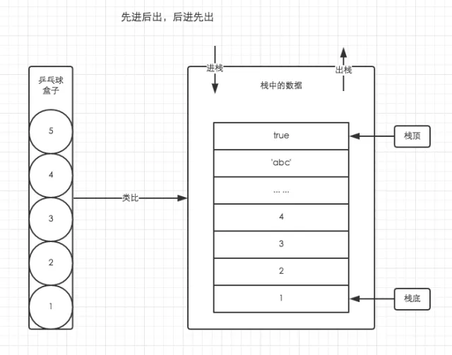
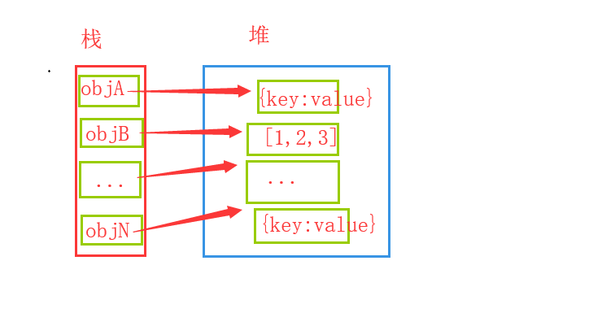
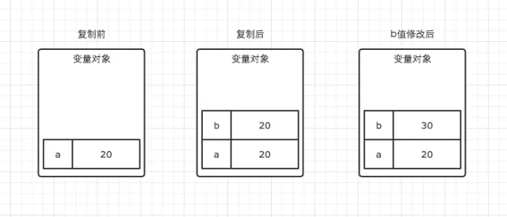
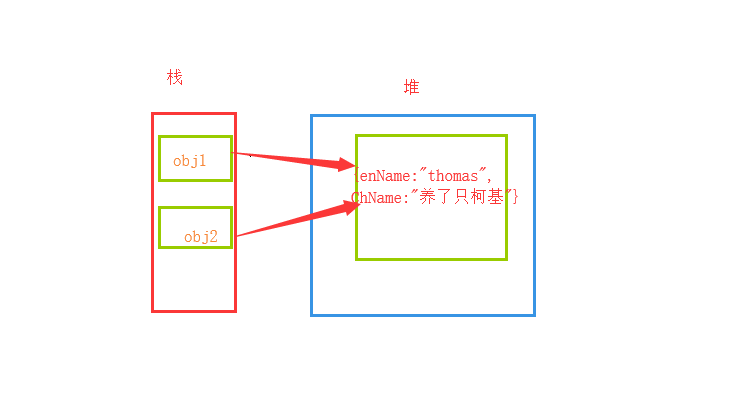

**认识和了解JS中的内存机制...**

在js中因为我们有非常方便的垃圾回收机制，所以在某种程度上来说我们并不需要像学习C语言一样对内存有明确的认识。但是随着时间的推移，我们会发现，因为对内存机制的不了解。阻碍了我们对一些问题的理解，比如：

1. 为什么引用类型看起来一样但是它们却不相等。
2. 浅复制和深复制的区别是什么。


这些常见的问题其实都和我们的内存机制息息相关。

我们都知道C语言中严格区分了栈和堆的存储概念，但是JS并没有这么严格的去区分堆栈存储的概念。我们平时为了方便理解和应用，在某些场景，我们仍然需要基于堆栈数据结构的思路进行处理。

**栈存储：**

在红宝书的中的数组篇中，使用了数组的方法模拟了栈的工作流程。`先进后出`。可以参考：[Js高阶教程读书笔记 (数组篇)](https://lmxyjy.github.io/JS%E9%AB%98%E9%98%B6%E6%95%99%E7%A8%8B%E8%AF%BB%E4%B9%A6%E7%AC%94%E8%AE%B0-(%E6%95%B0%E7%BB%84%E7%AF%87)/)

在我们放乒乓球的时候，肯定是5号球最后放进来。然后当我们想要拿到最底层的乒乓球的时候，我们肯定要先拿走它上面的乒乓球才行。也就是说5号球最先被拿出盒子。 这也就是我们栈存储的特点：**`先进后出，后进先出`**。

这里有一张图片能够详细的说明栈的工作流程：


**在JS中我们的基本数据类型就直接存储于栈中。**值得一提的是，我们平时对一个字符串进行更改实际上并不是在原来的字符串上更改的。而是创建了一个全新的字符串，这点和python中的基本数据类型是不可变的概念是非常相似的。

**堆存储：**

JS中的堆存储是用栈中存储的地址来保持索引的。在C语言中，我们知道栈中保存的实际上只是指针，而真正的数据是保存在堆中的。我们在使用这些数据的时候，实际上是通过指针去查找到相对应的数据。那么其实在JS中也是相似的，我们不关心数据到底存储在了堆中的哪个位置。我们只需要使用指向数据的那个变量就能准确的取到数据。就像我们使用对象的key就能得到对象的value一样。

如下图所示（灵魂画手）：



我们可以这么来理解： **在JS中我们的引用类型数据是存储于堆中的。** 我们使用的变量只是一个指向堆中对应数据的指针。

**在了解了JS基本的存储知识后，针对我们经常遇到的问题。就能够有理有据的说出答案了**

比如：

**例一**

````js
let a = 20;
let b = a;
b=30;
console.log(a) //20
````
为什么b引用a后，修改了b的值。而a的值没有变化。我们首先对代码的执行流程进行一个分析：

1. `let a = 20` 栈中开辟空间存储 a---20;
2. `let b = a` 实际上相当于栈中重新开辟空间存储了 b---20;
3. `b = 30` 这里可以理解成栈中弹出了原本存储的b---20，重新开辟控件存储了b---30;

用一个图片说明:



所以说,为什么b改变后而a的值没有被改变。我们反过来也可以推导出我们之前所说过的那句话：JS中的基本数据类型是不可变的，我们对变量重新赋值或者对基本数据类型进行修改实际上都是在栈中开辟空间存储了一个新的值。

**例二**
````js
let obj1 = {enName:"thomas",ChName:"养了只柯基"};
let obj2 = obj1;
obj2.ChName = "渣渣辉";
console.log(obj1);//{enName:"thomas",ChName:"渣渣辉"}
````
这个例子其实和上一个例子的流程是一样的，但是区别在于上一个例子是基本数据类型。而这个例子是引用类型。之前我们已经说过了，引用数据类型的存储是在堆中的。而栈中保存的只是相当于其数据的一个指针而已。

代码运行流程：
1. `let obj1 = {enName:"thomas",ChName:"养了只柯基"};` 在内存中开辟空间进行存储，栈中存储我们的地址。假设这里的`obj1 = 0x01`。堆中存储我们的对象数据。
2. `let obj2 = obj1;`在内存栈中开辟一个空间存储我们的`obj2` 因为`obj2`是复制`obj1`的。所以`obj2=0x01`。这个时候很明显我们可以知道它们指向堆中地址为 **0x1** 的同一个对象。就如下图所示一样：

3. `obj2.ChName = "渣渣辉";` 因为`obj1` 和 `obj2`指向了同一个对象,那么`obj2`修改ChName属性的时候实际上就是修改它们共同指向的那个对象中的ChName的值。那么结果就显而易见了。

参考资料：
[**内存空间详细图解**](https://mp.weixin.qq.com/s?__biz=MzI4NjE3MzQzNg==&mid=2649865899&idx=1&sn=78a092708828a61ac1c99388e9f7d998&scene=19#wechat_redirect)

**JS高阶教程第三版**

**JS权威指南**

**尾巴**

以上的总结，都是个人的感悟。难免有疏漏的地方，如有错误，还望不吝赐教。还是那句话，若批评无自由，则赞美无意义。


