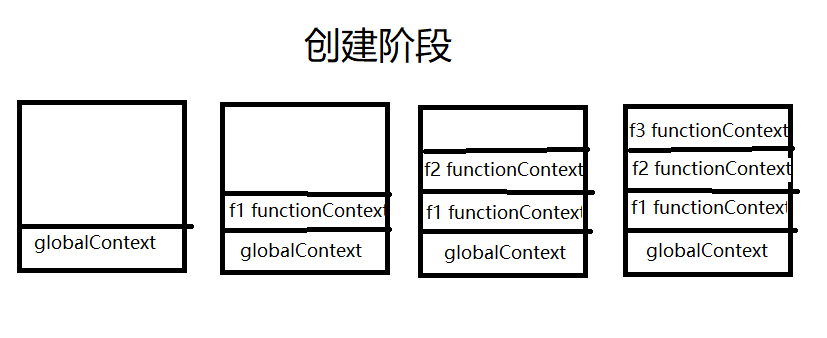
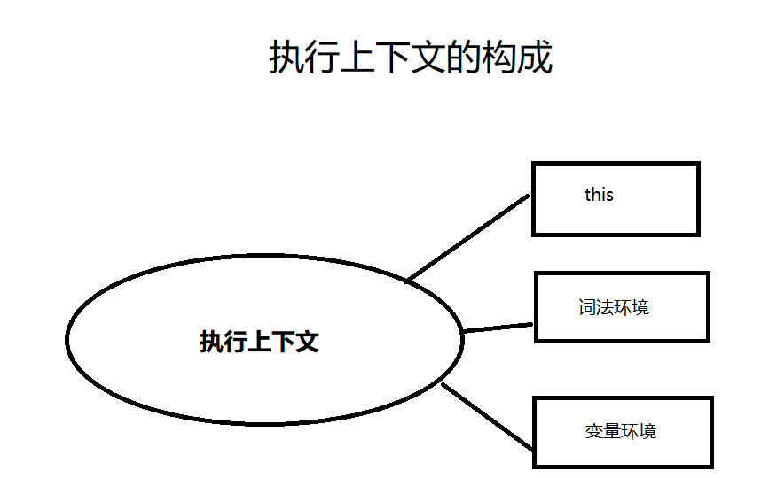

**在js中执行上下文是一个非常基础但同时也非常重要的东西，所以我们非常有必要去了解它是什么，它起到了什么作用**


JS代码在执行前，JS引擎总要做一番准备工作，这份工作其实就是创建对应的执行上下文。

**执行上下文是什么？**

执行上下文可以理解为当前代码执行的环境。在我们的js中主要的执行环境有以下的3种：

1. 全局环境
2. 函数环境
3. eval环境


当然我们也可以称之为:全局执行上下文，函数执行上下文，eval执行上下文。但是eval我们不常用，所以不再研究。

**全局执行上下文：**
在我们程序开始执行的时候，会首先创建一个全局执行上下文。并将这个全局执行上下文压入到调用栈中去。在浏览器中我们的全局执行上下文就是我们的window对象。它上面定义了很多的属性和方法，我们在全局环境的任何一个地方都能够访问到它。全局执行上下文是由浏览器创建的。


**函数执行上下文：**
js解释器遇到我们函数调用的时候，它就会在调用栈中创建一个函数执行上下文。需要明确知道的是，只要是函数调用就会创建一个新的函数执行上下文。即使是这个函数调用自己。

**每个执行上下文都包括了2个阶段：**

1. 创建阶段
2. 执行阶段

>这里我们引入了一个新的概念，叫做调用栈。调用栈实际上就是用于存储代码执行期间创建的所有上下文。

**调用栈的工作流程：**
1. 当我们的JS代码在首次运行的时候，会先创建一个全局执行上下文并压入到调用栈中去。`全局执行上下文因为是首先被创建的，所以它永远处于调用栈的底部。只有当我们程序完全卸载的时候，比如关闭浏览器的时候它才会被弹出调用栈`
2. 当js解释器遇到函数调用的时候，就创建一个当前函数的执行上下文。
3. 如果在当前函数的执行上下文中又发现了一个函数调用，那么就再创建一个函数执行上下文。
4. 所有能创建执行上下文的情况都没有后，开始执行调用栈最顶层的那个函数上下文的代码。
5. 代码执行完毕，将执行完毕后的函数执行上下文弹出调用栈。继续执行下一个函数执行上下文。

用伪代码模拟调用栈的工作流程：

````js
function f1() {
    f2();
    console.log(1);
};

function f2() {
    f3();
    console.log(2);
};

function f3() {
    console.log(3);
};

f1();//3 2 1
````

````js
/*创建阶段:*/

// 代码执行前创建全局执行上下文
ECStack = [globalContext] //将全局上下文压入到调用栈中
//js解释器发现函数f1()调用，创建函数f1的执行上下文
ECStack.push(f1 functionContext) //将f1的执行上下文压入到栈中
//js解释器发现函数f2()被调用，创建函数f2的执行上下文
ECStack.push(f2 functionContext) //将函数f2的执行上下文压入到栈中
//js解释器发现函数f3()被调用，创建函数f3的执行上下文
ECStack.push(f3 functionContext)//将函数f3的执行上下文压入到栈中

/*这个时候js解释器发现没有函数被掉用了，进入到代码执行阶段*/

//f3执行完毕
ECStack.pop() //将f3的执行上下文弹出调用栈
//f2执行完毕
ECStack.pop() //将f2的执行上下文弹出调用栈
//f1执行完毕
ECStack.pop() //将f1的执行上下文弹出调用栈
//此时调用栈中只有全局执行上下文
ECStack = [globalContext]

/*关闭浏览器*/
//调用栈弹出全局执行上下文
ECStack = []
````

对以上的过程使用图解：




**上面所演示的都是执行上下文创建完毕后被调用栈调用的情况。但是js解释器是如何创建执行上下文的呢？**

其实在创建阶段，执行上下文主要有以下三个部分被创建：

1. 确定this
2. 创建词法环境（LexicalEnvironment）
3. 创建变量环境（VariableEnvironment）

用伪代码来描述其实就是以下3个部分：

````js
ExecutionContext = {  
    // 确定this的值
    ThisBinding = <this value>,
    // 创建词法环境
    LexicalEnvironment = {},
    // 创建变量环境
    VariableEnvironment = {},
};
````

所以一个执行上下文有以下三个部分组成:



**确定this：** 实际上就是绑定我们的this指向，这个不难理解。

**词法环境：** 词法环境有2个部分组成:

1. `环境记录:` 用于存储变量和函数的声明，在执行阶段能对应的去进行赋值。
2. `对外引用记录:` 类似于我们作用链的概念，保存着我们对应的作用域变量访问权限。

>因为我们有全局执行上下文和函数执行上下文的区别，所以我们的词法环境也有 全局词法环境和函数词法环境的区别

全局词法环境：

1. 在它的 `对外引用记录中` 对外部环境的引用记录为null,因为它已经是最外层的环境了。
2. 在它的 `环境记录` 中保存着全局对象的所有方法和属性，包括用户自定义的全局对象。

函数词法环境：

1. 在它的 `对外引用记录中` 中保存的可以是全局环境对象也可以是其他函数环境。这个根据实际情况确定。
2. 在它的  `环境记录` 中除了保存用户自己自定义的所有变量外，还包含了一个arguments对象。

> 全局环境和函数环境的环境记录也不相同，全局环境中的环境记录叫做对象环境记录，而函数中则叫做声明性环境记录

伪代码表示如下：
````js
// 全局环境
GlobalExectionContext = {
    // 全局词法环境
    LexicalEnvironment: {
        // 环境记录
        EnvironmentRecord: {
            Type: "Object", //类型为对象环境记录
            // 标识符绑定在这里 
        },
        outer: < null >
    }
};
// 函数环境
FunctionExectionContext = {
    // 函数词法环境
    LexicalEnvironment: {
        // 环境纪录
        EnvironmentRecord: {
            Type: "Declarative", //类型为声明性环境记录
            // 标识符绑定在这里 
        },
        outer: < Global or outerfunction environment reference >
    }
};
````

**变量环境：**
变量环境其实同词法环境是相似的，它也是包含了`对外引用记录` 和 `环境记录` 。但是这里有一个非常重要的知识点，**在我们的ES6中，词法环境保存的是我们的函数声明、let、const声明的变量。而变量环境中只保存var声明的变量。**

````js
let a = 20;  
const b = 30;  
var c;

function multiply(e, f) {  
 var g = 20;  
 return e * f * g;  
}

c = multiply(20, 30);
````

利用伪代码来描述一下上面代码的创建流程：

````js
//全局执行上下文
GlobalExectionContext = {
    // this绑定为全局对象
    ThisBinding: <Global Object>,
    // 词法环境
    LexicalEnvironment: {  
        //环境记录
      EnvironmentRecord: {  
        Type: "Object",  // 对象环境记录
        // 标识符绑定在这里 let const创建的变量a b在这
        a: < uninitialized >,  
        b: < uninitialized >,  
        multiply: < func >  
      }
      // 全局环境外部环境引入为null
      outer: <null>  
    },
    
    //变量环境
    VariableEnvironment: {  
      EnvironmentRecord: {  
        Type: "Object",  // 对象环境记录
        // 标识符绑定在这里  var创建的c在这
        c: undefined,  
      }
      // 全局环境外部环境引入为null
      outer: <null>  
    }  
  }

  // 函数执行上下文
  FunctionExectionContext = {
     //由于函数是默认调用 this绑定同样是全局对象
    ThisBinding: <Global Object>,
    // 词法环境
    LexicalEnvironment: {  
      EnvironmentRecord: {  
        Type: "Declarative",  // 声明性环境记录
        // 标识符绑定在这里  arguments对象在这
        Arguments: {0: 20, 1: 30, length: 2},  
      },  
      // 外部环境引入记录为</Global>
      outer: <GlobalEnvironment>  
    },
  
    //变量环境
    VariableEnvironment: {  
      EnvironmentRecord: {  
        Type: "Declarative",  // 声明性环境记录
        // 标识符绑定在这里  var创建的g在这
        g: undefined  
      },  
      // 外部环境引入记录为</Global>
      outer: <GlobalEnvironment>  
    }  
  }
````

通过伪代码，我们不难得知。var声明的变量被赋予了初始值为undefined。但是let和const却没有被赋予初始值，这也就是为什么var声明的变量会有变量声明提升。然而let、const却没有。

**到这里我们就知道了执行上下文的创建过程。**

**关于执行上下文的的执行过程：** 其实执行上下文的执行过程是非常简单的。就是根据我们的词法环境和变量环境中的环境记录，比如早期var在创建阶段为undefined，如果有值就对应赋值，像let const值为未初始化，如果有值就赋值，无值则赋予undefined。

**参考:**

[一篇文章看懂JS执行上下文](https://www.cnblogs.com/echolun/p/11438363.html)

[详解执行上下文](https://mp.weixin.qq.com/s?__biz=MzI4NjE3MzQzNg==&mid=2649865900&idx=1&sn=a8fefbc436283b638eaeba1d7bd8496d&scene=19#wechat_redirect)

[JS中的执行上下文(Execution Context)和栈(stack)](https://www.jianshu.com/p/e4051933e88e)

[【你不知道的JavaScript】（三）执行上下文及其生命周期](https://www.jianshu.com/p/a6e8d2bf1ca0)

javaScript高阶教程第三版

**尾巴：**

感谢观看，如有问题或者建议。欢迎给我发邮件。