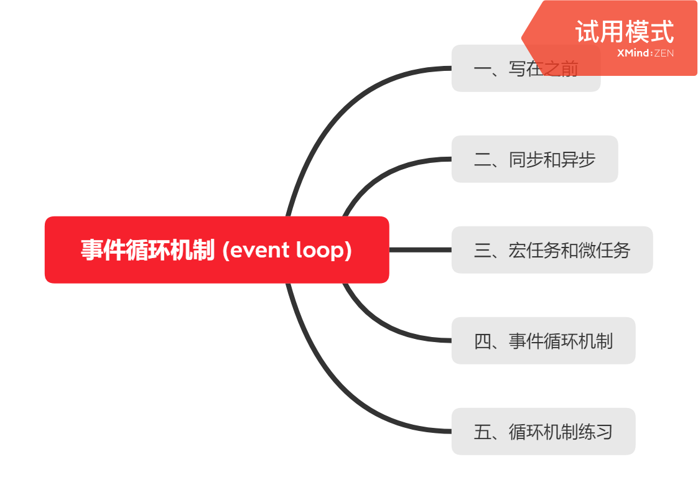
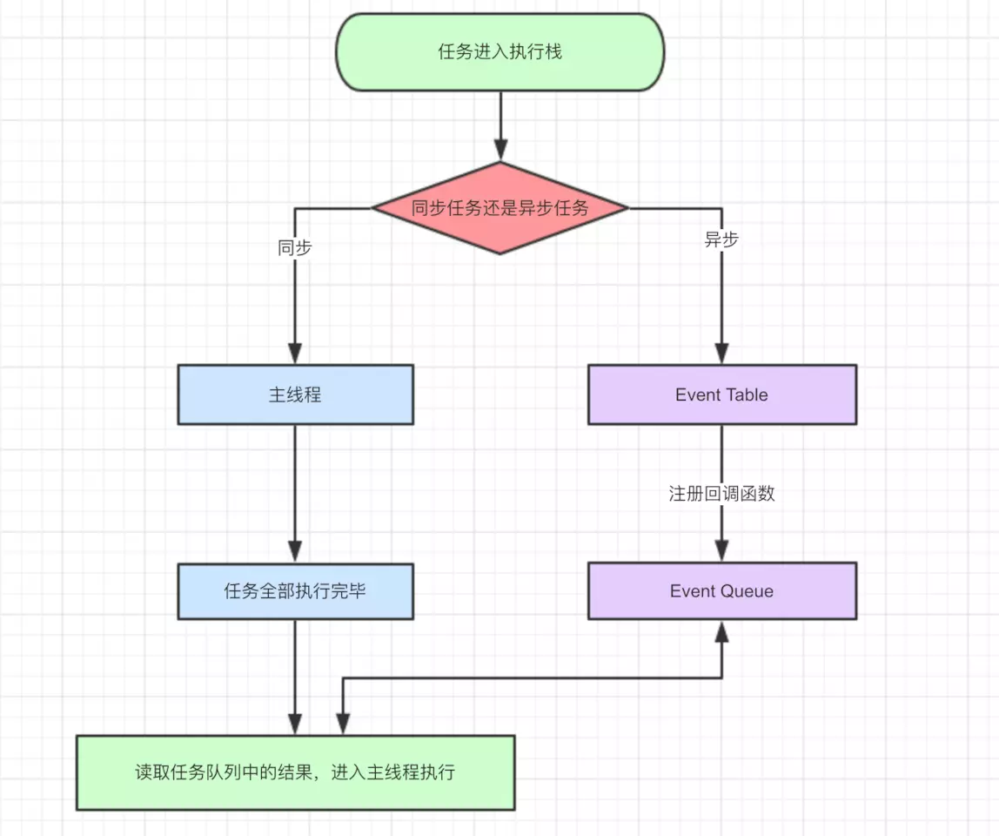
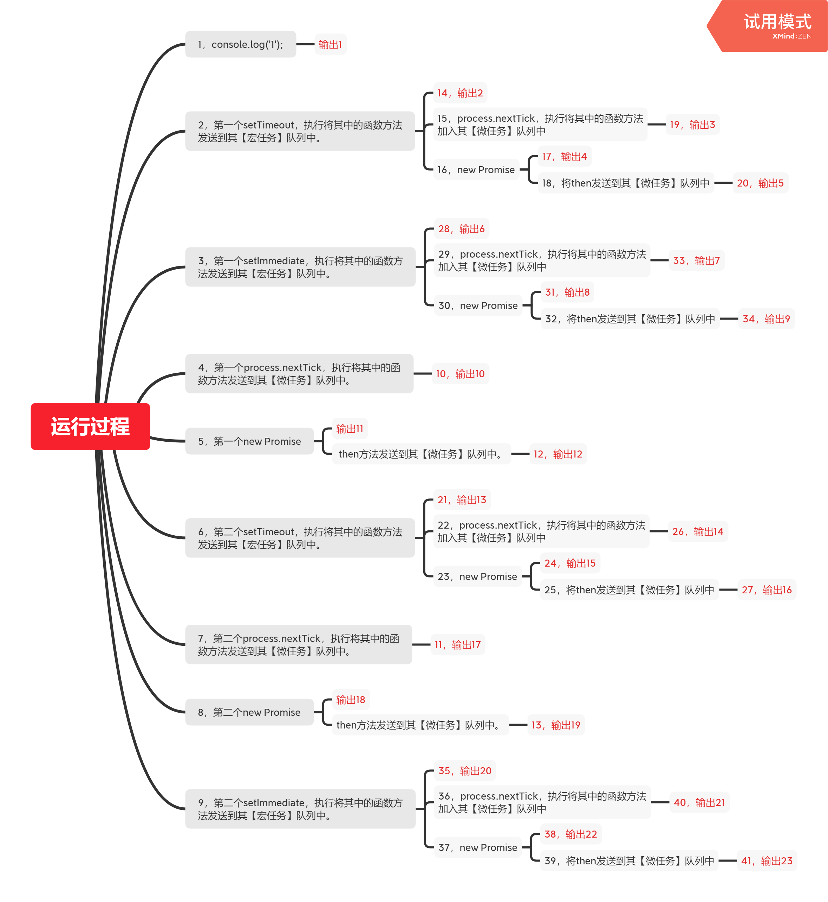

**事件循环机制 (event loop)**



**一、写在之前**

js执行代码的顺序都是从上到下依次执行。所以我们认为：

````js
console.log("first")
function f(){
    console.log("two")
}
f()
console.log("three")
/*
first
two
three
*/
````

那么实际上得到的结果也确实如此，但是实际上JS在执行代码的时候并没有那么的简单。比如下面的例子：

````js
setTimeout(()=>{
    console.log("1")
},0)
function f(){
    console.log("2")
}
new Promise((res,rej)=>{
    console.log("3");
    res();
    console.log("4");
}).then(()=>{
    console.log("5")
})
f()
console.log("6")
/*
3
4
2
6
5
1
*/
````

按照之前JS从上到下依次执行的分析来看，我们认为是`1,2,3,4,5,6`但是实际上执行的结果并不是这样。这是因为JS特殊的事件循环机制决定的。

**二、同步和异步**

从广义的角度来看，JS的任务分为同步任务和异步任务。需要耗时耗力的任务，比如图片加载、数据请求等通常都是异步执行的。这是为了提升我们用户的体验。而html骨架加载，文字信息渲染等通常是同步任务。



上图的流程实际上就是：

>同步任务和异步任务进入不同的执行区域，同步任务进入到主线程进行执行。而异步任务则是到event table中进行注册。

>当指定的同步任务执行完毕后，event loop中注册的函数会进入到event queue中。

>JS引擎检查主线程是否空闲，如果空闲则执行event queue中注册的任务。

上面的过程会不断执行，这也就是我们的事件循环机制。


**三、宏任务和微任务**

之前我们是从广义的同步和异步上去看事件循环机制。实际上在js的事件循环中，我们对任务有着更详细的划分。这就是我们常说的宏任务和微任务。

常见的宏任务源有：`setTimeout`、`setInterval`、`setImmediate`、`I/O`、`UI渲染`、`js整体代码`。  

常见的微任务源有：`process.nextTick`、 `Promise`、 `Object.observe(已废弃)`、 `MutationObserver(html5新特性)`

**四、事件循环机制**

从宏任务和微任务的角度来看事件循环机制，实际上就是：依托函数调用栈。宏任务会被优先调用，之后再调用微任务。反复执行这一个过程，也就是我们的事件循环机制。

根据以上的结论：分析我们之前的代码:

在分析前我们必须知道的是，setTimeout并不会被延迟执行，延迟执行的是它接受的那个函数。

````js
setTimeout(()=>{
    console.log("1")
},0)
function f(){
    console.log("2")
}
new Promise((res,rej)=>{
    console.log("3");
    res();
    console.log("4");
}).then(()=>{
    console.log("5")
})
f()
console.log("6")
````

**第一次循环执行过程**

1. 首先代码执行，全局执行上下文被压入到函数调用栈栈底。
2. 执行到`setTimeout`,因为 `setTimeout` 是一个宏任务源。所以会将接收到的第一个参数发送到 `setTimeout` 的任务队列中去。
3. 执行到`promise`，因为`new`关键词会立即执行的原因。所以`promise`中传入的函数会立即执行。所以立即就会打印出`3`,但是又因为`promise`是一个微任务源，`then`会被发送到微任务中去等待执行。所以会打印出`4`而不是`5`
4. 执行到f()，因为是宏任务。所以直接打印出`2`
5. 执行到最后一句，直接打印出`6`

**第二次循环执行过程**

1. 这个时候第一次循环的宏任务执行完毕了，会首先开始执行微任务。这里的微任务就只有一个，就是`then`。于是打印出`5`
2. 微任务执行完毕后，js引擎发现还有一个定时器`setTimeout`的宏任务，于是最后打印出`1`

以上就是为什么打印出的顺序是:3,4,2,6,5,1的原因。

**五、循环机制练习**

上面的题目我们分析出来了，接下来升级一下复杂度。检测我们是否掌握了循环机制：

开始之前有个小提示：`setTimeout`的执行顺序是高于`setImmediate`的。

````js
console.log('1');

setTimeout(function() {
    console.log('2');
    process.nextTick(function() {
        console.log('3');
    })
    new Promise(function(resolve) {
        console.log('4');
        resolve();
    }).then(function() {
        console.log('5')
    })
})

setImmediate(function() {
    console.log('6');
    process.nextTick(function() {
        console.log('7');
    })
    new Promise(function(resolve) {
        console.log('8');
        resolve();
    }).then(function() {
        console.log('9')
    })
})

process.nextTick(function() {
    console.log('10');
})
new Promise(function(resolve) {
    console.log('11');
    resolve();
}).then(function() {
    console.log('12')
})

setTimeout(function() {
    console.log('13');
    process.nextTick(function() {
        console.log('14');
    })
    new Promise(function(resolve) {
        console.log('15');
        resolve();
    }).then(function() {
        console.log('16')
    })
})

process.nextTick(function() {
    console.log('17');
})
new Promise(function(resolve) {
    console.log('18');
    resolve();
}).then(function() {
    console.log('19')
})

setImmediate(function() {
    console.log('20');
    process.nextTick(function() {
        console.log('21');
    })
    new Promise(function(resolve) {
        console.log('22');
        resolve();
    }).then(function() {
        console.log('23')
    })
})
````

结果是否如你所想？ 我们用思维导图的方式来模拟上述的运行过程。

红色部分表示产生了输出的步骤



可以看到我们的执行过程经历了这么多的步骤。如果能捋清楚这个执行顺序，那么基本也就是了解了js中的事件循环机制。

一道经典的面试题：

````js
//对输出的结果进行解释
for(var i=0;i<10;i++){
    setTimeout(()=>{
        console.log(i)
    },1000)
}
````

在执行这段代码的时候，结果并不是我们预计的每隔一秒打印出i的值。而是直接打印了10个10.其实原因就是我们事件循环机制导致的。

1. for循环会直接运行。
2. 将宏任务源（setTimeout）中的回调函数加入到其对应的事件队列中。
3. i的值发生改变。
4. 重复以上的步骤。
5. for循环执行完毕，主线程空闲，开始执行事件队列中的定时器。
6. 这个时候i已经变成10了，所以获取到的i就是10。

这里还有一个点需要注意，我们10个定时器几乎是同一时间触发的。这是因为，我们给定时器定的延迟时间。实际上是它将参数函数放入到事件队列中的时间。而不是它真实的执行时间。因为事件循环机制的存在，for循环会先于定时器的回调函数执行完毕。那么这个时候10个setTimout实际上都分发完成了任务。那么1s后，所有的任务都将会被依次执行。所以我们几乎看不到时间间隔。

**参考资料**

[深入核心，详解事件循环机制](https://mp.weixin.qq.com/s/m3a6vjp8-c9a2EYj0cDMmg)

[这一次，彻底弄懂 JavaScript 执行机制](https://juejin.im/post/59e85eebf265da430d571f89#heading-3)
